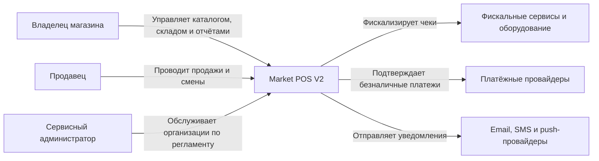
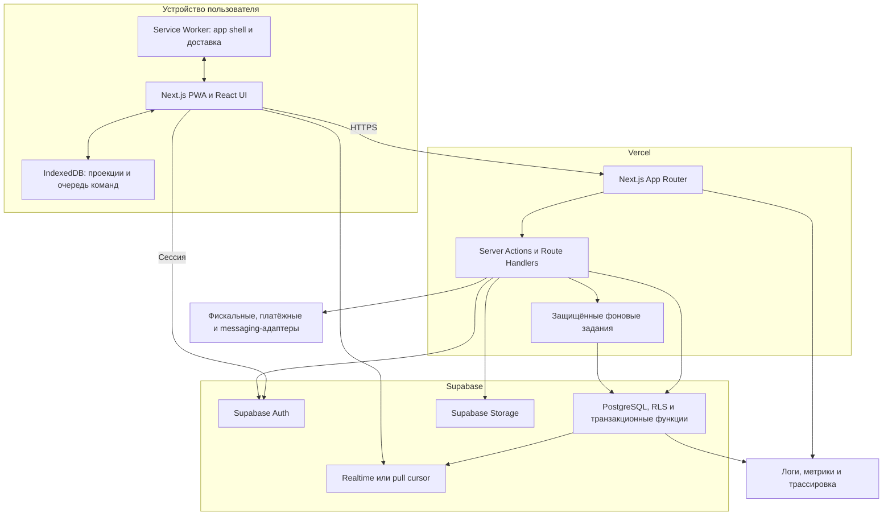
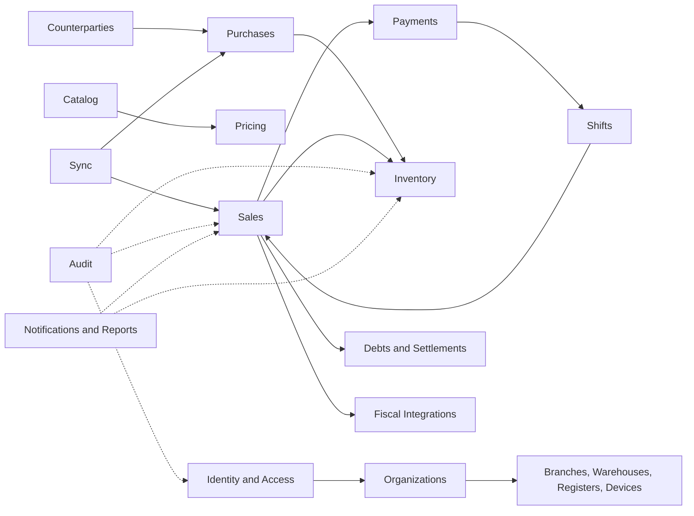
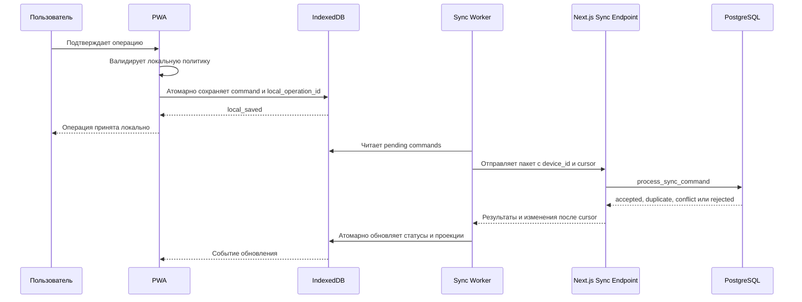
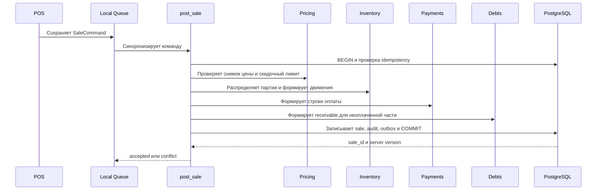
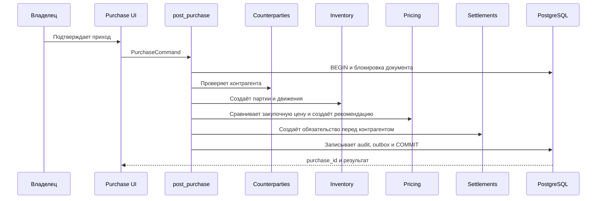
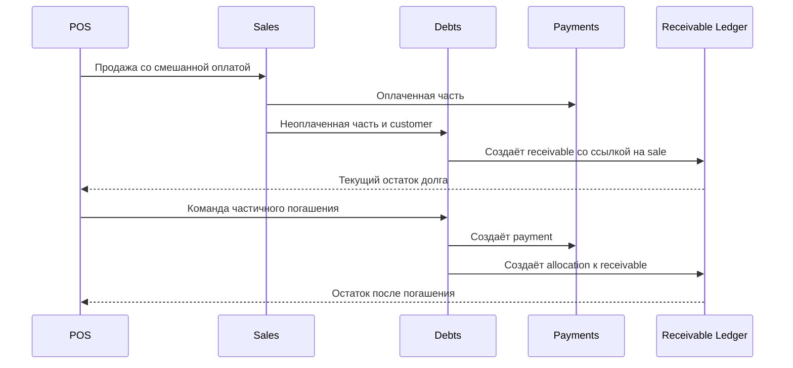
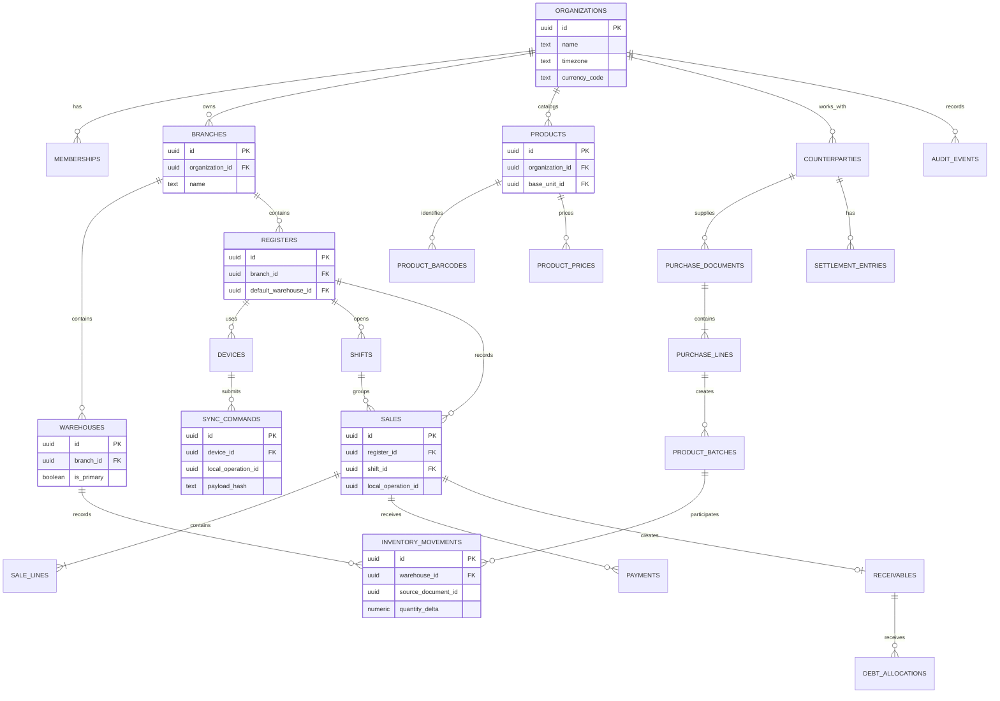

# Market POS V2 — целевая техническая архитектура

**Статус:** Proposed

**Версия:** 2.0

**Дата:** 25 июля 2026 года

**Основной источник требований:** [PRODUCT_SPEC_V2.md](./PRODUCT_SPEC_V2.md)

## 1. Назначение архитектурного документа

Документ описывает целевую техническую архитектуру Market POS V2 и безопасный переход от текущего приложения к Core Pilot. Он является общей опорой для схемы данных, серверных команд, клиентского приложения, offline-first синхронизации, RLS, тестирования и поэтапной поставки.

Документ не является миграцией базы данных и не меняет текущую реализацию. Имена целевых таблиц и команд являются архитектурными предложениями; перед реализацией каждого этапа они уточняются в ADR и отдельных миграциях.

## 2. Архитектурные цели

- сохранить скорость POS даже при нестабильном интернете;
- гарантировать атомарность продажи, оплаты, долга и складских движений;
- изолировать данные организаций на каждом уровне;
- исключить дубли при повторной синхронизации;
- сделать все финансовые и складские изменения объяснимыми;
- обеспечить развитие от одного магазина к нескольким филиалам без смены платформы;
- отделить бизнес-модули друг от друга без преждевременного перехода к микросервисам;
- дать команде реалистичный путь миграции существующих данных;
- не допускать автоматического изменения продажной цены без подтверждения;
- поддерживать сторнирование вместо удаления проведённых документов.

## 3. Архитектурные принципы

1. **Сервер авторитетен.** Supabase PostgreSQL является серверным источником истины.
2. **Локальная работа полноценна.** IndexedDB хранит достаточную проекцию данных и очередь команд для разрешённых offline-сценариев.
3. **Документы порождают проводки.** Остатки, деньги и долги меняются только проведёнными бизнес-документами.
4. **Проводки неизменяемы.** Исправление выполняется сторнированием и новой операцией.
5. **Команды идемпотентны.** Повтор с тем же `local_operation_id` возвращает прежний результат.
6. **Одна команда — одна транзакция.** Связанные записи либо фиксируются все, либо не фиксируется ни одна.
7. **RLS обязателен.** Проверка приложения дополняет, но не заменяет изоляцию в PostgreSQL.
8. **Модули владеют данными.** Запись в таблицы другого модуля разрешена только через его команду.
9. **Деньги и количество точны.** PostgreSQL `numeric`; на клиенте строки или decimal-библиотека, но не арифметика IEEE-754.
10. **Сначала модульный монолит.** Отдельные сервисы вводятся только после появления измеримой эксплуатационной причины.
11. **Совместимость миграций.** Переход выполняется расширением, обратным заполнением, переключением чтения и только затем выводом старых полей.
12. **Без скрытых исправлений.** Критические решения пользователя, конфликты и административные подтверждения журналируются.

## 4. Общий контекст системы

Market POS обслуживает владельцев, продавцов и сервисных администраторов. Внутри границы системы находятся PWA, Next.js-приложение и Supabase. Фискальные устройства, платёжные провайдеры и каналы уведомлений являются внешними системами.



## 5. Пользовательские приложения и интерфейсы

V2 поставляется как одно адаптивное Next.js PWA с разными рабочими областями:

- **Owner workspace:** каталог, закупки, склад, цены, контрагенты, долги, отчёты и аудит;
- **Seller POS:** быстрые продажи, оплаты, разрешённые долги, возвраты и смена;
- **Mobile owner view:** уведомления, быстрый приход, остатки и ключевые показатели;
- **Service console:** отдельная защищённая область для SaaS-операций, не использующая права владельца магазина;
- **Print surfaces:** чеки, ценники, штрихкоды и документы с отдельной светлой печатной темой.

Маршруты App Router отвечают за композицию и загрузку представлений. Бизнес-правила не должны жить только в React-компонентах.

## 6. Контейнерная архитектура



Прямой доступ браузера к Supabase допускается для безопасного чтения под RLS и realtime-проекций. Проведение финансовых и складских документов выполняется только серверными командами.

## 7. Модульная структура приложения

Целевая структура сохраняет один репозиторий и один deployable:

```text
src/
  app/                         # маршруты, layouts, route handlers
  modules/
    catalog/
      application/             # use cases и команды
      domain/                  # типы, правила, события
      infrastructure/          # Supabase repositories
      ui/                      # формы и представления модуля
    sales/
    inventory/
    sync/
    ...
  shared/
    auth/
    db/
    errors/
    i18n/
    money/
    observability/
    validation/
  offline/
    db/
    projections/
    queue/
    sync/
```

Текущие `src/lib`, `src/services`, `src/types` и `src/components` мигрируют постепенно. Новая структура вводится по модулю, без массового перемещения существующего кода.

Зависимости направлены от UI к application, от application к domain и через интерфейсы к infrastructure. Domain-код не импортирует Next.js, Supabase SDK или React.

## 8. Границы бизнес-модулей



### Identity and Access

- **Ответственность:** идентификация пользователя, профиль, членство, роли, разрешения и подтверждение критических действий.
- **Основные сущности:** auth identity, user profile, membership, permission profile, role assignment, approval.
- **Создаёт:** профили, назначения прав, подтверждения, записи о сессиях.
- **Читает:** организации, филиалы и политики доступа.
- **Запрещённые зависимости:** не меняет продажи, остатки, долги или цены.
- **Публикует:** `UserActivated`, `PermissionAssigned`, `CriticalActionApproved`, `DeviceSessionRevoked`.
- **Транзакционная граница:** одно изменение членства или одно административное подтверждение вместе с audit entry.

### Organizations

- **Ответственность:** жизненный цикл арендатора и общие настройки.
- **Основные сущности:** organization, organization settings, subscription reference.
- **Создаёт:** организации и настройки валюты, локали, временной зоны.
- **Читает:** тарифные ограничения Identity and Access.
- **Запрещённые зависимости:** не владеет операционными документами филиалов.
- **Публикует:** `OrganizationCreated`, `OrganizationSettingsChanged`, `OrganizationBlocked`.
- **Транзакционная граница:** организация и начальные настройки создаются атомарно.

### Branches

- **Ответственность:** торговые точки, адреса и локальные операционные настройки.
- **Основные сущности:** branch, branch membership, business hours.
- **Создаёт:** филиалы и их настройки.
- **Читает:** organization и назначения пользователей.
- **Запрещённые зависимости:** не хранит остаток и не заменяет warehouse или register.
- **Публикует:** `BranchOpened`, `BranchSettingsChanged`, `BranchArchived`.
- **Транзакционная граница:** изменение филиала и его audit entry.

### Warehouses

- **Ответственность:** места хранения и правила доступности товара.
- **Основные сущности:** warehouse, warehouse access, default warehouse assignment.
- **Создаёт:** склады и привязки к филиалам.
- **Читает:** branches и organization.
- **Запрещённые зависимости:** не записывает движения Inventory напрямую.
- **Публикует:** `WarehouseCreated`, `WarehouseArchived`, `DefaultWarehouseChanged`.
- **Транзакционная граница:** изменение конфигурации склада; остатки остаются в Inventory.

### Registers

- **Ответственность:** логические кассы и настройки продаж.
- **Основные сущности:** register, register settings, payment method availability.
- **Создаёт:** кассы и их конфигурацию.
- **Читает:** branch, warehouse и доступные способы оплаты.
- **Запрещённые зависимости:** не владеет сменами, платежами или продажами.
- **Публикует:** `RegisterCreated`, `RegisterConfigurationChanged`, `RegisterDisabled`.
- **Транзакционная граница:** конфигурация одной кассы.

### Devices

- **Ответственность:** регистрация, доверие и отзыв клиентских устройств.
- **Основные сущности:** device, device registration, sync cursor, revoked session.
- **Создаёт:** устройства, ключи регистрации и отметки синхронизации.
- **Читает:** register, branch, membership и security policy.
- **Запрещённые зависимости:** не меняет payload бизнес-команд.
- **Публикует:** `DeviceRegistered`, `DeviceRevoked`, `DeviceSyncAdvanced`.
- **Транзакционная граница:** регистрация или отзыв устройства вместе с audit entry.

### Catalog

- **Ответственность:** идентичность и описание товара.
- **Основные сущности:** product, barcode, category, brand, product type, unit, unit conversion.
- **Создаёт:** товары и справочники, но не цены и остатки.
- **Читает:** organization и Storage media reference.
- **Запрещённые зависимости:** не пишет Pricing, Inventory или Purchases.
- **Публикует:** `ProductCreated`, `ProductChanged`, `ProductArchived`, `BarcodeAssigned`.
- **Транзакционная граница:** одна карточка товара и её штрихкоды либо одно изменение справочника.

### Pricing

- **Ответственность:** действующие продажные цены, история и рекомендации.
- **Основные сущности:** price list, product price, price change request, price recommendation, price history.
- **Создаёт:** версии цен, рекомендации и подтверждения.
- **Читает:** Catalog и события закупочных цен.
- **Запрещённые зависимости:** не меняет партии и завершённые продажи.
- **Публикует:** `PurchasePriceChanged`, `SalePriceRecommended`, `SalePriceConfirmed`.
- **Транзакционная граница:** подтверждение одной или массовой версии цен с историей и audit entry.

### Counterparties

- **Ответственность:** единая карточка поставщика и покупателя.
- **Основные сущности:** counterparty, counterparty role, contact, address, credit terms.
- **Создаёт:** карточки, контакты и признаки supplier/customer.
- **Читает:** organization и настройки долгов.
- **Запрещённые зависимости:** не хранит агрегированный взаимный баланс как единственную истину.
- **Публикует:** `CounterpartyCreated`, `CounterpartyRoleAdded`, `CreditTermsChanged`.
- **Транзакционная граница:** карточка с ролями и контактами.

### Purchases

- **Ответственность:** заказы, приёмки, возвраты поставщику и ежедневный быстрый приход.
- **Основные сущности:** purchase document, purchase line, supplier return, daily intake template.
- **Создаёт:** документы и строки закупки.
- **Читает:** Counterparties, Catalog, Pricing, Warehouses.
- **Запрещённые зависимости:** не обновляет остаток, партию или баланс прямым SQL.
- **Публикует:** `PurchasePosted`, `PurchaseReversed`, `SupplierReturnPosted`.
- **Транзакционная граница:** проведение документа вместе с партиями, складскими и расчётными проводками через серверную команду.

### Inventory

- **Ответственность:** партии, append-only движения, остатки, перемещения, списания и инвентаризации.
- **Основные сущности:** inventory movement, batch, stock balance projection, inventory document.
- **Создаёт:** движения, партии и пересчитываемые проекции.
- **Читает:** Catalog, Warehouses и документы-источники.
- **Запрещённые зависимости:** не изменяет строки исходного документа и не принимает финансовые решения.
- **Публикует:** `StockMoved`, `BatchCreated`, `LowStockDetected`, `ExpirationApproaching`.
- **Транзакционная граница:** все движения одного документа фиксируются вместе; проекция обновляется в той же транзакции.

### Sales

- **Ответственность:** корзина, завершённая продажа, строки, скидки, возвраты и сторнирование.
- **Основные сущности:** sale, sale line, return document, discount approval.
- **Создаёт:** снимок состава, цены и скидок продажи.
- **Читает:** Catalog, Pricing, Counterparties, Shifts и доступную проекцию Inventory.
- **Запрещённые зависимости:** не редактирует остаток, платёж или долг напрямую.
- **Публикует:** `SalePosted`, `SaleReversed`, `SaleReturned`.
- **Транзакционная граница:** проведение продажи включает Payments, Inventory, Debts и Audit в одной PostgreSQL-транзакции.

### Payments

- **Ответственность:** денежные строки по способам оплаты, возвраты и кассовые движения.
- **Основные сущности:** payment, payment allocation, cash movement, provider transaction.
- **Создаёт:** неизменяемые денежные проводки.
- **Читает:** Sales, Debts, Shifts и настройки Registers.
- **Запрещённые зависимости:** `mixed` не является способом оплаты; смешанная оплата состоит из нескольких payment rows.
- **Публикует:** `PaymentAccepted`, `PaymentRefunded`, `CashMovementPosted`.
- **Транзакционная граница:** платежи документа и их распределение фиксируются вместе с документом-основанием.

### Debts

- **Ответственность:** обязательства клиента по конкретным продажам и их погашение.
- **Основные сущности:** receivable, receivable line reference, repayment, allocation.
- **Создаёт:** долговые обязательства и распределения платежей.
- **Читает:** Sales, Payments, Counterparties и кредитные лимиты.
- **Запрещённые зависимости:** не создаёт долг без документа-основания и не переписывает исходную продажу.
- **Публикует:** `DebtOpened`, `DebtPartiallyRepaid`, `DebtClosed`, `DebtLimitExceeded`.
- **Транзакционная граница:** долговая часть продажи либо платёж и его allocations.

### Settlements

- **Ответственность:** взаимные обязательства с контрагентом и закрытие периода.
- **Основные сущности:** settlement entry, settlement period, settlement act, offset.
- **Создаёт:** проводки поставок, выдач товара, оплат и взаимозачётов.
- **Читает:** Purchases, Sales, Payments и Counterparties.
- **Запрещённые зависимости:** не удаляет и не сворачивает первичные ежедневные поставки.
- **Публикует:** `SettlementEntryPosted`, `SettlementPeriodClosed`, `SettlementAdjusted`.
- **Транзакционная граница:** одна проводка или закрытие периода с неизменяемым снимком расчёта.

### Shifts

- **Ответственность:** открытие и закрытие смен, ожидаемые и фактические суммы.
- **Основные сущности:** shift, shift cash count, discrepancy, shift event.
- **Создаёт:** смены, пересчёты и расхождения.
- **Читает:** Registers, Payments, Sales и Identity.
- **Запрещённые зависимости:** не редактирует платежи закрытой смены.
- **Публикует:** `ShiftOpened`, `ShiftClosed`, `ShiftDiscrepancyDetected`.
- **Транзакционная граница:** открытие или закрытие смены вместе с итогами и audit entry.

### Sync

- **Ответственность:** приём идемпотентных команд, порядок зависимостей, курсоры и конфликты.
- **Основные сущности:** sync command, command result, device cursor, conflict, outbox event.
- **Создаёт:** журнал приёма, результат команды и записи конфликтов.
- **Читает:** Devices, Identity и публичные application commands модулей.
- **Запрещённые зависимости:** не реализует правила продаж, склада или долгов внутри общего dispatcher.
- **Публикует:** `SyncCommandAccepted`, `SyncCommandRejected`, `SyncConflictRaised`.
- **Транзакционная граница:** регистрация idempotency key и выполнение одной бизнес-команды находятся в одной транзакции.

### Audit

- **Ответственность:** неизменяемая бизнес-история значимых действий.
- **Основные сущности:** audit event, approval evidence, actor context.
- **Создаёт:** append-only audit entries.
- **Читает:** идентификаторы и безопасные снимки событий модулей.
- **Запрещённые зависимости:** не хранит секреты, пароли или полные платёжные реквизиты.
- **Публикует:** `AuditEventRecorded` только для технической доставки.
- **Транзакционная граница:** обязательная audit entry записывается в транзакции исходной команды.

### Notifications

- **Ответственность:** пользовательские уведомления и состояние доставки.
- **Основные сущности:** notification, recipient, delivery attempt, preference.
- **Создаёт:** уведомления о ценах, остатках, сроках, долгах и конфликтах.
- **Читает:** outbox-события модулей и пользовательские настройки.
- **Запрещённые зависимости:** сбой доставки не откатывает бизнес-транзакцию.
- **Публикует:** `NotificationCreated`, `NotificationDelivered`, `NotificationFailed`.
- **Транзакционная граница:** создание из outbox идемпотентно; каждая попытка доставки фиксируется отдельно.

### Reports

- **Ответственность:** read models, агрегаты и экспорт.
- **Основные сущности:** report query, materialized view, export job, metric definition.
- **Создаёт:** только восстанавливаемые проекции и файлы экспорта.
- **Читает:** опубликованные модели Sales, Inventory, Payments, Debts, Settlements и Shifts.
- **Запрещённые зависимости:** не является источником истины и не меняет операционные документы.
- **Публикует:** `ReportExportReady`, `ProjectionRefreshFailed`.
- **Транзакционная граница:** снимок отчёта использует согласованный cutoff или PostgreSQL snapshot.

### Fiscal Integrations

- **Ответственность:** адаптеры фискализации и оборудования.
- **Основные сущности:** fiscal request, fiscal receipt, adapter configuration, retry.
- **Создаёт:** технический запрос, внешний идентификатор и ответ провайдера.
- **Читает:** неизменяемый снимок Sales и Payments.
- **Запрещённые зависимости:** не определяет итог продажи и не создаёт второй чек при retry.
- **Публикует:** `FiscalReceiptIssued`, `FiscalizationDeferred`, `FiscalizationFailed`.
- **Транзакционная граница:** локальная регистрация запроса идемпотентна; внешний вызов выполняется после commit через outbox.

## 9. Организации и изоляция арендаторов

`organization_id` обязателен для каждой tenant-owned корневой сущности и денормализуется в операционные документы там, где это упрощает RLS и контроль целостности. Дочерняя строка без `organization_id` доступна только через гарантированный внешний ключ к корневому документу.

Правила:

- пользователь получает доступ через `organization_memberships`;
- platform service admin не маскируется под owner и использует отдельный audited support grant;
- все уникальные бизнес-ключи ограничиваются организацией;
- cross-tenant внешние ключи предотвращаются составными ограничениями или проверенными функциями;
- SQL-функции принимают контекст из `auth.uid()`, а не доверяют переданному клиентом `organization_id`;
- блокировка организации запрещает новые команды, но сохраняет чтение данных по политике тарифа и поддержки.

## 10. Филиалы, склады, кассы и устройства

Текущий `stores` фактически используется как торговая точка и одновременно как область склада, смены, продажи и синхронизации. V2 разделяет:

- `branches` — адрес и операционная торговая точка;
- `warehouses` — место учёта партий и остатков;
- `registers` — логическая касса и настройки оплаты;
- `devices` — физическое клиентское устройство.

Core Pilot создаёт для каждого legacy store один branch, один основной warehouse и одну register. Связь сохраняется в таблице соответствий на период миграции.

Устройство относится к организации и может быть назначено кассе. Оно имеет стабильный UUID, статус доверия, последний sync cursor и время отзыва. Смена относится к register, а складские движения — к warehouse.

## 11. Аутентификация

Supabase Auth остаётся поставщиком идентичности. `auth.users.id` связывается с профилем приложения один-к-одному.

Целевые правила:

- `user_profiles.auth_user_id` является `not null unique`;
- пароль или `password_hash` не хранится в public schema;
- Server Components проверяют пользователя через `supabase.auth.getUser()`;
- Server Actions и Route Handlers повторно проверяют сессию и разрешение;
- обновление cookie-сессии выполняется выделенным proxy/middleware-механизмом по актуальной рекомендации Supabase;
- блокировка профиля или организации немедленно запрещает бизнес-команды;
- offline-сессия имеет ограниченный срок и локально подписанный снимок разрешений без хранения пароля.

## 12. Авторизация, роли и разрешения

Текущий enum `user_role` пригоден для базовых ролей, но не выражает профили прав, филиальные ограничения и лимиты.

Целевая модель:

- системные роли `owner`, `seller`, `service_admin` остаются стабильными категориями;
- `permission_profiles` объединяют разрешения;
- `membership_permission_profiles` назначают профиль пользователю в организации;
- `branch_access` и `warehouse_access` ограничивают область данных;
- лимиты скидки и долга являются значениями политики, а не только boolean-разрешениями;
- критическое действие создаёт `approval_request` и `approval`, привязанные к команде;
- серверная команда проверяет разрешение повторно, даже если UI скрыл кнопку.

## 13. PostgreSQL RLS

RLS включается на всех tenant-owned таблицах, включая новые операционные таблицы. Политики строятся на небольшом наборе `security definer` helper-функций с фиксированным `search_path`, минимальными grants и тестами.

Базовые функции:

- `current_profile_id()`;
- `is_active_organization_member(organization_id)`;
- `has_permission(permission_code, branch_id)`;
- `can_access_branch(branch_id)`;
- `can_access_warehouse(warehouse_id)`;
- `has_support_grant(organization_id)`.

RLS отвечает за изоляцию строк. Бизнес-лимиты и проведение документов остаются в командах. Прямые insert/update grants на ledger-таблицы не выдаются authenticated-роли; запись доступна только через утверждённые функции.

Каждая новая политика тестируется минимум для owner, seller, service admin с support grant, пользователя другой организации, blocked user и anonymous.

## 14. Серверная бизнес-логика

Server Actions валидируют ввод, вызывают application command и преобразуют ожидаемые ошибки в локализованный результат. Они не выполняют последовательность связанных `.insert()` и `.update()` из браузерного Supabase SDK.

Критические команды реализуются как PostgreSQL functions/RPC либо единый server-side transaction layer:

- `post_purchase`;
- `reverse_purchase`;
- `post_sale`;
- `reverse_sale`;
- `post_debt_repayment`;
- `open_shift`;
- `close_shift`;
- `confirm_price_change`;
- `process_sync_command`.

Команда принимает DTO, actor context и idempotency key, блокирует необходимые строки, проверяет версии и фиксирует документ, проводки, outbox и audit атомарно.

## 15. Клиентская бизнес-логика

Клиент отвечает за:

- ввод и локальную валидацию;
- быстрые вычисления корзины с decimal arithmetic;
- локальную проекцию каталога и смены;
- формирование immutable command payload;
- сохранение команды в IndexedDB;
- отображение статуса синхронизации;
- предотвращение случайного повторного нажатия.

Клиент не является доверенной стороной для итогов денег, лимитов, прав, остатков или себестоимости. Сервер пересчитывает критические значения из снимка и действующих правил.

## 16. Источники истины для данных

| Данные | Серверный источник истины | Локальная копия |
| --- | --- | --- |
| Пользователь и membership | Supabase Auth и PostgreSQL | Ограниченный session snapshot |
| Каталог | Catalog tables | IndexedDB projection |
| Продажная цена | Pricing ledger/current projection | Версионированная price projection |
| Склад | Inventory movements | Warehouse stock projection с cursor |
| Продажи | Posted sales и lines | Команды и подтверждённые документы |
| Платежи | Payment ledger | Локальные pending/accepted payments |
| Долги | Receivables и allocations | Read model с server version |
| Отчёты | Восстанавливаемые серверные проекции | Кэш, не источник истины |
| Sync status | Server command log | Local operation queue |

Кэшированное значение никогда не является единственным доказательством финансового или складского состояния.

## 17. Архитектура offline-first

Offline-first применяется прежде всего к POS и ограниченному быстрому приходу. Административные операции с высоким риском могут требовать онлайн-подтверждения.



## 18. IndexedDB и локальная очередь операций

Рекомендуется использовать версионируемую оболочку над IndexedDB, например Dexie, после отдельного технического spike.

Хранилища:

- `catalog_products`;
- `catalog_barcodes`;
- `prices`;
- `warehouse_stock`;
- `active_shift`;
- `customers_minimal`;
- `operation_queue`;
- `operation_results`;
- `sync_metadata`;
- `conflicts`.

Запись команды и локального optimistic result выполняется одной IndexedDB-транзакцией. Queue item содержит `local_operation_id`, `device_id`, тип, schema version, payload, зависимости, время устройства, статус, число попыток и последнюю ошибку.

Payload после постановки в очередь не редактируется. Исправление создаёт новую команду.

## 19. Синхронизация с сервером

Клиент отправляет ограниченный пакет команд и последний pull cursor. Сервер:

1. аутентифицирует пользователя и устройство;
2. проверяет membership и регистрацию устройства;
3. сортирует или отклоняет команды с неудовлетворёнными зависимостями;
4. обрабатывает каждую команду идемпотентно;
5. возвращает стабильный результат;
6. отдаёт изменения проекций после cursor.

Push и pull разделены логически, но могут выполняться одним HTTP round trip. Для больших каталогов применяется incremental pull. Realtime используется как сигнал «есть изменения», а не как единственный механизм доставки.

Схема payload версионируется. Сервер сохраняет минимальный канонический command envelope, hash payload и результат.

## 20. Идемпотентность

Каждая синхронизируемая команда имеет UUID `local_operation_id`. Серверный уникальный ключ:

```text
(organization_id, device_id, local_operation_id)
```

Алгоритм:

- попытаться зарегистрировать команду;
- при существующем ключе сравнить command type и payload hash;
- при полном совпадении вернуть сохранённый результат;
- при различии payload вернуть `idempotency_key_reused`;
- выполнить бизнес-команду и сохранить результат в одной транзакции;
- не полагаться только на проверку «существует ли запись» до insert.

Идемпотентность дополнительно применяется к фискальным запросам, экспортам и доставке outbox.

## 21. Разрешение конфликтов

Конфликты делятся на:

- **автоматически разрешимые:** повтор команды, изменение не пересекающихся полей;
- **принимаемые с предупреждением:** offline-sale при изменившемся серверном остатке;
- **требующие решения:** одновременное редактирование справочника, превышение обновлённого лимита;
- **неразрешимые:** отозванное устройство, закрытая смена, повторное использование idempotency key с другим payload.

Финансовые документы не используют last-write-wins. Конфликт не изменяет исходную локальную команду. Решение пользователя создаёт новую команду со ссылкой на конфликт и сохраняется в Audit.

## 22. Транзакции и атомарность

Одна PostgreSQL-транзакция обязана охватывать:

- проведение продажи, строки, платежи, долговое обязательство, складские движения, audit и outbox;
- проведение прихода, строки, партии, движения, взаиморасчёты, ценовую рекомендацию, audit и outbox;
- погашение долга, payment, allocation, остаток receivable, shift totals, audit и outbox;
- сторнирование документа и все обратные проводки;
- закрытие смены и её неизменяемый итог.

Используются row locks либо optimistic version checks. Внешние HTTP-вызовы не выполняются внутри транзакции; для них создаётся transactional outbox.

## 23. Архитектура складского учёта

`inventory_movements` — append-only ledger. Каждая строка содержит organization, warehouse, product, batch, quantity delta, unit, source document type/id/line id, reversal reference, actor и время.

`inventory_balances` является транзакционно обновляемой проекцией по `(warehouse_id, product_id, batch_id)` и может быть полностью пересчитана из ledger.

Правила:

- прямой update остатка запрещён;
- движение всегда ссылается на документ-источник;
- партия создаётся строкой проведённого прихода;
- FIFO/FEFO выбирает партии в серверной команде продажи;
- перемещение создаёт парные движения out/in;
- сторнирование создаёт обратные движения;
- отрицательный остаток требует явной политики и audit;
- единица движения приводится к базовой единице товара.

## 24. Архитектура продаж



Sale хранит снимок названия, единицы, цены, скидки, налога и себестоимости на момент проведения. Позднее изменение каталога не меняет историю продажи.

Возврат и отмена являются отдельными документами. Hard delete запрещён.

## 25. Архитектура закупок



Быстрый ежедневный приход использует ту же команду с упрощённым DTO и шаблоном, а не отдельный несогласованный механизм.

## 26. Архитектура цен и истории цен

Закупочная цена принадлежит партии и строке прихода. Продажная цена принадлежит Pricing и не хранится как история внутри партии.

Целевые сущности:

- `price_lists`;
- `product_prices` с периодом действия;
- `price_change_requests`;
- `price_recommendations`;
- `price_history`.

`products.sale_price` временно остаётся compatibility projection. После переключения чтения он становится производным либо выводится из использования.

Изменение закупочной цены создаёт событие и рекомендацию. Только `confirm_price_change` создаёт новую действующую продажную цену. Массовое изменение имеет общий document id и audit.

## 27. Архитектура долгов и взаиморасчётов



`customers.current_debt` заменяется восстанавливаемой проекцией. Каждое receivable связано с продажей и хранит исходную сумму. Partial repayment распределяется явными allocations.

Settlements ведёт взаимный ledger контрагента для поставок, оплат, выдачи товара и зачётов. Ежедневные документы не объединяются физически; закрытие периода создаёт immutable settlement act.

## 28. Кассовые смены и платежи

Смена относится к `register_id`, `branch_id`, пользователю и устройству. Уникальное ограничение определяется режимом кассы: одна открытая смена на register либо один session lane на продавца.

Payment является строкой конкретного способа. Смешанная оплата — несколько строк. Денежные внесения и изъятия оформляются `cash_movements`.

Закрытие смены рассчитывает ожидаемые суммы по payment ledger и фиксирует фактический пересчёт. После закрытия изменение запрещено; correction попадает в следующую смену или отдельный акт.

## 29. Журналирование и аудит

`audit_events` является append-only и содержит:

- actor user, auth identity, role snapshot и device;
- organization, branch и register;
- command и `local_operation_id`;
- action, entity type/id;
- безопасные before/after fragments;
- reason, approval id и correlation id;
- server timestamp и client timestamp.

Audit не заменяет доменные ledgers. Для чувствительных полей используется маскирование. Записи создаются в той же транзакции, что и критическая команда.

## 30. Уведомления

Notifications потребляет transactional outbox и создаёт пользовательские уведомления о:

- росте закупочной цены;
- рекомендации новой продажной цены;
- низком остатке;
- приближении срока годности;
- просроченном долге;
- конфликте синхронизации;
- расхождении смены;
- неуспешной фискализации.

In-app уведомления входят в первую очередь. Email, SMS и push подключаются адаптерами. Повтор доставки идемпотентен.

## 31. Отчёты и аналитика

Операционные запросы не должны строить тяжёлые отчёты непосредственно поверх write-модели в часы продаж. Используются:

- обычные SQL views для простых отчётов;
- materialized views или projection tables для агрегатов;
- incremental refresh по outbox/cursor;
- экспорт как background job;
- единые определения выручки, поступления денег, себестоимости, прибыли и долга.

Каждый отчёт имеет tenant, branch, timezone, currency и data cutoff. Пользователь может перейти от агрегата к документам-источникам.

## 32. Работа с денежными значениями

PostgreSQL использует `numeric(18, 4)` для денежных проводок и хранит `currency_code`. Точность отображения задаётся валютой, но промежуточные вычисления не округляются преждевременно.

В TypeScript денежные значения передаются как decimal strings. Перед UI-форматированием используется decimal-библиотека и `Intl.NumberFormat`. JavaScript `number` не используется для сложения итогов, долга, налога или прибыли.

Правило округления является настройкой организации и фиксируется в документе.

## 33. Единицы измерения и количества

Количество хранится как `numeric(18, 6)`. Product имеет базовую единицу, а `unit_conversions` задаёт рациональный коэффициент.

Строка документа сохраняет введённую единицу, введённое количество, коэффициент на момент операции и нормализованное базовое количество. Изменение справочника единиц не переписывает историю.

Весовые товары поддерживают точность оборудования и допустимый шаг. Нельзя смешивать значение размера упаковки со структурированной конверсией единиц.

## 34. Даты, время и часовые пояса

- события хранятся как `timestamptz` в UTC;
- organization хранит IANA timezone, например `Asia/Tashkent`;
- business date документа вычисляется сервером в timezone филиала;
- client timestamp хранится отдельно и не определяет порядок финансовых операций;
- сроки годности хранятся как `date`;
- закрытие смены и отчётные периоды используют явные полуинтервалы `[from, to)`;
- hardcoded timezone в Server Actions выводится из использования.

## 35. Локализация

Поддерживаются `ru`, `en`, `uz-Latn`, `uz-Cyrl`. Все UI-тексты используют типизированные ключи. Доменный error code стабилен и не содержит локализованный текст; перевод выполняется на границе UI.

Печатные документы фиксируют использованную локаль. Числа, даты и валюты форматируются по locale и настройкам организации. Пользовательские названия товаров и контрагентов не переводятся автоматически.

## 36. Хранение изображений и файлов

Изображения товаров, импорты, экспорты и документы хранятся в Supabase Storage:

- private buckets по умолчанию;
- object path включает organization id и UUID объекта;
- доступ через Storage policies или короткоживущие signed URLs;
- база хранит object key и metadata, а не произвольный внешний URL как источник истины;
- тип, размер и содержимое проверяются;
- замена файла создаёт новую версию;
- удаление бизнес-документа не удаляет файл без retention policy.

## 37. Обработка ошибок

Ошибки классифицируются:

- validation;
- unauthenticated;
- forbidden;
- conflict;
- business rule violation;
- idempotent duplicate;
- integration unavailable;
- transient infrastructure;
- unexpected.

Сервер возвращает стабильный `error_code`, correlation id и безопасные details. Пользователь получает локализованное действие: исправить ввод, повторить, запросить подтверждение или обратиться к владельцу.

Partial success для атомарной команды запрещён. Retry выполняется только для известных transient-ошибок.

## 38. Наблюдаемость и технические журналы

Технические логи отделены от Audit. Они содержат correlation id, command type, organization id в допустимом виде, latency, retry и результат без секретов.

Наблюдаемые метрики:

- latency и error rate серверных команд;
- длина и возраст offline queue;
- процент конфликтов и дублей;
- время синхронизации;
- количество rollback;
- задержка outbox;
- ошибки RLS и внешних интеграций;
- расхождения пересчёта проекций.

Для Vercel и Supabase настраиваются алерты и retention. Пользовательские данные маскируются.

## 39. Резервное копирование и восстановление

- используются автоматические backup/PITR возможности выбранного тарифа Supabase;
- перед рискованной миграцией создаётся проверяемая точка восстановления;
- ежеквартально выполняется restore drill в отдельное окружение;
- Storage включается в план восстановления;
- документируется RPO и RTO для тарифа;
- IndexedDB не считается резервной копией сервера;
- проекции и отчёты восстанавливаются из первичных ledgers;
- миграции имеют forward recovery; destructive rollback не является основным планом.

## 40. Развёртывание и окружения

Окружения:

- local development;
- preview на pull request;
- staging с отдельным Supabase project;
- production.

Каждое окружение имеет отдельные ключи, базу, Storage и внешние sandbox-настройки. `.env.local` не коммитится. Миграции применяются CI-процессом последовательно после проверки.

Vercel развёртывает Next.js. Supabase размещает Auth, PostgreSQL, Storage и при необходимости Realtime. Feature flags позволяют включать V2-модули по организации.

## 41. Внешние интеграции

Интеграции реализуются через anti-corruption adapters:

- fiscal adapter;
- payment provider adapter;
- receipt printer/browser printing adapter;
- barcode scanner keyboard/HID adapter;
- scales adapter;
- email/SMS/push adapter;
- Excel import/export pipeline.

Исходящая задача создаётся в outbox. Adapter хранит внешний idempotency key и сырой ответ в безопасном виде. Недоступность интеграции не повреждает внутренний документ.

## 42. Безопасность

- Supabase Auth и короткоживущие сессии;
- RLS на всех tenant-owned таблицах;
- запрет service-role key в браузере;
- CSRF-safe Server Actions и проверка origin для sync endpoint;
- строгая DTO-валидация;
- rate limiting для login, sync и критических команд;
- CSP, безопасные cookie и ограничения загрузки файлов;
- повторная аутентификация или admin approval для критических действий;
- отзыв устройств и offline grants;
- минимальные SQL grants;
- секреты только в environment secret stores;
- dependency и migration scanning в CI;
- журналирование support access.

## 43. Производительность

Целевые показатели:

- локальный barcode lookup: p95 до 200 мс;
- локальное добавление строки в корзину: p95 до 100 мс;
- server `post_sale`: p95 до 800 мс без внешней фискализации;
- старт синхронизации после появления сети: до 5 секунд;
- стандартная owner page: p95 server response до 1,5 секунды при штатной нагрузке;
- индексы начинаются с tenant и operational scope;
- списки используют keyset pagination;
- тяжёлые отчёты работают по read models;
- payload синхронизации имеет лимит размера и количества команд.

Нагрузочные тесты включают параллельные продажи одного товара, массовую очередь после offline-периода и закрытие смены.

## 44. Масштабирование

Первый уровень масштабирования — stateless Next.js instances и управляемый PostgreSQL. Модульный монолит допускает:

- read replicas для аналитики;
- partitioning крупных ledgers по времени после измерения;
- background workers для outbox и отчётов;
- connection pooling;
- архивные политики;
- выделение интеграционного worker без выделения доменного микросервиса.

Модуль извлекается в отдельный сервис только при независимой нагрузке, отдельной команде и устойчивом контракте событий. До этого транзакционная целостность PostgreSQL ценнее сетевого разделения.

## 45. Анализ текущей базы данных

Изучены миграции `0001_initial_schema.sql`–`0006_products_2.sql`.

Сильные стороны текущей базы:

- UUID уже используются для основных сущностей;
- присутствуют organization, store access и Supabase Auth mapping;
- деньги и количество в PostgreSQL используют `numeric`;
- продажи имеют базовый `local_operation_id`;
- существуют заготовки devices, sync_operations и operation_logs;
- RLS включён для identity, catalog и stock income;
- hard delete policies для каталога не выдаются;
- каталог расширен брендами, единицами, типами и архивированием.

Текущая реализация Auth использует `@supabase/ssr`, `auth.getUser()` и профиль `public.users`. Owner guards существуют на уровне страниц и Server Actions.

Текущий stock income создаёт supplier, batch, update `products.current_quantity` и stock movement отдельными запросами. Ошибки `quantityUpdatePartial`, `quantityConflictPartial` и `movementCreatePartial` прямо показывают отсутствие атомарной границы.

Offline/PWA пока не реализован: отсутствуют manifest, service worker, IndexedDB layer и sync worker. Существующие таблицы являются только подготовкой.

## 46. Проблемы текущей схемы

1. `stores` смешивает филиал, склад, кассу и sync scope.
2. `products.current_quantity` хранит общий остаток и конфликтует с требованием остатков по складам.
3. `products.unit` и `unit_id` дублируют единицу без формальной стратегии совместимости.
4. `suppliers` и `customers` разделяют одного возможного контрагента; customer дополнительно scoped к store.
5. Роли жёстко заданы enum и не выражают permission profiles, branch scope и лимиты.
6. `product_batches` не связан со строкой полноценного документа прихода.
7. `stock_movements` не имеет обязательной ссылки на source document и reversal.
8. `old_quantity` и `new_quantity` в движении выглядят источником истины, хотя могут расходиться при конкуренции.
9. Проведение прихода состоит из независимых запросов и допускает частичное состояние.
10. Продажи, платежи, долговые записи и складские движения не объединены одной транзакционной командой.
11. `payment_method.mixed` смешивает композицию платежей со способом оплаты.
12. `sale_type` частично дублирует состав payment rows и receivable.
13. `customers.current_debt` и `products.current_quantity` являются изменяемыми агрегатами без доказуемого ledger rebuild.
14. `local_operation_id` есть не у всех синхронизируемых операций и имеет разную область уникальности.
15. `auth_user_id` nullable и не имеет unique constraint; `password_hash` в public users не нужен при Supabase Auth.
16. На значительной части sales, payments, debts, shifts, devices и sync tables RLS ещё не определён.
17. Policies многократно повторяют проверки и не формируют единый permission layer.
18. Category insert policy в `0005` допускает seller, тогда как owner-management модель требует явного разрешения.
19. `on delete cascade` у финансовых и складских сущностей противоречит запрету удаления документов.
20. Нет сторнирования и обязательных обратных движений.
21. Цена товара и `sale_price_at_arrival` партии не разделены полноценной Pricing history.
22. Использование JavaScript `number` для сумм и сложения количества создаёт риск точности.
23. Business date прихода жёстко вычисляется в `Asia/Tashkent`, а не по timezone организации.
24. `image_url` допускает произвольную внешнюю ссылку без Storage ownership.
25. Нет transactional outbox, server-side command log и механизма пересчёта проекций.

## 47. Целевая модель данных верхнего уровня



ER-диаграмма показывает границы, а не все поля. Детальные DDL создаются поэтапно.

## 48. Стратегия миграции текущих данных

Используется expand-and-contract:

1. **Инвентаризация:** backup, контроль orphan rows, duplicate auth mappings, отрицательных остатков и несогласованных totals.
2. **Расширение:** добавить новые таблицы без удаления legacy-структур.
3. **Организационный backfill:** для каждого `stores` создать branch, primary warehouse и register; сохранить mapping.
4. **Контрагенты:** создать counterparties из suppliers и customers, применить детерминированное matching только для безопасных совпадений.
5. **Закупки:** сгруппировать legacy batches в synthetic posted purchase documents с отметкой `migrated`.
6. **Склад:** создать opening balance document и/или восстановить движения; сверить с legacy current quantity и batch remaining.
7. **Цены:** перенести текущую sale price как initial confirmed price; закупочные цены оставить в batches.
8. **Продажи и долги:** связать существующие sale, payment, debt entry и debt payment; несогласованное вынести в migration exceptions.
9. **Dual read:** сравнивать V1 и V2 projections в shadow mode.
10. **Переключение записи:** включать команды V2 feature flag по организации; dual write избегать, если нельзя гарантировать одну транзакцию.
11. **Переключение чтения:** UI читает V2 projections после автоматической сверки.
12. **Заморозка legacy:** запретить прямую запись в старые поля, сохранить compatibility views.
13. **Contract:** удаление или переименование legacy возможно только после пилота, retention и отдельного ADR.

Каждый backfill идемпотентен, имеет checkpoint, dry run и reconciliation report. Предыдущие миграции не переписываются.

## 49. Очерёдность реализации модулей

### Этап A — Architecture and Database Foundation

- **Результат:** утверждённые ADR, command envelope, migration conventions, money/quantity types, outbox и базовые helper-функции RLS.
- **Зависимости:** текущая спецификация и аудит данных.
- **Основные таблицы:** `command_log`, `outbox_events`, `migration_exceptions`, базовый `audit_events`.
- **Основные серверные операции:** idempotency registration, outbox claim, reconciliation checks.
- **Критерии готовности:** миграции проходят на пустой и копии текущей базы; rollback/forward recovery документирован; RLS tests зелёные.
- **Нельзя начинать:** проведение V2 продаж, закупок и offline sync.

### Этап B — Identity, Organization and Access

- **Результат:** memberships, permission profiles, branch scopes и support grants.
- **Зависимости:** этап A.
- **Основные таблицы:** `user_profiles`, `organization_memberships`, `permission_profiles`, `permissions`, `branch_access`, `approval_requests`.
- **Основные серверные операции:** assign permission profile, approve critical action, revoke device/session.
- **Критерии готовности:** owner/seller/support isolation покрыта RLS tests; blocked user не выполняет команды.
- **Нельзя начинать:** выдачу критических прав через UI до завершения server enforcement.

### Этап C — Catalog and Pricing

- **Результат:** V2 catalog boundaries, structured units/barcodes и подтверждаемая история цен.
- **Зависимости:** этапы A и B.
- **Основные таблицы:** `products`, `product_barcodes`, `units`, `unit_conversions`, `price_lists`, `product_prices`, `price_change_requests`.
- **Основные серверные операции:** create/update/archive product, confirm price change, import catalog draft.
- **Критерии готовности:** нет прямого изменения действующей цены без подтверждения; legacy catalog reconciliation пройден.
- **Нельзя начинать:** V2 purchase и POS строки до стабилизации product/unit identifiers.

### Этап D — Purchases and Inventory

- **Результат:** документы прихода, партии, warehouse ledger и balances projection.
- **Зависимости:** этапы A–C и созданные branch/warehouse mappings.
- **Основные таблицы:** `purchase_documents`, `purchase_lines`, `product_batches_v2`, `inventory_movements`, `inventory_balances`.
- **Основные серверные операции:** post/reverse purchase, transfer stock, write off, inventory adjustment.
- **Критерии готовности:** атомарность и сторнирование доказаны; баланс пересчитывается из движений; concurrent income tests зелёные.
- **Нельзя начинать:** V2 POS списание до готовой server allocation партий.

### Этап E — POS, Payments and Shifts

- **Результат:** онлайн-POS с атомарной продажей, смешанной оплатой, возвратом и сменами.
- **Зависимости:** этапы A–D.
- **Основные таблицы:** `registers`, `shifts_v2`, `sales_v2`, `sale_lines_v2`, `payments_v2`, `cash_movements`.
- **Основные серверные операции:** open/close shift, post/reverse/return sale, post cash movement.
- **Критерии готовности:** sale, payment, inventory, audit фиксируются одной транзакцией; mixed payment и limits протестированы.
- **Нельзя начинать:** offline POS rollout до стабильного online command contract.

### Этап F — Customers, Debts and Settlements

- **Результат:** единый counterparty, долг по продаже, частичное погашение и периодическое взаиморасчётное закрытие.
- **Зависимости:** этапы A–E.
- **Основные таблицы:** `counterparties`, `counterparty_roles`, `receivables`, `debt_repayments`, `debt_allocations`, `settlement_entries`, `settlement_acts`.
- **Основные серверные операции:** post debt sale, post repayment, post counterparty withdrawal, close settlement period.
- **Критерии готовности:** долг восстанавливается из документов; лимиты enforce server-side; закрытие периода неизменяемо.
- **Нельзя начинать:** списание и сложные взаимозачёты без approval/audit.

### Этап G — Offline Sync

- **Результат:** PWA, IndexedDB projections, operation queue, idempotent push/pull и conflict UI.
- **Зависимости:** стабильные команды этапов E и F, Devices из этапа B.
- **Основные таблицы:** `devices_v2`, `sync_commands`, `sync_command_results`, `sync_conflicts`, `projection_change_log`.
- **Основные серверные операции:** register device, process command batch, pull changes, resolve conflict.
- **Критерии готовности:** повтор sync не создаёт дубли; offline day survives restart; dependency ordering и revoked device протестированы.
- **Нельзя начинать:** массовый pilot rollout до тестов потери сети, часов устройства и больших очередей.

### Этап H — Reports, Audit and Notifications

- **Результат:** операционные отчёты, полный audit и in-app notifications.
- **Зависимости:** доменные события этапов D–G.
- **Основные таблицы:** `audit_events`, `notifications`, `notification_deliveries`, report projections.
- **Основные серверные операции:** refresh projection, acknowledge notification, export report, inspect audit.
- **Критерии готовности:** метрики сверены с ledgers; drill-down достигает исходного документа; delivery retry идемпотентен.
- **Нельзя начинать:** AI-рекомендации и тяжёлый BI до согласования определений метрик.

### Этап I — Localization, PWA and Pilot Hardening

- **Результат:** четыре языка, themes, device matrix, backup restore drill, security/performance hardening и pilot runbook.
- **Зависимости:** этапы A–H.
- **Основные таблицы:** настройки locale/theme, pilot incidents; новых core ledgers не требуется.
- **Основные серверные операции:** operational health checks, support grant workflow, recovery verification.
- **Критерии готовности:** полный торговый день проходит online/offline; lint/build/tests зелёные; RPO/RTO и support process проверены.
- **Нельзя начинать:** production rollout следующей организации до закрытия критических pilot incidents.

## 50. Архитектурные риски

| Риск | Последствие | Снижение риска |
| --- | --- | --- |
| Миграция агрегированных остатков не сходится с партиями | Недостоверный стартовый склад | Reconciliation report, opening balance document, ручное утверждение исключений |
| Слишком ранний offline rollout | Дубли и сложные конфликты | Сначала стабильные online commands и idempotency tests |
| RLS становится сложным и медленным | Утечки или медленные запросы | Helper-функции, индексы, policy tests и EXPLAIN |
| Server Actions продолжают multi-write | Частично проведённые документы | Запрет прямых ledger writes и транзакционные RPC |
| Decimal преобразуется в JavaScript number | Ошибки денег и количества | Decimal strings, общая библиотека и property tests |
| Legacy и V2 записываются одновременно | Расхождение источников истины | Один writer, feature flag, shadow read вместо небезопасного dual write |
| События outbox задерживаются | Поздние уведомления и отчёты | Метрики возраста outbox, retry и dead-letter review |
| Service admin получает чрезмерный доступ | Нарушение tenant isolation | Временный support grant, reason, approval и audit |
| Фискальная интеграция блокирует POS | Остановка продаж | Adapter, outbox и регламентированный offline policy |
| Объём документа ведёт к big-bang реализации | Длительная ветка без ценности | Этапы A–I, вертикальные slices и per-organization rollout |

## 51. Критерии готовности архитектуры

Архитектура готова к реализации, когда:

1. PRODUCT_SPEC V2 и этот документ одобрены владельцем продукта и техническим ответственным.
2. Все ADR имеют статус Accepted либо явно отмечены как требующие spike.
3. Для Core Pilot утверждена терминология organization, branch, warehouse, register и device.
4. Подготовлена детальная схема этапа A без изменения предыдущих миграций.
5. Определены command envelope, `local_operation_id`, payload version и server result.
6. Определены транзакционные границы продажи, прихода, погашения долга и закрытия смены.
7. Определён append-only ledger и правила сторнирования.
8. Согласованы money, quantity, unit, timezone и rounding rules.
9. RLS threat model и матрица тестов покрывают все роли и cross-tenant сценарии.
10. Создан migration rehearsal plan с reconciliation и restore.
11. Определены offline scope Core Pilot и конфликтные сценарии.
12. Этапы A–I имеют владельцев, критерии готовности и запреты на преждевременное начало.
13. Производительность и наблюдаемость имеют измеримые показатели.
14. Нет архитектурного требования к hard delete финансовых или складских документов.
15. Команда может реализовать первый вертикальный slice без неоднозначности источника истины.

## Архитектурные решения

### ADR-001: modular monolith вместо микросервисов

- **Статус:** Accepted.
- **Контекст:** команда и продукт находятся на ранней стадии, а продажи, платежи, долги и склад требуют общих транзакций.
- **Решение:** один Next.js deployable и одна PostgreSQL база с явными модульными границами.
- **Последствия:** проще атомарность и эксплуатация; дисциплина зависимостей проверяется структурой и тестами. Извлечение сервиса возможно позже.

### ADR-002: Supabase PostgreSQL как серверный источник истины

- **Статус:** Accepted.
- **Контекст:** клиент должен работать offline, но окончательная согласованность нужна на сервере.
- **Решение:** PostgreSQL хранит канонические документы, ledgers и результаты команд.
- **Последствия:** IndexedDB является репликой и очередью; сервер разрешает конфликты и формирует отчётные данные.

### ADR-003: IndexedDB как локальное offline-хранилище

- **Статус:** Accepted.
- **Контекст:** POS должен продолжать работу без сети и переживать перезапуск вкладки.
- **Решение:** версионируемая IndexedDB хранит проекции, активную смену и immutable operation queue.
- **Последствия:** нужны миграции локальной схемы, quota handling, encryption review и sync worker.

### ADR-004: append-only движения для склада и финансов

- **Статус:** Accepted.
- **Контекст:** изменяемые агрегаты не объясняют историю и плохо восстанавливаются.
- **Решение:** складские и денежные движения только добавляются; проекции пересчитываются.
- **Последствия:** больше строк и необходимость эффективных индексов, зато появляется аудит и восстановление.

### ADR-005: документы и проводки вместо прямого изменения остатков

- **Статус:** Accepted.
- **Контекст:** `products.current_quantity` сейчас меняется отдельно от партии и движения.
- **Решение:** проведённый документ является причиной проводок; прямой update остатка запрещён.
- **Последствия:** все изменения проходят команды; корректировка оформляется документом.

### ADR-006: UUID для бизнес-сущностей

- **Статус:** Accepted.
- **Контекст:** offline-устройства должны создавать идентификаторы без обращения к серверу.
- **Решение:** UUID используется для документов, строк, устройств и операций.
- **Последствия:** индексы крупнее последовательных integer; рекомендуется современный случайный UUID и корректные индексы.

### ADR-007: numeric/decimal для денег и количества

- **Статус:** Accepted.
- **Контекст:** IEEE-754 создаёт ошибки округления.
- **Решение:** PostgreSQL `numeric`, транспорт decimal strings, клиентская decimal arithmetic.
- **Последствия:** требуется единая библиотека сериализации, валидации и округления.

### ADR-008: RLS как обязательный уровень изоляции

- **Статус:** Accepted.
- **Контекст:** UI и Server Actions не являются достаточной tenant boundary.
- **Решение:** RLS включён на всех tenant-owned таблицах и покрыт автоматическими тестами.
- **Последствия:** запросы и helper-функции проектируются с учётом производительности и рекурсии политик.

### ADR-009: идемпотентные команды синхронизации

- **Статус:** Accepted.
- **Контекст:** сеть может оборваться после commit до получения ответа.
- **Решение:** каждая команда имеет уникальный `local_operation_id`, payload hash и сохранённый server result.
- **Последствия:** retry безопасен; повторное использование ключа с другим payload является конфликтом.

### ADR-010: подтверждаемое изменение продажной цены

- **Статус:** Accepted.
- **Контекст:** новая закупочная цена должна влиять на рекомендацию, но не должна неожиданно менять цену на кассе.
- **Решение:** purchase event создаёт recommendation; новая sale price появляется только после подтверждения.
- **Последствия:** Pricing хранит request, approver и историю; POS получает версионированную цену.

### ADR-011: единый контрагент вместо раздельных клиентов и поставщиков

- **Статус:** Accepted.
- **Контекст:** один человек или бизнес может поставлять товар и забирать товары из магазина.
- **Решение:** одна counterparty с несколькими ролями и единым settlement ledger.
- **Последствия:** suppliers/customers мигрируют через mapping; автоматическое объединение выполняется только при надёжном совпадении.

### ADR-012: один основной склад на филиал в Core Pilot с поддержкой расширения

- **Статус:** Accepted.
- **Контекст:** пилотному магазину не нужен сложный выбор склада, но архитектура должна поддерживать рост.
- **Решение:** Core Pilot автоматически использует primary warehouse филиала; модель допускает несколько складов.
- **Последствия:** простой UX не смешивает branch и warehouse; будущие перемещения не требуют смены модели.
