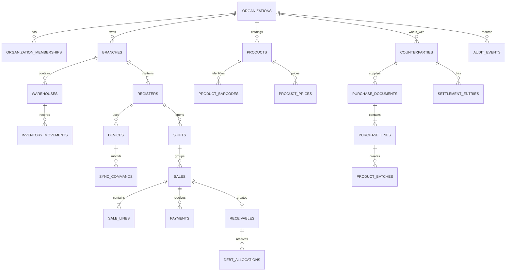
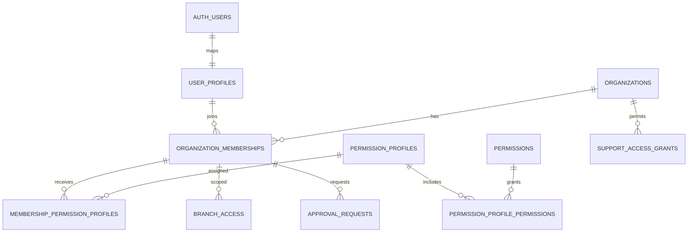
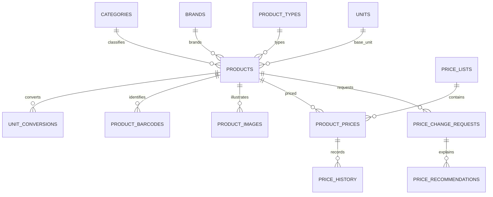
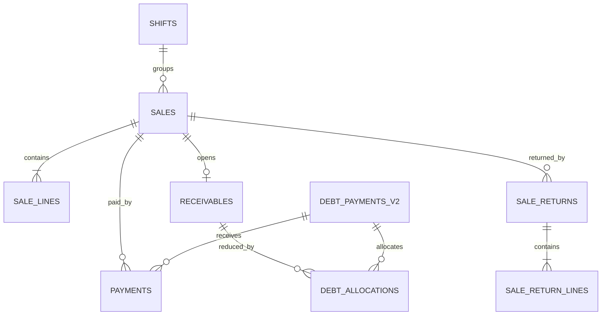
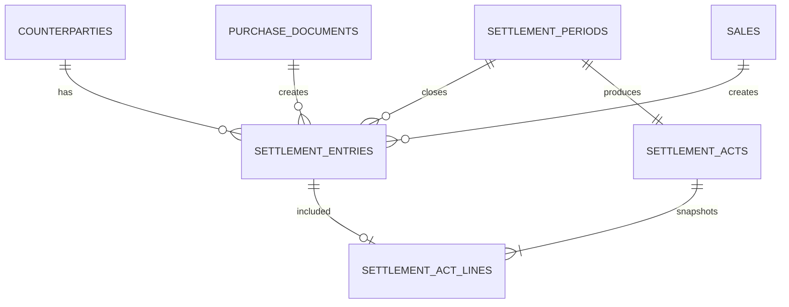
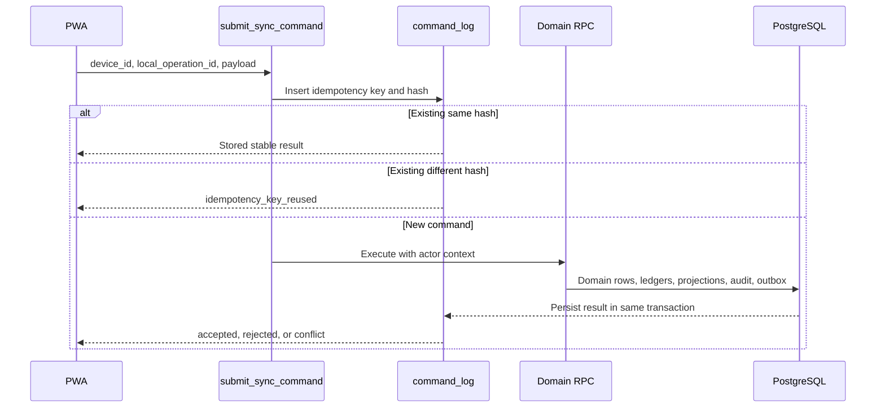
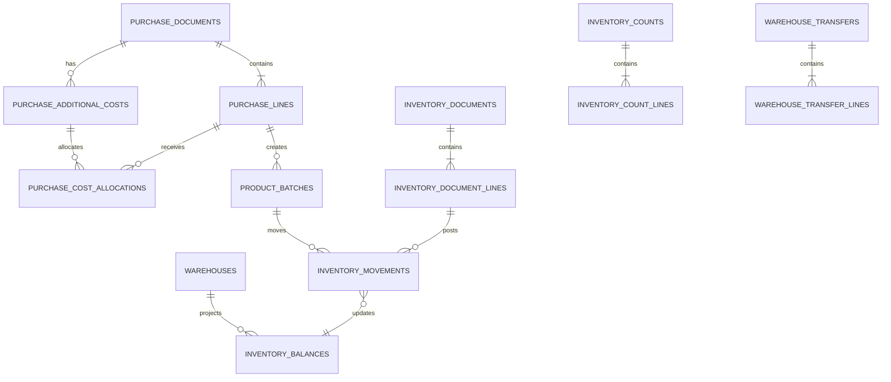

# Market POS V2 — проектирование базы данных

**Статус:** Proposed

**Версия:** 2.0

**Дата:** 25 июля 2026 года

**Источники:** [PRODUCT_SPEC_V2.md](./PRODUCT_SPEC_V2.md), [ARCHITECTURE_V2.md](./ARCHITECTURE_V2.md)

Документ проектирует целевую PostgreSQL-модель до написания новых migrations. Имена, типы, ограничения и транзакционные контракты ниже являются входом для будущих миграций `0007`–`0020`; существующие migrations не изменяются.

## 1. Назначение документа

Цель — дать реализуемую модель данных для Core Pilot Market POS V2: таблицы, владение, RLS, ledgers, projections, транзакционные команды, перенос V1 и проверки целостности.

## 2. Область проектирования

В область входят identity/access, organization structure, catalog, pricing, counterparties, purchases, inventory, sales, payments, debts, settlements, shifts, fiscal records, offline sync, audit, notifications и report projections.

Не входят SQL-реализация, выбор конкретного fiscal provider, бухгалтерский план счетов и удаление legacy-таблиц.



## 3. Принципы модели данных

- PostgreSQL — серверный источник истины; IndexedDB — локальная реплика и очередь.
- Документы порождают append-only проводки; карточки не меняют остатки и деньги.
- Ledger и projection разделены, projection всегда пересчитывается.
- Tenant-owned запись имеет `organization_id` либо достижимую неизменяемую связь с tenant root.
- Проведённые документы не удаляются и не переписываются; исправление — reversal.
- Одна команда фиксирует документ, проводки, audit и outbox одной транзакцией.
- Browser пишет только безопасные drafts/reference data; posting доступен через functions/RPC.
- Новые lifecycle-статусы используют `text + check`, если набор не является стабильным межмодульным типом.

**Общие типы:** деньги `numeric(18,4)`, количество `numeric(18,6)`, будущий курс `numeric(20,10)`, валюта `char(3)`, метки времени `timestamptz`, business date `date`, payload `jsonb`.

## 4. Соглашения по именованию

- таблицы и поля: `snake_case`, таблицы во множественном числе;
- PK: `id`; FK: `<entity>_id`;
- timestamps: `created_at`, `updated_at`, `posted_at`, `reversed_at`, `archived_at`;
- check: `<table>_<rule>_check`;
- unique: `<table>_<scope>_key`;
- index: `<table>_<query>_idx`;
- RLS policy: `<table>_<operation>_<scope>`;
- functions: глагол + объект, например `post_sale`;
- суммы оканчиваются на `_amount`, цены на `_price`, количества на `_quantity`;
- status — lowercase stable code, переводится только в UI.

## 5. Соглашения по UUID

Все business entities используют `uuid primary key default gen_random_uuid()`. Offline-клиент заранее генерирует UUID для документа и `local_operation_id`. Сервер не доверяет клиентскому UUID как доказательству tenant или прав.

Для идемпотентности уникален `(organization_id, device_id, local_operation_id)`. UUID не переиспользуется после reversal или archive.

## 6. Денежные значения

Все финансовые поля — `numeric(18,4)` и имеют `currency_code char(3)`. Между PostgreSQL и TypeScript передаются decimal strings.

Округление:

- строка документа — после quantity × unit price с точностью валюты;
- скидка и налог — по строке, остаток распределяется детерминированно;
- итог — сумма уже округлённых строк и расходов;
- purchase cost allocation — пропорционально выбранной базе, остаток последней строке;
- settlement — только после суммирования ledger;
- reports — агрегируют сохранённые суммы, не пересчитывают документы;
- Core Pilot использует `UZS`, но не hardcodes валюту в таблицах.

## 7. Количества и единицы измерения

Количество — `numeric(18,6)`. Документ хранит введённые unit/quantity, коэффициент и `base_quantity`. `unit_conversions.factor` строго больше нуля. Остаток ведётся только в базовой единице товара.

## 8. Даты, время и business date

События хранятся в UTC как `timestamptz`. `business_date` вычисляется сервером по IANA timezone филиала. Client time хранится отдельно и не определяет порядок проводок. Срок годности — `date`; периоды — полуинтервалы `[starts_at, ends_at)`.

## 9. Организации и tenant isolation

### `organizations`

**Контракт:** модуль Organizations; tenant root. PK `id`; unique `slug`; RLS — active membership, support только по grant; insert platform onboarding, update owner/service command; delete запрещён, archive через `status/archived_at`; создаётся `create_organization`; outbox `OrganizationCreated/Archived`; offline read-only snapshot.

| Поле | PostgreSQL type | Null | Default | Назначение |
| --- | --- | --- | --- | --- |
| id | uuid | нет | gen_random_uuid() | Организация |
| name | text | нет | — | Название |
| slug | text | нет | — | Стабильный tenant key |
| status | text | нет | `'active'` | `active`, `blocked`, `archived` |
| created_at | timestamptz | нет | now() | Создание |
| updated_at | timestamptz | нет | now() | Изменение |
| archived_at | timestamptz | да | — | Архивирование |

Checks: непустые `name/slug`, допустимый status. Индексы: unique lower(slug), `(status)`. FK отсутствуют. Прямой authenticated insert/delete запрещён.

### `organization_settings`

**Контракт:** Organizations; настройки 1:1. PK/FK `organization_id → organizations restrict`; RLS как organization; upsert owner с permission; delete запрещён; источник `create_organization/update_organization_settings`; outbox `OrganizationSettingsChanged`; offline синхронизируются locale/timezone/currency и лимиты.

| Поле | PostgreSQL type | Null | Default | Назначение |
| --- | --- | --- | --- | --- |
| organization_id | uuid | нет | — | PK и владелец |
| currency_code | char(3) | нет | `'UZS'` | Основная валюта |
| timezone | text | нет | `'Asia/Tashkent'` | IANA timezone |
| default_locale | text | нет | `'ru'` | Локаль |
| price_rounding_scale | smallint | нет | `0` | Знаки цены |
| max_offline_hours | integer | нет | `24` | Offline grant |
| settings | jsonb | нет | `'{}'` | Некритичные расширения |
| updated_at | timestamptz | нет | now() | Изменение |

Checks: ISO currency, locale из четырёх поддерживаемых, scales/hours в допустимом диапазоне. Индекс не нужен сверх PK.

## 10. Пользователи и профили

### `user_profiles`

**Контракт:** Identity and Access; профиль Supabase identity. PK `id`, unique `auth_user_id`; FK `auth_user_id → auth.users restrict`; RLS self/authorized management/support grant; update self только безопасные поля, status — admin command; delete запрещён, deactivation через status; источник onboarding/invite; outbox `UserProfileCreated/UserStatusChanged`; offline минимальный actor snapshot.

| Поле | PostgreSQL type | Null | Default | Назначение |
| --- | --- | --- | --- | --- |
| id | uuid | нет | gen_random_uuid() | Profile id |
| auth_user_id | uuid | нет | — | Supabase Auth id |
| full_name | text | нет | — | Имя |
| phone | text | да | — | Телефон |
| email_snapshot | text | да | — | Отображаемый email |
| status | text | нет | `'active'` | `invited`, `active`, `blocked`, `inactive` |
| preferred_locale | text | нет | `'ru'` | Язык |
| created_at | timestamptz | нет | now() | Создание |
| updated_at | timestamptz | нет | now() | Изменение |

Checks: full name not blank, locale supported, status allowed. Индексы: unique `(auth_user_id)`, optional normalized phone. Пароль и password hash отсутствуют.

## 11. Memberships

### `organization_memberships`

**Контракт:** Identity and Access; связь profile↔organization и системная роль. PK `id`; FK profile/org restrict; unique pair; RLS own membership и organization managers; insert/update command-only; delete запрещён, status inactive; source invite/accept/block; outbox `MembershipCreated/StatusChanged`; offline permission snapshot versioned.

| Поле | PostgreSQL type | Null | Default | Назначение |
| --- | --- | --- | --- | --- |
| id | uuid | нет | gen_random_uuid() | Membership |
| organization_id | uuid | нет | — | Tenant |
| user_profile_id | uuid | нет | — | Пользователь |
| system_role | text | нет | — | `owner`, `seller`, `service_admin` |
| status | text | нет | `'invited'` | `invited`, `active`, `blocked`, `inactive` |
| permission_version | bigint | нет | `1` | Версия offline snapshot |
| invited_by | uuid | да | — | Кто пригласил |
| joined_at | timestamptz | да | — | Принятие |
| created_at | timestamptz | нет | now() | Создание |
| updated_at | timestamptz | нет | now() | Изменение |

Unique `(organization_id,user_profile_id)`. Checks role/status. Индексы `(user_profile_id,status)`, `(organization_id,status)`. `service_admin` tenant membership не создаёт скрытый доступ: нужен support grant.

## 12. Роли, permission profiles и permissions

### `permission_profiles`

**Контракт:** Identity and Access; tenant permission bundle. PK `id`; FK organization restrict, null только для system templates; unique active name per tenant; RLS safe select, manage owner; update allowed while not archived; delete запрещён; source permission commands; outbox `PermissionProfileChanged`; offline full assigned profile.

| Поле | PostgreSQL type | Null | Default | Назначение |
| --- | --- | --- | --- | --- |
| id | uuid | нет | gen_random_uuid() | Профиль |
| organization_id | uuid | да | — | Null для system template |
| code | text | нет | — | Stable code |
| name | text | нет | — | Название |
| description | text | да | — | Описание |
| is_system | boolean | нет | false | Системный шаблон |
| archived_at | timestamptz | да | — | Архив |
| created_at | timestamptz | нет | now() | Создание |
| updated_at | timestamptz | нет | now() | Изменение |

### `permissions`

**Контракт:** Identity and Access; глобальный справочник capability codes. PK `id`, unique `code`; read authenticated; writes только deployment migration; update/delete runtime запрещены; не tenant-owned; outbox отсутствует; offline читается как часть permission snapshot.

| Поле | PostgreSQL type | Null | Default | Назначение |
| --- | --- | --- | --- | --- |
| id | uuid | нет | gen_random_uuid() | Permission |
| code | text | нет | — | Например `sales.discount.override` |
| module | text | нет | — | Владеющий модуль |
| description | text | нет | — | Семантика |
| critical | boolean | нет | false | Требует approval |

### `permission_profile_permissions`

**Контракт:** Identity and Access; M:N profile↔permission с лимитами. Composite unique; FK cascade только для непроведённых access configuration; RLS по profile tenant; command-only write; delete разрешён как изменение конфигурации с audit; outbox `PermissionProfileChanged`; offline snapshot.

| Поле | PostgreSQL type | Null | Default | Назначение |
| --- | --- | --- | --- | --- |
| id | uuid | нет | gen_random_uuid() | Связь |
| permission_profile_id | uuid | нет | — | Профиль |
| permission_id | uuid | нет | — | Permission |
| constraints | jsonb | нет | `'{}'` | Лимит скидки, долга и scope |
| created_at | timestamptz | нет | now() | Назначение |

### `membership_permission_profiles`

**Контракт:** Identity and Access; назначения membership↔profile. Unique pair; RLS own read/owner manage; insert/delete command with audit; update не нужен; outbox `PermissionAssigned/Revoked`; offline version bump membership.

| Поле | PostgreSQL type | Null | Default | Назначение |
| --- | --- | --- | --- | --- |
| id | uuid | нет | gen_random_uuid() | Назначение |
| membership_id | uuid | нет | — | Membership |
| permission_profile_id | uuid | нет | — | Профиль |
| assigned_by | uuid | нет | — | Actor membership |
| created_at | timestamptz | нет | now() | Назначение |

Для четырёх таблиц: names/codes nonblank; unique profile `(coalesce(organization_id,nil_uuid),code)` и связи по паре; индексы на все FK. Запрещается назначать tenant profile membership другой организации; это проверяет command и deferred constraint trigger.



## 13. Branch access

### `branch_access`

**Контракт:** Identity and Access; membership scope к branch. Unique pair; FK membership/branch restrict; RLS own read/owner manage; insert/delete commands with audit; update only flags; no archive; outbox `BranchAccessChanged`; offline scope snapshot.

| Поле | PostgreSQL type | Null | Default | Назначение |
| --- | --- | --- | --- | --- |
| id | uuid | нет | gen_random_uuid() | Access |
| organization_id | uuid | нет | — | Tenant guard |
| membership_id | uuid | нет | — | Membership |
| branch_id | uuid | нет | — | Филиал |
| is_primary | boolean | нет | false | Основной филиал |
| created_at | timestamptz | нет | now() | Назначение |

Unique `(membership_id,branch_id)` и partial unique primary per membership. Organization всех ссылок обязана совпадать. Индексы `(branch_id,membership_id)`.

## 14. Подтверждение критических действий

### `approval_requests`

**Контракт:** Identity and Access; approval для конкретной команды. PK id; FK tenant/requester/approver restrict; unique `(organization_id,command_id)` для active request; RLS requester, eligible approver, support grant; insert command, approve/reject constrained update; delete запрещён; retention audit policy; source critical commands; outbox `ApprovalRequested/Resolved`; offline запрос может создаваться, подтверждение требует server.

| Поле | PostgreSQL type | Null | Default | Назначение |
| --- | --- | --- | --- | --- |
| id | uuid | нет | gen_random_uuid() | Request |
| organization_id | uuid | нет | — | Tenant |
| branch_id | uuid | да | — | Scope |
| command_id | uuid | нет | — | Запрашиваемая команда |
| permission_code | text | нет | — | Требуемое право |
| requested_by | uuid | нет | — | Membership |
| status | text | нет | `'pending'` | `pending`, `approved`, `rejected`, `expired` |
| reason | text | нет | — | Обоснование |
| payload_hash | text | нет | — | Неизменность команды |
| approved_by | uuid | да | — | Approver |
| decided_at | timestamptz | да | — | Решение |
| expires_at | timestamptz | нет | — | Срок |
| created_at | timestamptz | нет | now() | Создание |

Checks согласованности status/approver/decided_at. Индексы `(organization_id,status,expires_at)`, `(requested_by,created_at desc)`.

### `support_access_grants`

**Контракт:** Identity and Access; временный явный доступ service admin. PK id; FK organization/admin/approver restrict; RLS owner и указанный service admin; insert/approve/revoke server-only; delete запрещён; retention security policy; source support workflow; outbox `SupportAccessGranted/Revoked`; offline не реплицируется.

| Поле | PostgreSQL type | Null | Default | Назначение |
| --- | --- | --- | --- | --- |
| id | uuid | нет | gen_random_uuid() | Grant |
| organization_id | uuid | нет | — | Tenant |
| service_admin_profile_id | uuid | нет | — | Получатель |
| scopes | text[] | нет | — | Ограниченные права |
| reason | text | нет | — | Причина |
| status | text | нет | `'pending'` | `pending`, `active`, `revoked`, `expired` |
| approved_by_membership_id | uuid | да | — | Owner approver |
| starts_at | timestamptz | нет | now() | Начало |
| expires_at | timestamptz | нет | — | Конец |
| revoked_at | timestamptz | да | — | Отзыв |
| created_at | timestamptz | нет | now() | Создание |

Checks `expires_at > starts_at`, active requires approver. Индекс `(service_admin_profile_id,status,expires_at)`.

### `organization_settings` (migration 0009)

Настройки организации хранят currency, timezone, locale, округление цен, допустимое offline-окно и расширяемый JSON object. Строка создаётся только будущей server command; migration 0009 не выполняет backfill существующих organizations. Browser получает только RLS-защищённый SELECT для active membership или точного support scope `organization.manage`.

## 15. Филиалы

### `branches`

**Контракт:** Branches; торговая точка. PK id; FK organization restrict; unique active code/name; RLS membership+branch access/support grant; owner command writes; delete запрещён, archive; source create/update branch; outbox `BranchCreated/Archived`; offline assigned branch snapshot.

| Поле | PostgreSQL type | Null | Default | Назначение |
| --- | --- | --- | --- | --- |
| id | uuid | нет | gen_random_uuid() | Филиал |
| organization_id | uuid | нет | — | Tenant |
| code | text | нет | — | Код |
| name | text | нет | — | Название |
| address | text | да | — | Адрес |
| phone | text | да | — | Телефон |
| timezone | text | да | — | Override organization |
| status | text | нет | `'active'` | `active`, `inactive`, `archived` |
| legacy_store_id | uuid | да | — | Mapping V1 |
| created_at | timestamptz | нет | now() | Создание |
| updated_at | timestamptz | нет | now() | Изменение |
| archived_at | timestamptz | да | — | Архив |

Indexes `(organization_id,status,name)`, unique active `(organization_id,lower(code))`, unique non-null legacy id. `legacy_store_id` принимается только если `public.stores.organization_id` совпадает с branch tenant; mapping создаётся явно без backfill.

## 16. Склады

### `warehouses`

**Контракт:** Warehouses; место ledger. PK id; FK branch/organization restrict; один primary на branch partial unique; RLS branch access; owner manage configuration; delete запрещён после любых движений, archive; outbox `WarehouseCreated/PrimaryChanged`; offline assigned warehouse.

| Поле | PostgreSQL type | Null | Default | Назначение |
| --- | --- | --- | --- | --- |
| id | uuid | нет | gen_random_uuid() | Склад |
| organization_id | uuid | нет | — | Tenant |
| branch_id | uuid | нет | — | Филиал |
| code | text | нет | — | Код |
| name | text | нет | — | Название |
| is_primary | boolean | нет | false | Основной |
| allow_negative_stock | boolean | нет | false | Исключительная политика |
| status | text | нет | `'active'` | Lifecycle |
| created_at | timestamptz | нет | now() | Создание |
| updated_at | timestamptz | нет | now() | Изменение |
| archived_at | timestamptz | да | — | Архив |

Unique `(organization_id,code)`, partial unique `(branch_id) where is_primary and archived_at is null`; checks tenant branch consistency. Индекс `(branch_id,status)`.

## 17. Кассы

### `registers`

**Контракт:** Registers; логическая POS-касса. PK id; FK branch/default warehouse restrict; unique code per branch; RLS branch access; owner manage; delete запрещён после смены, archive; outbox `RegisterCreated/ConfigurationChanged`; offline assigned register.

| Поле | PostgreSQL type | Null | Default | Назначение |
| --- | --- | --- | --- | --- |
| id | uuid | нет | gen_random_uuid() | Касса |
| organization_id | uuid | нет | — | Tenant |
| branch_id | uuid | нет | — | Филиал |
| default_warehouse_id | uuid | нет | — | Единственный default warehouse |
| code | text | нет | — | Код |
| name | text | нет | — | Название |
| settings | jsonb | нет | `'{}'` | Оплаты и печать |
| status | text | нет | `'active'` | Lifecycle |
| created_at | timestamptz | нет | now() | Создание |
| updated_at | timestamptz | нет | now() | Изменение |
| archived_at | timestamptz | да | — | Архив |

Warehouse обязан принадлежать тому же branch. Unique `(branch_id,code)`. Индексы `(organization_id,branch_id,status)`.

## 18. Устройства

### `devices` (conceptual) / `public.devices_v2` (physical coexistence table)

**Контракт:** Devices; зарегистрированное offline-устройство. Во время coexistence целевой V2-контракт физически хранится в `public.devices_v2`. Существующая `public.devices` остаётся неизменённой legacy V1-таблицей; controlled backfill/cutover и возможное переименование допускаются только отдельной будущей миграцией. PK id; FK organization/branch/register restrict; optional unique `legacy_device_id` mapping к V1; mapping проверяет tenant через `public.devices.store_id → public.stores.organization_id` и создаётся только явно, без backfill. V1 ownership после mapping не может переноситься между tenants; окончательная защита ownership и cutover выполняются будущей controlled migration. Unique fingerprint hash per tenant; RLS own assigned users/owner/support; registration/revoke commands; update только heartbeat/cursor server-side; delete запрещён, revoke; outbox `DeviceRegistered/Revoked`; является offline actor.

| Поле | PostgreSQL type | Null | Default | Назначение |
| --- | --- | --- | --- | --- |
| id | uuid | нет | gen_random_uuid() | Device |
| organization_id | uuid | нет | — | Tenant |
| branch_id | uuid | нет | — | Филиал |
| register_id | uuid | да | — | Касса |
| legacy_device_id | uuid | да | — | Optional mapping к legacy `public.devices` |
| name | text | нет | — | Имя |
| device_type | text | нет | — | `desktop`, `tablet`, `mobile` |
| fingerprint_hash | text | нет | — | Необратимый fingerprint |
| status | text | нет | `'pending'` | `pending`, `trusted`, `revoked` |
| last_sync_cursor | bigint | нет | `0` | Pull cursor |
| last_seen_at | timestamptz | да | — | Heartbeat |
| revoked_at | timestamptz | да | — | Отзыв |
| created_at | timestamptz | нет | now() | Создание |
| updated_at | timestamptz | нет | now() | Изменение |

Unique `(organization_id,fingerprint_hash)`. Checks register belongs branch, revoked status/timestamp. Индексы `(organization_id,branch_id,status)`, `(register_id,status)`.

## 19. Категории

Migration 0010 использует physical coexistence tables `categories_v2`, `brands_v2`, `units_v2`, `product_types_v2` и `products_v2`. Одноимённые legacy tables из migrations 0001/0006 остаются неизменными для V1 UI и документов. Nullable unique mappings tenant-safe и не заполняются автоматически. Compatibility views с занятыми именами не создаются; rename возможен только после controlled backfill, reconciliation и feature cutover.

### `categories` (conceptual) / `public.categories_v2` (physical coexistence table)

**Контракт:** Catalog; tenant hierarchy. PK id; self FK parent set null; unique active normalized name under parent; RLS tenant read, catalog manage write; update draft metadata, delete запрещён, archive; source catalog commands; outbox `CategoryChanged`; offline reference projection.

| Поле | PostgreSQL type | Null | Default | Назначение |
| --- | --- | --- | --- | --- |
| id | uuid | нет | gen_random_uuid() | Категория |
| organization_id | uuid | нет | — | Tenant |
| parent_id | uuid | да | — | Родитель той же organization |
| name | text | нет | — | Название |
| description | text | да | — | Описание |
| sort_order | integer | нет | `0` | Сортировка |
| status | text | нет | `'active'` | `active`, `inactive`, `archived` |
| created_at | timestamptz | нет | now() | Создание |
| updated_at | timestamptz | нет | now() | Изменение |
| archived_at | timestamptz | да | — | Архив |

Indexes `(organization_id,parent_id,sort_order)`, `(organization_id,status,name)`. Trigger/function запрещает цикл и cross-tenant parent.

## 20. Бренды

### `brands` (conceptual) / `public.brands_v2` (physical coexistence table)

**Контракт:** Catalog; бренд организации. PK id; unique active normalized name; RLS tenant read/catalog manage; update allowed, delete запрещён, archive; outbox `BrandChanged`; offline reference.

| Поле | PostgreSQL type | Null | Default | Назначение |
| --- | --- | --- | --- | --- |
| id | uuid | нет | gen_random_uuid() | Бренд |
| organization_id | uuid | нет | — | Tenant |
| name | text | нет | — | Название |
| description | text | да | — | Описание |
| status | text | нет | `'active'` | Lifecycle |
| created_at | timestamptz | нет | now() | Создание |
| updated_at | timestamptz | нет | now() | Изменение |
| archived_at | timestamptz | да | — | Архив |

Partial unique `(organization_id,lower(name)) where archived_at is null`; index status/name.

## 21. Единицы измерения

### `units` (conceptual) / `public.units_v2` (physical coexistence table)

**Контракт:** Catalog; tenant UOM. PK id; unique code and short name; RLS reference read/catalog manage; update label allowed before archive, delete запрещён if referenced; archive; outbox `UnitChanged`; offline reference.

| Поле | PostgreSQL type | Null | Default | Назначение |
| --- | --- | --- | --- | --- |
| id | uuid | нет | gen_random_uuid() | Unit |
| organization_id | uuid | нет | — | Tenant |
| code | text | нет | — | Stable code |
| name | text | нет | — | Название |
| short_name | text | нет | — | Сокращение |
| precision_scale | smallint | нет | `0` | Допустимая точность |
| status | text | нет | `'active'` | Lifecycle |
| created_at | timestamptz | нет | now() | Создание |
| updated_at | timestamptz | нет | now() | Изменение |
| archived_at | timestamptz | да | — | Архив |

Checks scale 0..6; unique `(organization_id,code)` and active lower(short_name).

## 22. Конверсии единиц

### `unit_conversions`

**Контракт:** Catalog; conversion к base unit товара. PK id; FK product/from/to unit restrict; unique triple; RLS product tenant; create/update catalog command, delete только пока нет document reference, иначе inactive; outbox `UnitConversionChanged`; offline full conversion.

| Поле | PostgreSQL type | Null | Default | Назначение |
| --- | --- | --- | --- | --- |
| id | uuid | нет | gen_random_uuid() | Conversion |
| organization_id | uuid | нет | — | Tenant |
| product_id | uuid | нет | — | Товар |
| from_unit_id | uuid | нет | — | Вводимая единица |
| to_unit_id | uuid | нет | — | Base unit |
| factor | numeric(20,10) | нет | — | Множитель |
| status | text | нет | `'active'` | Lifecycle |
| created_at | timestamptz | нет | now() | Создание |
| updated_at | timestamptz | нет | now() | Изменение |

Checks factor > 0, from != to, tenant consistency. Unique `(product_id,from_unit_id,to_unit_id)`. После использования изменение создаёт новую version, а документ хранит snapshot factor.

## 23. Типы товаров

### `product_types` (conceptual) / `public.product_types_v2` (physical coexistence table)

**Контракт:** Catalog; поведение товара. PK id; unique code/name; RLS reference read/manage; update/archiving, delete запрещён; outbox `ProductTypeChanged`; offline reference.

| Поле | PostgreSQL type | Null | Default | Назначение |
| --- | --- | --- | --- | --- |
| id | uuid | нет | gen_random_uuid() | Тип |
| organization_id | uuid | нет | — | Tenant |
| code | text | нет | — | Stable code |
| name | text | нет | — | Название |
| description | text | да | — | Описание |
| behavior | jsonb | нет | `'{}'` | Weight/expiry flags defaults |
| status | text | нет | `'active'` | Lifecycle |
| created_at | timestamptz | нет | now() | Создание |
| updated_at | timestamptz | нет | now() | Изменение |
| archived_at | timestamptz | да | — | Архив |

Unique `(organization_id,code)` and active name; behavior schema validated by application and constrained keys.

## 24. Товары

### `products` (conceptual) / `public.products_v2` (physical coexistence table)

**Контракт:** Catalog; identity товара, без остатка и цены. PK id; FK category/brand/type/base unit restrict or set null only for optional references; unique SKU; RLS tenant safe read/catalog manage; update descriptive fields, delete запрещён, archive; source `create_or_update_product`; outbox `ProductCreated/Changed/Archived`; offline primary catalog projection.

| Поле | PostgreSQL type | Null | Default | Назначение |
| --- | --- | --- | --- | --- |
| id | uuid | нет | gen_random_uuid() | Товар |
| organization_id | uuid | нет | — | Tenant |
| sku | text | да | — | Внутренний код |
| name | text | нет | — | Название |
| category_id | uuid | да | — | Категория |
| brand_id | uuid | да | — | Бренд |
| product_type_id | uuid | да | — | Тип |
| base_unit_id | uuid | нет | — | Базовая единица |
| description | text | да | — | Описание |
| is_expirable | boolean | нет | false | Партии по срокам |
| is_weighted | boolean | нет | false | Весовой товар |
| min_quantity | numeric(18,6) | нет | `0` | Рекомендация, не остаток |
| status | text | нет | `'active'` | Lifecycle |
| version | bigint | нет | `1` | Optimistic lock |
| created_at | timestamptz | нет | now() | Создание |
| updated_at | timestamptz | нет | now() | Изменение |
| archived_at | timestamptz | да | — | Архив |

Checks min >= 0 and status. Partial unique `(organization_id,sku)` where sku not null and not archived. Index active search with trigram/full text. Архивный product отвергается posting functions.

## 25. Штрихкоды

### `product_barcodes`

**Контракт:** Catalog; все баркоды. PK id; FK product restrict; уникален `(organization_id,normalized_barcode)`; RLS catalog read/manage; update запрещён после использования, замена archive+insert; delete только неиспользованный draft, иначе archive; outbox `BarcodeAssigned/Archived`; offline indexed lookup.

| Поле | PostgreSQL type | Null | Default | Назначение |
| --- | --- | --- | --- | --- |
| id | uuid | нет | gen_random_uuid() | Barcode row |
| organization_id | uuid | нет | — | Tenant |
| product_id | uuid | нет | — | Товар |
| barcode | text | нет | — | Исходное значение |
| normalized_barcode | text | нет | — | Lookup value |
| is_primary | boolean | нет | false | Основной |
| status | text | нет | `'active'` | Lifecycle |
| created_at | timestamptz | нет | now() | Создание |
| archived_at | timestamptz | да | — | Архив |

Unique active barcode per organization and one primary per product. Checks nonblank. Barcode lookup index является обязательным POS path.

## 26. Изображения товаров

### `product_images`

**Контракт:** Catalog/Storage; metadata объекта. PK id; FK product restrict; unique storage path; RLS tenant read signed URL/manage; update sort/primary only, delete metadata после Storage retention job, archive first; outbox `ProductImageChanged`; offline thumbnail URL optional.

| Поле | PostgreSQL type | Null | Default | Назначение |
| --- | --- | --- | --- | --- |
| id | uuid | нет | gen_random_uuid() | Image |
| organization_id | uuid | нет | — | Tenant |
| product_id | uuid | нет | — | Товар |
| storage_bucket | text | нет | — | Private bucket |
| storage_path | text | нет | — | Object key |
| content_type | text | нет | — | MIME |
| size_bytes | bigint | нет | — | Размер |
| sort_order | integer | нет | `0` | Порядок |
| is_primary | boolean | нет | false | Основное |
| created_at | timestamptz | нет | now() | Создание |
| archived_at | timestamptz | да | — | Архив |

Checks size > 0, approved MIME. Unique bucket/path; one active primary per product.

## 27. Прайс-листы

### `price_lists`

**Контракт:** Pricing; область цены. PK id; FK organization, optional branch; unique code per tenant; RLS safe read/pricing manage; update metadata, delete запрещён, archive; outbox `PriceListChanged`; offline assigned lists. `currency_code` immutable после создания: для другой валюты создаётся новый price list, поэтому существующие price versions всегда сохраняют соответствие валюте своего списка.

| Поле | PostgreSQL type | Null | Default | Назначение |
| --- | --- | --- | --- | --- |
| id | uuid | нет | gen_random_uuid() | Price list |
| organization_id | uuid | нет | — | Tenant |
| branch_id | uuid | да | — | Branch override |
| code | text | нет | — | Stable code |
| name | text | нет | — | Название |
| currency_code | char(3) | нет | — | Валюта |
| is_default | boolean | нет | false | Default scope |
| status | text | нет | `'active'` | Lifecycle |
| created_at | timestamptz | нет | now() | Создание |
| archived_at | timestamptz | да | — | Архив |

Unique `(organization_id,code)`, partial unique default per scope. Branch tenant consistency.

## 28. Продажные цены

### `product_prices`

**Контракт:** Pricing; подтверждённые версии sale price. Все product FK направлены только на физическую `public.products_v2`. PK id; FK product/list/request restrict; no overlapping active periods; один request создаёт максимум одну confirmed price row. RLS browser safe read, writes only controlled pricing functions. Business data append-only: единственный допустимый UPDATE закрывает `valid_to` из NULL в timestamp внутри `v2_confirm_price_change`; correction closes interval and inserts row. Delete запрещён; outbox `SalePriceConfirmed`; offline versioned price projection.

| Поле | PostgreSQL type | Null | Default | Назначение |
| --- | --- | --- | --- | --- |
| id | uuid | нет | gen_random_uuid() | Price version |
| organization_id | uuid | нет | — | Tenant |
| price_list_id | uuid | нет | — | Прайс-лист |
| product_id | uuid | нет | — | Товар |
| amount | numeric(18,4) | нет | — | Цена |
| currency_code | char(3) | нет | — | Валюта |
| valid_from | timestamptz | нет | — | Начало |
| valid_to | timestamptz | да | — | Исключающий конец |
| confirmed_by | uuid | нет | — | Membership |
| price_change_request_id | uuid | да | — | Основание |
| created_at | timestamptz | нет | now() | Создание |

Checks amount >= 0, valid_to > valid_from. Exclusion constraint по product/list/tstzrange не допускает две действующие цены. Индекс active lookup `(price_list_id,product_id,valid_from desc)`.

## 29. История цен

### `price_history`

**Контракт:** Pricing append-only audit ledger; PK id; FK product/list/source restrict; RLS owner/pricing read, insert только pricing command; update/delete запрещены; reversal — новое событие; outbox не требуется, сама запись создаётся с price event; offline только current price, история owner-on-demand.

| Поле | PostgreSQL type | Null | Default | Назначение |
| --- | --- | --- | --- | --- |
| id | uuid | нет | gen_random_uuid() | History event |
| organization_id | uuid | нет | — | Tenant |
| product_price_id | uuid | нет | — | Подтверждённая версия `product_prices` |
| price_list_id | uuid | нет | — | List |
| product_id | uuid | нет | — | Product |
| old_amount | numeric(18,4) | да | — | Было |
| new_amount | numeric(18,4) | нет | — | Стало |
| reason_code | text | нет | — | Причина |
| source_type | text | нет | — | purchase/manual/import |
| source_id | uuid | да | — | Документ |
| changed_by | uuid | нет | — | Actor |
| created_at | timestamptz | нет | now() | Время |

Checks nonnegative values. Индекс `(organization_id,product_id,created_at desc)`. Reconciliation сверяет current product_prices с последним history event.

## 30. Запросы и рекомендации изменения цены

### `price_change_requests`

**Контракт:** Pricing; workflow подтверждения. PK id; FK tenant/product/list/source; unique active request per source/product; RLS owner/pricing; create by purchase/manual, decision constrained update; delete запрещён, terminal retention; outbox `PriceChangeRequested/Resolved`; offline owner notification, seller read current only.

| Поле | PostgreSQL type | Null | Default | Назначение |
| --- | --- | --- | --- | --- |
| id | uuid | нет | gen_random_uuid() | Request |
| organization_id | uuid | нет | — | Tenant |
| product_id | uuid | нет | — | Product |
| price_list_id | uuid | нет | — | List |
| current_amount | numeric(18,4) | да | — | Текущая цена; NULL означает initial price |
| requested_amount | numeric(18,4) | нет | — | Предложение |
| source_type | text | нет | — | Причина |
| source_id | uuid | да | — | Приход |
| status | text | нет | `'pending'` | pending/confirmed/rejected/expired |
| requested_by | uuid | нет | — | Actor/system membership |
| decided_by | uuid | да | — | Approver |
| decided_at | timestamptz | да | — | Решение |
| created_at | timestamptz | нет | now() | Создание |

### `price_recommendations`

**Контракт:** Pricing; расчётная рекомендация, не действующая цена. PK id; FK request/product; RLS owner/pricing; insert server calculation, immutable; delete retention allowed only after terminal request; outbox `SalePriceRecommended`; offline owner read.

| Поле | PostgreSQL type | Null | Default | Назначение |
| --- | --- | --- | --- | --- |
| id | uuid | нет | gen_random_uuid() | Recommendation |
| organization_id | uuid | нет | — | Tenant |
| price_change_request_id | uuid | нет | — | Request |
| product_id | uuid | нет | — | Product |
| purchase_price | numeric(18,4) | нет | — | Новая закупочная |
| previous_purchase_price | numeric(18,4) | да | — | Предыдущая |
| margin_percent | numeric(9,4) | да | — | Наценка |
| recommended_amount | numeric(18,4) | нет | — | Рекомендация |
| calculation | jsonb | нет | `'{}'` | Объяснение |
| created_at | timestamptz | нет | now() | Создание |

Checks nonnegative. Request status consistency and indexes `(organization_id,status,created_at)` and `(product_id,created_at desc)`.

### Coexistence pricing V1/V2

Migration `0011_v2_pricing.sql` не изменяет legacy `public.products` и
`public.products.sale_price`. V1 UI продолжает читать и записывать legacy price
своим существующим путём. Pricing V2 ссылается только на `public.products_v2`;
backfill, trigger-based dual-write и compatibility views отсутствуют.
Сопоставление и переключение чтения выполняются только как controlled cutover
после migrations 0019–0020.

Все runtime mutations pricing выполняются только controlled RPC при активном
transaction-local context `market_pos.pricing_command`. Даже trusted backend не
может напрямую вставлять requests, confirmed prices или history без этого
context; browser table writes также закрыты. `source_type` описывает происхождение
(`initial`, `manual`, `purchase`, `import`, `system`) и не является sentinel
наличия предыдущей цены. Первая цена допускает любой из этих source types,
а `old_amount = NULL` определяется фактическим отсутствием предыдущей
`product_prices` version. Для последующих версий `old_amount` обязан точно
совпадать с amount предыдущей версии.



## 31. Контрагенты

### `counterparties`

**Контракт:** Counterparties; единая party. PK id; unique optional tax/registration id; RLS tenant members by permission; create/update permitted, delete запрещён, archive; source counterparty commands/POS quick customer; outbox `CounterpartyChanged`; offline minimal customer projection, suppliers owner-side.

| Поле | PostgreSQL type | Null | Default | Назначение |
| --- | --- | --- | --- | --- |
| id | uuid | нет | gen_random_uuid() | Counterparty |
| organization_id | uuid | нет | — | Tenant |
| display_name | text | нет | — | Имя |
| legal_name | text | да | — | Юр. имя |
| tax_id | text | да | — | ИНН |
| notes | text | да | — | Заметка |
| status | text | нет | `'active'` | Lifecycle |
| created_at | timestamptz | нет | now() | Создание |
| updated_at | timestamptz | нет | now() | Изменение |
| archived_at | timestamptz | да | — | Архив |

Partial unique normalized tax id. Index active name/trigram. Архивный party не используется в новых документах.

## 32. Роли контрагента

### `counterparty_roles`

**Контракт:** Counterparties; supplier/customer markers. Unique pair; RLS as party; insert/delete role command with audit, update absent; physical delete allowed only before references, otherwise `ended_at`; outbox `CounterpartyRoleAdded/Ended`; offline relevant roles.

| Поле | PostgreSQL type | Null | Default | Назначение |
| --- | --- | --- | --- | --- |
| id | uuid | нет | gen_random_uuid() | Role row |
| organization_id | uuid | нет | — | Tenant |
| counterparty_id | uuid | нет | — | Party |
| role_code | text | нет | — | `supplier`, `customer` |
| started_at | timestamptz | нет | now() | Начало |
| ended_at | timestamptz | да | — | Завершение |

Partial unique active `(counterparty_id,role_code)`. Checks role code.

## 33. Контактные данные и адреса

### `counterparty_contacts`

**Контракт:** Counterparties; multiple contacts. RLS by party; CRUD while party active; delete allowed only non-historical contact, otherwise archive; no financial ownership; outbox `CounterpartyChanged`; offline selected phones.

| Поле | PostgreSQL type | Null | Default | Назначение |
| --- | --- | --- | --- | --- |
| id | uuid | нет | gen_random_uuid() | Contact |
| organization_id | uuid | нет | — | Tenant |
| counterparty_id | uuid | нет | — | Party |
| contact_type | text | нет | — | phone/email/person |
| value | text | нет | — | Значение |
| label | text | да | — | Подпись |
| is_primary | boolean | нет | false | Основной |
| created_at | timestamptz | нет | now() | Создание |
| archived_at | timestamptz | да | — | Архив |

### `counterparty_addresses`

**Контракт:** Counterparties; delivery/legal addresses. Same RLS/lifecycle; outbox `CounterpartyChanged`; offline only needed delivery address.

| Поле | PostgreSQL type | Null | Default | Назначение |
| --- | --- | --- | --- | --- |
| id | uuid | нет | gen_random_uuid() | Address |
| organization_id | uuid | нет | — | Tenant |
| counterparty_id | uuid | нет | — | Party |
| address_type | text | нет | — | legal/delivery/other |
| address_text | text | нет | — | Адрес |
| metadata | jsonb | нет | `'{}'` | Geo/parts |
| is_primary | boolean | нет | false | Основной |
| created_at | timestamptz | нет | now() | Создание |
| archived_at | timestamptz | да | — | Архив |

### `counterparty_credit_settings`

**Контракт:** Counterparties/Debts; tenant credit policy 1:1. PK/FK party; RLS owner full, seller reads effective limits; update owner command with audit; delete запрещён, disable; outbox `CreditTermsChanged`; offline signed policy snapshot.

| Поле | PostgreSQL type | Null | Default | Назначение |
| --- | --- | --- | --- | --- |
| counterparty_id | uuid | нет | — | PK |
| organization_id | uuid | нет | — | Tenant |
| credit_enabled | boolean | нет | false | Разрешение |
| credit_limit_amount | numeric(18,4) | нет | `0` | Лимит |
| max_due_days | integer | нет | `0` | Срок |
| currency_code | char(3) | нет | — | Валюта |
| updated_by | uuid | нет | — | Actor |
| updated_at | timestamptz | нет | now() | Изменение |

Checks nonnegative. Partial unique primary contacts/addresses. Index normalized contact value for customer lookup.

### Counterparties authorization и coexistence

Физические имена `public.counterparties`, `counterparty_roles`,
`counterparty_contacts`, `counterparty_addresses` и
`counterparty_credit_settings` свободны и используются без суффикса `_v2`.
Legacy `suppliers` и `customers` остаются неизменными; nullable unique mappings
`legacy_supplier_id` и `legacy_customer_id` не заполняются автоматически.
Существующие FK `product_batches → suppliers` и
`sales/debt_entries/debt_payments → customers` сохраняются. Migration 0013
ссылается только на `public.counterparties`; backfill, reconciliation и cutover
выполняются в migrations 0019–0020.

Permission registry модуля `counterparties` содержит:
`counterparties.view`, `counterparties.manage`,
`counterparties.customer.view`, `counterparties.customer.create`,
`counterparties.credit.view` и `counterparties.credit.manage`. Owner template
получает все шесть прав. Seller template получает только customer view/create и
credit view: seller читает активных customers через безопасный
`v2_customer_directory`, который возвращает только display name, status и
primary phone. Raw party, role, contact и address rows требуют полного
`counterparties.view/manage`; legal name, tax id, notes, адреса и произвольные
контакты seller не раскрываются. Credit policy отделена от
обычных debt overrides. Расширение `seller_default` увеличивает
`permission_version` ровно на один для active memberships с этим template,
инвалидируя offline/client permission cache; inactive и несвязанные memberships
не изменяются.

Все runtime mutations выполняются security-definer RPC внутри
transaction-local `market_pos.counterparty_command`; direct browser и trusted
backend table writes без context запрещены. POS quick customer принимает только
display name и optional phone, создаёт только customer role и не принимает
supplier role, tax/legal data, notes, credit policy или legacy mappings.
Support grants дают только exact-scope SELECT и никогда не разрешают mutation
RPC.

Contact/address RPC проверяют переданный child id вместе с organization и
counterparty parent под row lock; cross-tenant и cross-party id substitution
запрещены. `contact_type` и `address_type` immutable. Archived children terminal,
а archived counterparty не допускает child create/update. Команды не используют
cross-scope `ON CONFLICT(id) DO UPDATE`; archive является односторонним controlled
переходом и не допускает восстановления.

## 34. Документы закупки

### `purchase_documents`

**Контракт:** Purchases; header документа. PK id; FK tenant/branch/warehouse/counterparty/device/reversal restrict; unique document number and local operation key; RLS safe select by branch, draft insert/update by permission, posting command only; posted update/delete forbidden; reversal creates new document; outbox `PurchasePosted/Reversed`; offline quick purchase allowed by policy.

| Поле | PostgreSQL type | Null | Default | Назначение |
| --- | --- | --- | --- | --- |
| id | uuid | нет | gen_random_uuid() | Purchase |
| organization_id | uuid | нет | — | Tenant |
| branch_id | uuid | нет | — | Филиал |
| warehouse_id | uuid | нет | — | Склад |
| counterparty_id | uuid | да | — | Supplier |
| document_number | text | нет | — | Номер |
| business_date | date | нет | — | Операционная дата |
| status | text | нет | `'draft'` | draft/posted/reversed/cancelled |
| currency_code | char(3) | нет | — | Валюта |
| subtotal_amount | numeric(18,4) | нет | `0` | Строки |
| additional_cost_amount | numeric(18,4) | нет | `0` | Расходы |
| total_amount | numeric(18,4) | нет | `0` | Итог |
| device_id | uuid | да | — | Offline device |
| local_operation_id | uuid | да | — | Idempotency |
| client_created_at | timestamptz | да | — | Client time |
| posted_at | timestamptz | да | — | Проведение |
| posted_by | uuid | да | — | Actor |
| reversal_of_id | uuid | да | — | Исходный документ |
| created_at | timestamptz | нет | now() | Создание |

Checks totals >=0 and status timestamps. Unique `(organization_id,document_number)` and `(organization_id,device_id,local_operation_id)` where non-null. Index branch/business date/status.

## 35. Строки закупки

### `purchase_lines`

**Контракт:** Purchases; immutable after post. PK id; FK purchase/product/unit restrict; unique line number; RLS via header; CRUD draft only; delete posted forbidden; reversal lines in reversal document; no own archive; outbox through header; offline embedded in command.

| Поле | PostgreSQL type | Null | Default | Назначение |
| --- | --- | --- | --- | --- |
| id | uuid | нет | gen_random_uuid() | Line |
| organization_id | uuid | нет | — | Tenant |
| purchase_document_id | uuid | нет | — | Header |
| line_number | integer | нет | — | Порядок |
| product_id | uuid | нет | — | Product |
| unit_id | uuid | нет | — | Введённая unit |
| quantity | numeric(18,6) | нет | — | Введено |
| unit_factor | numeric(20,10) | нет | — | Snapshot conversion |
| base_quantity | numeric(18,6) | нет | — | Для склада |
| unit_purchase_price | numeric(18,4) | нет | — | Закупочная |
| line_amount | numeric(18,4) | нет | — | Округлённая сумма |
| expiration_date | date | да | — | Срок |
| supplier_batch_number | text | да | — | Номер поставщика |
| created_at | timestamptz | нет | now() | Создание |

Checks quantities/factor >0, prices >=0. Unique `(purchase_document_id,line_number)`. Index product and document.

## 36. Дополнительные расходы закупки

### `purchase_additional_costs`

**Контракт:** Purchases; freight/tax/etc. Draft CRUD, immutable after post; RLS via header; delete posted forbidden; outbox via purchase; offline embedded.

| Поле | PostgreSQL type | Null | Default | Назначение |
| --- | --- | --- | --- | --- |
| id | uuid | нет | gen_random_uuid() | Cost |
| organization_id | uuid | нет | — | Tenant |
| purchase_document_id | uuid | нет | — | Purchase |
| cost_type | text | нет | — | Freight/tax/other |
| amount | numeric(18,4) | нет | — | Сумма |
| currency_code | char(3) | нет | — | Валюта |
| allocation_method | text | нет | — | amount/quantity/weight/manual |
| created_at | timestamptz | нет | now() | Создание |

### `purchase_cost_allocations`

**Контракт:** Purchases; immutable allocation cost→line. Создаётся `post_purchase`; browser write/update/delete запрещены; RLS owner read; reversal через reversal purchase; reconciliation sum to cost.

| Поле | PostgreSQL type | Null | Default | Назначение |
| --- | --- | --- | --- | --- |
| id | uuid | нет | gen_random_uuid() | Allocation |
| organization_id | uuid | нет | — | Tenant |
| purchase_additional_cost_id | uuid | нет | — | Cost |
| purchase_line_id | uuid | нет | — | Line |
| allocated_amount | numeric(18,4) | нет | — | Распределено |
| created_at | timestamptz | нет | now() | Создание |

Unique pair, checks positive; sum allocations equals cost at posting.

## 37. Партии товаров

### `product_batches` (physical `public.product_batches_v2` during coexistence)

**Контракт:** Inventory; lot created by posted purchase line, not document itself. PK id; FK warehouse/product/purchase line restrict; unique warehouse/batch code; RLS safe inventory read, insert only posting functions; update only controlled lifecycle metadata; delete forbidden, closed/expired statuses; outbox `BatchCreated/Depleted`; offline stock projection.

Legacy `public.product_batches` остаётся V1-таблицей со ссылками на
`stores`, `products` и `suppliers`. Migration 0013 создаёт только
`public.product_batches_v2`; legacy table, её FK, текущий V1 UI/API и данные не
изменяются и не получают dual-write/backfill. Controlled rename допустим только
после backfill, reconciliation и feature cutover.

| Поле | PostgreSQL type | Null | Default | Назначение |
| --- | --- | --- | --- | --- |
| id | uuid | нет | gen_random_uuid() | Batch |
| organization_id | uuid | нет | — | Tenant |
| warehouse_id | uuid | нет | — | Warehouse |
| product_id | uuid | нет | — | Product |
| purchase_line_id | uuid | нет | — | Source |
| batch_code | text | нет | — | Internal code |
| supplier_batch_number | text | да | — | External |
| received_date | date | нет | — | Приход |
| expiration_date | date | да | — | Срок |
| initial_quantity | numeric(18,6) | нет | — | Initial |
| purchase_unit_cost | numeric(18,4) | нет | — | Purchase + allocated cost |
| currency_code | char(3) | нет | — | Валюта |
| status | text | нет | `'open'` | open/depleted/blocked/reversed |
| created_at | timestamptz | нет | now() | Создание |

Закупочная цена не является sale price. Current quantity не хранится здесь как ledger truth. Index FEFO `(warehouse_id,product_id,expiration_date)` where open.

## 38. Документы ежедневной поставки

### `daily_delivery_templates`

**Контракт:** Purchases; reusable draft pattern. Tenant/branch/counterparty scoped; owner manage; update/delete allowed only template, archive; outbox `DailyDeliveryTemplateChanged`; offline available.

| Поле | PostgreSQL type | Null | Default | Назначение |
| --- | --- | --- | --- | --- |
| id | uuid | нет | gen_random_uuid() | Template |
| organization_id | uuid | нет | — | Tenant |
| branch_id | uuid | нет | — | Branch |
| counterparty_id | uuid | нет | — | Supplier/customer |
| name | text | нет | — | Название |
| default_lines | jsonb | нет | `'[]'` | Product/unit template |
| status | text | нет | `'active'` | Lifecycle |
| created_at | timestamptz | нет | now() | Создание |
| updated_at | timestamptz | нет | now() | Изменение |
| archived_at | timestamptz | да | — | Архив |

### `daily_delivery_documents`

**Контракт:** Purchases; отдельный daily wrapper 1:1 к purchase. PK id; FK template/purchase unique; created by `post_daily_delivery`; immutable, no delete, reversal follows purchase; RLS branch; outbox `DailyDeliveryPosted`; offline sync metadata inherited from purchase.

| Поле | PostgreSQL type | Null | Default | Назначение |
| --- | --- | --- | --- | --- |
| id | uuid | нет | gen_random_uuid() | Daily doc |
| organization_id | uuid | нет | — | Tenant |
| template_id | uuid | да | — | Template |
| purchase_document_id | uuid | нет | — | Posted purchase |
| delivery_date | date | нет | — | Отдельный день |
| sequence_number | integer | нет | — | Номер в день |
| created_at | timestamptz | нет | now() | Создание |

Unique purchase and `(counterparty/template,delivery_date,sequence_number)` as applicable.

## 39. Складские документы

### `inventory_documents`

**Контракт:** Inventory; header adjustment/write-off/transfer receipt/opening/reversal. PK id; FK tenant/warehouse/device/reversal; RLS branch safe read, drafts by permission, post RPC; posted immutable/delete forbidden; outbox `InventoryDocumentPosted/Reversed`; offline only allowed command types.

| Поле | PostgreSQL type | Null | Default | Назначение |
| --- | --- | --- | --- | --- |
| id | uuid | нет | gen_random_uuid() | Document |
| organization_id | uuid | нет | — | Tenant |
| branch_id | uuid | нет | — | Branch |
| warehouse_id | uuid | нет | — | Primary scope |
| document_type | text | нет | — | opening/adjustment/write_off/transfer/reversal |
| document_number | text | нет | — | Number |
| business_date | date | нет | — | Date |
| status | text | нет | `'draft'` | draft/posted/reversed/cancelled |
| reason_code | text | нет | — | Reason |
| device_id | uuid | да | — | Offline |
| local_operation_id | uuid | да | — | Idempotency |
| posted_by | uuid | да | — | Actor |
| posted_at | timestamptz | да | — | Posted |
| reversal_of_id | uuid | да | — | Original |
| created_at | timestamptz | нет | now() | Created |

### `inventory_document_lines`

**Контракт:** Inventory; draft lines and immutable posted source. RLS via header; CRUD draft, no delete after post; outbox through header; offline embedded.

| Поле | PostgreSQL type | Null | Default | Назначение |
| --- | --- | --- | --- | --- |
| id | uuid | нет | gen_random_uuid() | Line |
| organization_id | uuid | нет | — | Tenant |
| inventory_document_id | uuid | нет | — | Header |
| line_number | integer | нет | — | Order |
| product_id | uuid | нет | — | Product |
| batch_id | uuid | да | — | Batch |
| unit_id | uuid | нет | — | Unit |
| quantity | numeric(18,6) | нет | — | Entered |
| unit_factor | numeric(20,10) | нет | — | Snapshot |
| base_quantity_delta | numeric(18,6) | нет | — | Signed change |
| comment | text | да | — | Reason details |

Unique document/line. Checks nonzero delta. Header numbering indexes.

### `warehouse_transfers`

**Контракт:** Inventory; отдельный header межскладского перемещения. Transfer не
является `inventory_documents.document_type`: source и destination warehouses
проверяются в одном tenant/branch, posting создаёт равные по модулю out/in
movements, reversal создаёт новый transfer. Draft mutable; posted/reversed
immutable; idempotency scoped по organization/device/local operation.

### `warehouse_transfer_lines`

Строка ссылается только на `products_v2`, `units_v2` и optional source
`product_batches_v2`. Поскольку batch физически warehouse-scoped, source batch
используется только для outgoing movement; incoming movement обновляет aggregate
destination balance без ложной cross-warehouse batch-ссылки. Оба balance scopes
блокируются детерминированно.

## 40. Складские движения

### `inventory_movements`

**Контракт:** Inventory append-only source of truth. PK id; all FK restrict; unique `(source_type,source_line_id,movement_role)`; RLS safe projection-oriented select, direct browser writes forbidden; update/delete forbidden; reversal is opposite row linked by `reversal_of_id`; source posting commands; outbox `StockMoved`; offline pull projection, not raw full ledger by default.

| Поле | PostgreSQL type | Null | Default | Назначение |
| --- | --- | --- | --- | --- |
| id | uuid | нет | gen_random_uuid() | Movement |
| organization_id | uuid | нет | — | Tenant |
| branch_id | uuid | нет | — | Branch |
| warehouse_id | uuid | нет | — | Warehouse |
| product_id | uuid | нет | — | Product |
| batch_id | uuid | да | — | Batch |
| movement_type | text | нет | — | purchase/sale/return/transfer/etc |
| quantity_delta | numeric(18,6) | нет | — | Signed base quantity |
| source_document_type | text | нет | — | Source kind |
| source_document_id | uuid | нет | — | Source header |
| source_line_id | uuid | нет | — | Source line |
| movement_role | text | нет | `'primary'` | out/in/reversal |
| reversal_of_id | uuid | да | — | Original movement |
| command_id | uuid | нет | — | Command log |
| created_by | uuid | нет | — | Actor membership |
| created_at | timestamptz | нет | now() | Ledger time |

Checks delta != 0, reversal opposite sign/same product/warehouse. Index `(warehouse_id,product_id,batch_id,created_at,id)`, source lookup, organization created_at.

Current projection = sum deltas; reconciliation recomputes balances and reports any difference. Ошибочная запись исправляется только reversal + correct document.

## 41. Проекция остатков

### `inventory_balances`

**Контракт:** Inventory mutable projection, не ledger. Composite logical key warehouse/product/batch; FK restrict; RLS browser safe assigned warehouse select; writes only posting/rebuild functions; delete only rebuild maintenance; no archive; no outbox independent; offline primary stock source.

| Поле | PostgreSQL type | Null | Default | Назначение |
| --- | --- | --- | --- | --- |
| id | uuid | нет | gen_random_uuid() | Projection row |
| organization_id | uuid | нет | — | Tenant |
| warehouse_id | uuid | нет | — | Warehouse |
| product_id | uuid | нет | — | Product |
| batch_id | uuid | да | — | Null aggregate or batch row |
| on_hand_quantity | numeric(18,6) | нет | `0` | Physical ledger sum |
| reserved_quantity | numeric(18,6) | нет | `0` | Reservations |
| available_quantity | numeric(18,6) | нет | `0` | on_hand-reserved |
| last_movement_id | uuid | да | — | Cursor |
| version | bigint | нет | `0` | Optimistic lock |
| updated_at | timestamptz | нет | now() | Projection time |

Unique `(warehouse_id,product_id,batch_id)` with nulls not distinct. Checks reserved >=0, available = on_hand-reserved; negative on_hand denied unless warehouse policy.

При двух продажах `post_sale` locks aggregate balance rows in deterministic product order, verifies available, allocates FEFO batch rows, inserts movements and increments projection/version. Вторая transaction ждёт lock и видит новый остаток; при недостатке получает `insufficient_stock`, если negative policy не разрешена.

## 42. Инвентаризация

### `inventory_counts`

**Контракт:** Inventory; count session/document. RLS branch; draft counting updates, posting command freezes; delete only empty draft, posted forbidden; reversal adjustment; outbox `InventoryCountPosted`; offline count may sync with version conflict.

| Поле | PostgreSQL type | Null | Default | Назначение |
| --- | --- | --- | --- | --- |
| id | uuid | нет | gen_random_uuid() | Count |
| organization_id | uuid | нет | — | Tenant |
| warehouse_id | uuid | нет | — | Warehouse |
| business_date | date | нет | — | Date |
| status | text | нет | `'draft'` | draft/counting/posted/cancelled |
| snapshot_cursor | bigint | нет | — | Starting projection |
| started_by | uuid | нет | — | Actor |
| posted_by | uuid | да | — | Actor |
| posted_at | timestamptz | да | — | Posted |
| created_at | timestamptz | нет | now() | Created |

### `inventory_count_lines`

**Контракт:** Inventory; expected/actual snapshot. RLS via count; update actual while counting; immutable after post; no delete after post; posting creates adjustment document/movements.

| Поле | PostgreSQL type | Null | Default | Назначение |
| --- | --- | --- | --- | --- |
| id | uuid | нет | gen_random_uuid() | Count line |
| organization_id | uuid | нет | — | Tenant |
| inventory_count_id | uuid | нет | — | Count |
| product_id | uuid | нет | — | Product |
| batch_id | uuid | да | — | Batch |
| expected_quantity | numeric(18,6) | нет | — | Snapshot |
| actual_quantity | numeric(18,6) | да | — | Counted |
| difference_quantity | numeric(18,6) | да | — | Actual-expected |
| counted_by | uuid | да | — | Actor |
| counted_at | timestamptz | да | — | Time |

Unique count/product/batch. Index status/date and missing actual lines.

## 43. Перемещения между складами

### `warehouse_transfers`

**Контракт:** Inventory; paired warehouse document. PK id; FK source/destination restrict; RLS access to both warehouses; draft CRUD/post command; posted delete forbidden, reversal transfer; outbox `WarehouseTransferPosted`; offline disabled Core Pilot unless both projections current.

| Поле | PostgreSQL type | Null | Default | Назначение |
| --- | --- | --- | --- | --- |
| id | uuid | нет | gen_random_uuid() | Transfer |
| organization_id | uuid | нет | — | Tenant |
| source_warehouse_id | uuid | нет | — | From |
| destination_warehouse_id | uuid | нет | — | To |
| document_number | text | нет | — | Number |
| business_date | date | нет | — | Date |
| status | text | нет | `'draft'` | draft/posted/reversed/cancelled |
| posted_by | uuid | да | — | Actor |
| posted_at | timestamptz | да | — | Posted |
| reversal_of_id | uuid | да | — | Original |
| created_at | timestamptz | нет | now() | Created |

### `warehouse_transfer_lines`

**Контракт:** Inventory; quantities. RLS via transfer; draft CRUD, posted immutable; posting creates paired out/in movements sharing line.

| Поле | PostgreSQL type | Null | Default | Назначение |
| --- | --- | --- | --- | --- |
| id | uuid | нет | gen_random_uuid() | Line |
| organization_id | uuid | нет | — | Tenant |
| warehouse_transfer_id | uuid | нет | — | Header |
| line_number | integer | нет | — | Order |
| product_id | uuid | нет | — | Product |
| source_batch_id | uuid | да | — | Batch |
| quantity | numeric(18,6) | нет | — | Base quantity |

Checks source != destination, quantity >0. Unique header/line. Locks source balances then destination in UUID order to avoid deadlock.

## 44. Списания

Списание не создаёт отдельную дублирующую таблицу: это `inventory_documents.document_type='write_off'` со строками и отрицательными `inventory_movements`. Причина обязательна; превышение лимита требует `approval_request`. Проведённое списание не удаляется, reversal создаёт обратные движения. Это сохраняет одну ответственность Inventory Documents.

## 45. Продажи

### `sales`

**Контракт:** Sales; posted sale header. PK id; FK tenant/branch/register/warehouse/shift/customer/device/reversal restrict; unique number/idempotency; RLS branch safe read, draft/held separately, insert only `post_sale`; update/delete posted запрещены; reversal document; outbox `SalePosted/Reversed`; offline primary command/result.

| Поле | PostgreSQL type | Null | Default | Назначение |
| --- | --- | --- | --- | --- |
| id | uuid | нет | gen_random_uuid() | Sale |
| organization_id | uuid | нет | — | Tenant |
| branch_id | uuid | нет | — | Branch |
| register_id | uuid | нет | — | Register |
| warehouse_id | uuid | нет | — | Stock source |
| shift_id | uuid | нет | — | Open shift |
| customer_counterparty_id | uuid | да | — | Customer |
| document_number | text | нет | — | Number |
| business_date | date | нет | — | Date |
| status | text | нет | `'posted'` | posted/reversed/partially_returned/returned |
| currency_code | char(3) | нет | — | Currency |
| subtotal_amount | numeric(18,4) | нет | — | Before discount |
| discount_amount | numeric(18,4) | нет | `0` | Discount |
| tax_amount | numeric(18,4) | нет | `0` | Tax |
| total_amount | numeric(18,4) | нет | — | Total |
| paid_amount | numeric(18,4) | нет | `0` | Payments |
| debt_amount | numeric(18,4) | нет | `0` | Receivable |
| device_id | uuid | нет | — | Device |
| local_operation_id | uuid | нет | — | Idempotency |
| client_created_at | timestamptz | нет | — | Client time |
| posted_by | uuid | нет | — | Membership |
| posted_at | timestamptz | нет | now() | Server time |
| reversal_of_id | uuid | да | — | Original |

Checks totals nonnegative and `paid_amount + debt_amount = total_amount`; customer required if debt > 0. Unique `(organization_id,document_number)` and `(organization_id,device_id,local_operation_id)`. Index register/business date, shift, customer/date.

### `held_sales`

**Контракт:** Sales; mutable temporary cart, not financial document. PK id; branch/register/user scoped; RLS creator/authorized seller; CRUD allowed, TTL delete allowed; no ledger/outbox except optional `HeldSaleChanged`; offline local-first with optional server backup.

| Поле | PostgreSQL type | Null | Default | Назначение |
| --- | --- | --- | --- | --- |
| id | uuid | нет | gen_random_uuid() | Held cart |
| organization_id | uuid | нет | — | Tenant |
| register_id | uuid | нет | — | Register |
| created_by | uuid | нет | — | Membership |
| cart_payload | jsonb | нет | — | Versioned draft |
| expires_at | timestamptz | нет | — | TTL |
| created_at | timestamptz | нет | now() | Created |
| updated_at | timestamptz | нет | now() | Updated |

Index `(register_id,created_by,updated_at desc)` and TTL. Payload schema validated by application.

## 46. Строки продажи

### `sale_lines`

**Контракт:** Sales; immutable item snapshot. FK sale/product/unit/batch restrict; RLS via sale; insert only `post_sale`, update/delete forbidden; reversal/return separate lines; outbox via sale; offline embedded result.

| Поле | PostgreSQL type | Null | Default | Назначение |
| --- | --- | --- | --- | --- |
| id | uuid | нет | gen_random_uuid() | Line |
| organization_id | uuid | нет | — | Tenant |
| sale_id | uuid | нет | — | Header |
| line_number | integer | нет | — | Order |
| product_id | uuid | нет | — | Product |
| product_name_snapshot | text | нет | — | Historical name |
| unit_id | uuid | нет | — | Unit |
| unit_name_snapshot | text | нет | — | Historical unit |
| quantity | numeric(18,6) | нет | — | Entered |
| unit_factor | numeric(20,10) | нет | — | Conversion |
| base_quantity | numeric(18,6) | нет | — | Stock quantity |
| unit_sale_price | numeric(18,4) | нет | — | Confirmed snapshot |
| unit_cost | numeric(18,4) | нет | — | Allocated cost |
| discount_amount | numeric(18,4) | нет | `0` | Discount |
| tax_amount | numeric(18,4) | нет | `0` | Tax |
| line_total_amount | numeric(18,4) | нет | — | Total |

Unique sale/line; checks quantity/factor >0 and amounts >=0. Batch allocation may create multiple internal movement rows for one sale line.

## 47. Платежи

### `payments`

**Контракт:** Payments append-only; one row per actual method, never `mixed`. FK sale/debt payment/shift/register/device/reversal restrict; RLS owner and seller own shift; insert only payment commands, update/delete forbidden; refund/reversal opposite row; outbox `PaymentAccepted/Refunded`; offline command result.

| Поле | PostgreSQL type | Null | Default | Назначение |
| --- | --- | --- | --- | --- |
| id | uuid | нет | gen_random_uuid() | Payment |
| organization_id | uuid | нет | — | Tenant |
| branch_id | uuid | нет | — | Branch |
| register_id | uuid | нет | — | Register |
| shift_id | uuid | нет | — | Shift |
| sale_id | uuid | да | — | Sale |
| debt_payment_id | uuid | да | — | Debt repayment |
| method | text | нет | — | cash/card/transfer/provider |
| amount | numeric(18,4) | нет | — | Signed amount |
| currency_code | char(3) | нет | — | Currency |
| provider_reference | text | да | — | External id |
| status | text | нет | `'confirmed'` | pending/confirmed/failed/reversed |
| device_id | uuid | нет | — | Device |
| local_operation_id | uuid | нет | — | Idempotency |
| reversal_of_id | uuid | да | — | Original |
| created_by | uuid | нет | — | Actor |
| created_at | timestamptz | нет | now() | Time |

Exactly one source sale/debt payment; amount nonzero; provider ref unique per provider when set. Unique local operation scope. Index shift/method, sale, created_at.

## 48. Возвраты продажи

### `sale_returns`

**Контракт:** Sales; return header linked to original sale. RLS branch; insert only `post_sale_return`; immutable/delete forbidden; reversal possible; outbox `SaleReturned`; offline only with original sale snapshot.

| Поле | PostgreSQL type | Null | Default | Назначение |
| --- | --- | --- | --- | --- |
| id | uuid | нет | gen_random_uuid() | Return |
| organization_id | uuid | нет | — | Tenant |
| original_sale_id | uuid | нет | — | Original |
| register_id | uuid | нет | — | Register |
| shift_id | uuid | нет | — | Shift |
| document_number | text | нет | — | Number |
| status | text | нет | `'posted'` | posted/reversed |
| total_amount | numeric(18,4) | нет | — | Refund total |
| debt_reduction_amount | numeric(18,4) | нет | `0` | Unpaid portion |
| device_id | uuid | нет | — | Device |
| local_operation_id | uuid | нет | — | Idempotency |
| posted_by | uuid | нет | — | Actor |
| posted_at | timestamptz | нет | now() | Time |
| reversal_of_id | uuid | да | — | Reversal |

### `sale_return_lines`

**Контракт:** Sales; immutable returned quantities. RLS via return; insert command-only; no update/delete; stock movements reference line; outbox via header.

| Поле | PostgreSQL type | Null | Default | Назначение |
| --- | --- | --- | --- | --- |
| id | uuid | нет | gen_random_uuid() | Line |
| organization_id | uuid | нет | — | Tenant |
| sale_return_id | uuid | нет | — | Header |
| original_sale_line_id | uuid | нет | — | Sold line |
| quantity | numeric(18,6) | нет | — | Returned base qty |
| refund_amount | numeric(18,4) | нет | — | Refund |
| debt_reduction_amount | numeric(18,4) | нет | `0` | Debt impact |

Returned cumulative quantity and amount cannot exceed original less previous returns. Debt reduction cannot exceed unpaid allocation attributable to returned lines.

## 49. Сторнирование и корректировки

Проведённая продажа, закупка, возврат, inventory document, payment или settlement entry не обновляется и не удаляется. Reversal:

1. locks original and checks not already fully reversed;
2. creates new header with `reversal_of_id`;
3. creates opposite payment, inventory, receivable/settlement and cash movements;
4. marks original lifecycle status only as derived convenience;
5. writes audit and outbox in the same transaction.

Корректировка — reversal ошибочного документа и новый правильный документ. Ledger rows update/delete запрещены database grants и defensive trigger.

## 50. Дебиторская задолженность

### `receivables`

**Контракт:** Debts; obligation tied to exact sale. FK sale/customer restrict, unique sale; RLS owner and authorized seller; insert only `post_sale`; current projection fields update only debt functions under lock; delete forbidden, write-off/reversal ledger command; outbox `DebtOpened/StatusChanged`; offline customer debt projection.

| Поле | PostgreSQL type | Null | Default | Назначение |
| --- | --- | --- | --- | --- |
| id | uuid | нет | gen_random_uuid() | Receivable |
| organization_id | uuid | нет | — | Tenant |
| branch_id | uuid | нет | — | Branch |
| counterparty_id | uuid | нет | — | Customer |
| sale_id | uuid | нет | — | Source |
| original_amount | numeric(18,4) | нет | — | Initial debt |
| outstanding_amount | numeric(18,4) | нет | — | Projection |
| currency_code | char(3) | нет | — | Currency |
| due_date | date | да | — | Due |
| status | text | нет | `'open'` | open/partial/paid/written_off/reversed |
| version | bigint | нет | `1` | Lock |
| created_at | timestamptz | нет | now() | Created |
| closed_at | timestamptz | да | — | Closed |

Checks `0 <= outstanding <= original`; unique sale; indexes customer/status/due date. Source truth is sale plus allocations; projection reconciled.

## 51. Погашения долга

### `debt_payments_v2`

**Контракт:** Debts; repayment document, linked payments. Физическое имя V2 в coexistence — `public.debt_payments_v2`; `public.debt_payments` остаётся неизменной legacy V1 table без backfill и dual-write. PK id; branch/register/customer/shift/device; RLS authorized; insert only `record_debt_payment`; immutable/delete forbidden; reversal document в текущей открытой смене; outbox `DebtPaymentRecorded/Reversed`; offline allowed within policy.

| Поле | PostgreSQL type | Null | Default | Назначение |
| --- | --- | --- | --- | --- |
| id | uuid | нет | gen_random_uuid() | Repayment |
| organization_id | uuid | нет | — | Tenant |
| branch_id | uuid | нет | — | Branch |
| counterparty_id | uuid | нет | — | Customer |
| shift_id | uuid | нет | — | Shift |
| total_amount | numeric(18,4) | нет | — | Amount |
| currency_code | char(3) | нет | — | Currency |
| status | text | нет | `'posted'` | posted/reversed |
| device_id | uuid | нет | — | Device |
| local_operation_id | uuid | нет | — | Idempotency |
| posted_by | uuid | нет | — | Actor |
| posted_at | timestamptz | нет | now() | Time |
| reversal_of_id | uuid | да | — | Original |

Checks amount >0; unique operation scope. Sum linked payment rows equals total.

## 52. Распределение платежей по долгам

### `debt_allocations`

**Контракт:** Debts append-only allocation repayment/return/write-off → receivable. RLS authorized read; insert debt functions; update/delete forbidden; reversal opposite allocation linked; outbox `DebtPartiallyRepaid/Closed`; offline result projection.

| Поле | PostgreSQL type | Null | Default | Назначение |
| --- | --- | --- | --- | --- |
| id | uuid | нет | gen_random_uuid() | Allocation |
| organization_id | uuid | нет | — | Tenant |
| receivable_id | uuid | нет | — | Debt |
| debt_payment_id | uuid | да | — | Repayment |
| sale_return_id | uuid | да | — | Return reduction |
| sale_reversal_id | uuid | да | — | Sale reversal source |
| allocation_type | text | нет | — | payment/return/write_off/sale_reversal |
| amount | numeric(18,4) | нет | — | Signed |
| reversal_of_id | uuid | да | — | Original |
| created_by | uuid | нет | — | Actor |
| created_at | timestamptz | нет | now() | Time |

Primary allocation имеет положительную сумму. Reversal не является отдельным `allocation_type`: это точная отрицательная строка того же типа с `reversal_of_id`, и на primary allocation разрешён максимум один reversal. Function locks receivable and refuses allocation over outstanding. Reconciliation: `outstanding_amount = original_amount - sum(all signed debt_allocations.amount)`.



## 53. Взаиморасчёты с контрагентами

Settlements использует единый signed ledger: положительное значение означает долг контрагента магазину, отрицательное — долг магазина контрагенту. Первичные purchase/sale/goods-taken/payment документы не объединяются и остаются источниками строк.

## 54. Записи ledger взаиморасчётов

### `settlement_entries`

**Контракт:** Settlements append-only source. Положительный `amount_delta` означает долг контрагента организации, отрицательный — долг организации контрагенту. FK counterparty/source/reversal restrict; period определяется только immutable `business_date` interval и act-line snapshot; RLS owner/settlement permission; insert posting functions; update/delete forbidden; reversal opposite row; outbox `SettlementEntryPosted`; offline owner projection only.

| Поле | PostgreSQL type | Null | Default | Назначение |
| --- | --- | --- | --- | --- |
| id | uuid | нет | gen_random_uuid() | Entry |
| organization_id | uuid | нет | — | Tenant |
| branch_id | uuid | нет | — | Branch |
| counterparty_id | uuid | нет | — | Party |
| entry_type | text | нет | — | supply/payment/goods_taken/offset/etc |
| amount_delta | numeric(18,4) | нет | — | Signed |
| currency_code | char(3) | нет | — | Currency |
| business_date | date | нет | — | Date |
| source_document_type | text | нет | — | Source |
| source_document_id | uuid | нет | — | Header |
| reversal_of_id | uuid | да | — | Original |
| created_by | uuid | нет | — | Actor |
| created_at | timestamptz | нет | now() | Time |

Unique `(source_document_type,source_document_id,entry_type)` as appropriate; amount nonzero. Index counterparty/business date and open period.

## 55. Акты сверки и закрытие периода

### `settlement_periods`

**Контракт:** Settlements; close boundary. RLS owner; insert/close command; closed update/delete forbidden; correction in next period; outbox `SettlementPeriodClosed`; no offline close.

| Поле | PostgreSQL type | Null | Default | Назначение |
| --- | --- | --- | --- | --- |
| id | uuid | нет | gen_random_uuid() | Period |
| organization_id | uuid | нет | — | Tenant |
| counterparty_id | uuid | нет | — | Party |
| currency_code | char(3) | нет | — | Mandatory currency scope |
| starts_on | date | нет | — | Inclusive |
| ends_on | date | нет | — | Exclusive |
| status | text | нет | `'open'` | open/closed/corrected |
| opening_balance | numeric(18,4) | нет | `0` | Opening |
| closing_balance | numeric(18,4) | да | — | Who owes whom |
| closed_by | uuid | да | — | Actor |
| closed_at | timestamptz | да | — | Time |
| created_at | timestamptz | нет | now() | Created |

### `settlement_acts`

**Контракт:** Settlements; immutable closing snapshot 1:1 period. Insert close command; no update/delete; RLS owner; outbox `SettlementActCreated`; downloadable report.

| Поле | PostgreSQL type | Null | Default | Назначение |
| --- | --- | --- | --- | --- |
| id | uuid | нет | gen_random_uuid() | Act |
| organization_id | uuid | нет | — | Tenant |
| settlement_period_id | uuid | нет | — | Period |
| act_number | text | нет | — | Number |
| total_debit | numeric(18,4) | нет | — | Debit |
| total_credit | numeric(18,4) | нет | — | Credit |
| closing_balance | numeric(18,4) | нет | — | Net |
| snapshot_hash | text | нет | — | Integrity |
| created_by | uuid | нет | — | Actor |
| created_at | timestamptz | нет | now() | Time |

### `settlement_act_lines`

**Контракт:** Settlements; immutable snapshot lines. FK act/entry restrict; insert close command only; no update/delete; RLS via act.

| Поле | PostgreSQL type | Null | Default | Назначение |
| --- | --- | --- | --- | --- |
| id | uuid | нет | gen_random_uuid() | Line |
| organization_id | uuid | нет | — | Tenant |
| settlement_act_id | uuid | нет | — | Act |
| settlement_entry_id | uuid | нет | — | Ledger row |
| line_number | integer | нет | — | Order |
| amount_delta | numeric(18,4) | нет | — | Snapshot |

Periods for one counterparty/currency cannot overlap (exclusion constraint). Act number unique tenant. Closed period blocks new entries with business date inside; correction points to later period. `settlement_entries` не содержит `settlement_period_id`: immutable membership фиксируется только ordered `settlement_act_lines`, а canonical hash включает schema version, tenant, counterparty, currency, range, balances и ordered entry data.



## 56. Кассовые смены

### `shifts_v2`

**Контракт:** Shifts; физическая V2 register session во время coexistence. RLS branch seller own/owner; open/close RPC only; переход `open → closing → closed` выполняется в одной transaction, closed row полностью immutable/delete forbidden; outbox `ShiftOpened/ShiftClosed`; offline active shift snapshot. Legacy `public.shifts` не изменяется и не получает dual-write/backfill.

| Поле | PostgreSQL type | Null | Default | Назначение |
| --- | --- | --- | --- | --- |
| id | uuid | нет | gen_random_uuid() | Shift |
| organization_id | uuid | нет | — | Tenant |
| branch_id | uuid | нет | — | Branch |
| register_id | uuid | нет | — | Register |
| opened_by | uuid | нет | — | Membership |
| opening_cash_amount | numeric(18,4) | нет | `0` | Opening |
| business_date | date | логически нет для новых rows | — | Branch-local business date |
| currency_code | char(3) | логически нет для новых rows | — | ISO currency |
| status | text | нет | `'open'` | open/closing/closed |
| opened_at | timestamptz | нет | now() | Open |
| closed_by | uuid | да | — | Actor |
| closed_at | timestamptz | да | — | Close |
| actual_cash_amount | numeric(18,4) | да | — | Count |
| expected_cash_amount | numeric(18,4) | да | — | Signed physical cash ledger sum at close |
| difference_amount | numeric(18,4) | да | — | Difference |
| open_command_id | uuid | логически нет для новых rows | — | Exact open command |
| close_command_id | uuid | да | — | Exact close command |
| close_approval_id | uuid | да | — | Exact discrepancy approval |
| version | bigint | нет | `1` | Lock |

Historical rows получают currency/business date только из доказуемых organization settings, а open command — только при однозначной exact correlation; иначе nullable compatibility сохраняется без ложных данных. Guard применяет обязательный contract ко всем новым command-created shifts. Partial unique допускает только одну open/closing shift на register.

### `shift_totals`

**Контракт:** Shifts projection/snapshot by payment method. FK shift; RLS shift; update only while open by payment command, frozen at close; delete only projection rebuild before close; no independent outbox; offline totals.

| Поле | PostgreSQL type | Null | Default | Назначение |
| --- | --- | --- | --- | --- |
| id | uuid | нет | gen_random_uuid() | Total |
| organization_id | uuid | нет | — | Tenant |
| shift_id | uuid | нет | — | Shift |
| payment_method | text | нет | — | Method |
| expected_amount | numeric(18,4) | нет | `0` | Ledger sum |
| actual_amount | numeric(18,4) | да | — | Count |
| version | bigint | нет | `0` | Projection |
| updated_at | timestamptz | нет | now() | Updated |

Unique shift/method. Authoritative equation: `expected_amount[method] = sum(confirmed payments_v2.amount)`; opening/manual cash movements projection не меняют. При close cash `actual_amount` равен physical count минус opening и все manual/correction deltas; card/transfer actual totals передаются canonical close payload.

## 57. Кассовые движения

### `cash_movements`

**Контракт:** Payments/Shifts append-only signed physical cash ledger. FK organization/branch/register/shift/device/command/approval/actor/reversal; INSERT только command helpers, UPDATE/DELETE всегда запрещены. Payment-derived cash row создаётся сразу после exact `payments_v2` INSERT, card/transfer возвращают `NULL`; ручные движения идут через `v2_record_cash_movement`, reversal — exact opposite append-only row. Outbox: `OpeningCashRecorded`, `CashMovementPosted`, `CashMovementReversed`.

| Поле | PostgreSQL type | Null | Default | Назначение |
| --- | --- | --- | --- | --- |
| id | uuid | нет | gen_random_uuid() | Movement |
| organization_id | uuid | нет | — | Tenant |
| branch_id | uuid | нет | — | Branch |
| register_id | uuid | нет | — | Register |
| shift_id | uuid | нет | — | Shift |
| movement_type | text | нет | — | opening/sale/refund/debt_payment/supplier_payment/cash_in/cash_out/correction |
| amount_delta | numeric(18,4) | нет | — | Signed cash |
| currency_code | char(3) | нет | — | Shift currency |
| business_date | date | нет | — | Shift business date |
| source_type | text | нет | — | Source |
| source_id | uuid | нет | — | Document |
| reason | text | да | — | Required manual in/out |
| device_id | uuid | нет | — | Device |
| local_operation_id | uuid | нет | — | Idempotency |
| reversal_of_id | uuid | да | — | Original |
| command_id | uuid | нет | — | Exact command |
| approval_request_id | uuid | да | — | Exact critical approval |
| created_by | uuid | нет | — | Actor |
| created_at | timestamptz | нет | now() | Time |

Opening допускает zero и уникален на shift; остальные deltas nonzero. Payment source уникален, а reversal chain допускает только одного непосредственного successor на row. Manual cash-in положителен, cash-out отрицателен, correction signed; reason обязателен только manual. Tenant/location/device/currency/business-date должны точно совпадать с shift. Register advisory lock сериализует open/close и всех финансовых writers.

### `shift_cash_counts`

Immutable denomination snapshot canonical close. Каждая строка хранит positive denomination, nonnegative quantity и exact `counted_amount = denomination_value × quantity`; currency/location/command совпадают с closing shift. Уникальны `(shift_id,line_number)` и `(shift_id,denomination_value)`. Непустой payload и сумма строк, равная physical cash actual, проверяются до commit. Denominations не hardcoded.

### `supplier_payments`

Unallocated supplier settlement payment; он не заявляет оплату конкретной purchase и не создаёт advance. Header и signed `payments_v2` rows находятся в current open shift, exact settlement entry имеет положительный delta и уменьшает отрицательную liability. Текущий authoritative balance обязан быть `< 0`, а total не превышает его absolute value; иначе `V2_SUPPLIER_PAYMENT_EXCEEDS_PAYABLE`. Historical inactive/ended supplier role или archived party допускаются при реальном отрицательном balance. Reversal требует critical `settlements.reverse`, exact approval, создаёт новый header/current-shift opposite payments/cash и отрицательную settlement reversal entry; historical shift не меняется.

## 58. Фискальные чеки

### `fiscal_documents`

**Контракт:** Fiscal; one fiscal intent/result per sale/return. RLS owner/seller own shift; insert transactional intent, status update adapter only; delete forbidden; retry same idempotency key; outbox `FiscalizationRequested/Completed/Failed`; offline queued according policy.

| Поле | PostgreSQL type | Null | Default | Назначение |
| --- | --- | --- | --- | --- |
| id | uuid | нет | gen_random_uuid() | Fiscal doc |
| organization_id | uuid | нет | — | Tenant |
| source_type | text | нет | — | sale/return |
| source_id | uuid | нет | — | Source |
| provider_code | text | нет | — | Adapter |
| status | text | нет | `'pending'` | pending/processing/issued/deferred/failed/cancelled |
| idempotency_key | text | нет | — | Provider key |
| external_receipt_id | text | да | — | External |
| fiscal_sign | text | да | — | Fiscal sign |
| issued_at | timestamptz | да | — | Time |
| created_at | timestamptz | нет | now() | Created |
| updated_at | timestamptz | нет | now() | Updated |

### `fiscal_attempts`

**Контракт:** Fiscal technical append log. FK document; RLS owner/support grant; insert worker; update/delete forbidden until retention expiry; no reversal; outbox not needed.

| Поле | PostgreSQL type | Null | Default | Назначение |
| --- | --- | --- | --- | --- |
| id | uuid | нет | gen_random_uuid() | Attempt |
| fiscal_document_id | uuid | нет | — | Document |
| attempt_number | integer | нет | — | Sequence |
| request_hash | text | нет | — | Safe hash |
| response_code | text | да | — | Result |
| response_payload | jsonb | да | — | Redacted response |
| error_code | text | да | — | Error |
| created_at | timestamptz | нет | now() | Time |

Unique source and provider idempotency; attempts unique document/number.

## 59. Sync commands

### `sync_commands`

**Контракт:** Sync; received command envelope. FK tenant/device/actor/command result; RLS device own results/owner; insert only `submit_sync_command`, status update processor; delete by long retention only after terminal; no business update; outbox sync events; primary offline bridge.

| Поле | PostgreSQL type | Null | Default | Назначение |
| --- | --- | --- | --- | --- |
| id | uuid | нет | gen_random_uuid() | Sync row |
| organization_id | uuid | нет | — | Tenant |
| device_id | uuid | нет | — | Device |
| actor_membership_id | uuid | нет | — | Actor |
| local_operation_id | uuid | нет | — | Client key |
| command_type | text | нет | — | Command |
| schema_version | integer | нет | — | Payload version |
| payload | jsonb | нет | — | Immutable payload |
| payload_hash | text | нет | — | Integrity |
| status | text | нет | `'received'` | received/processing/accepted/rejected/conflict |
| result | jsonb | да | — | Stable response |
| error_code | text | да | — | Stable error |
| client_created_at | timestamptz | нет | — | Client time |
| received_at | timestamptz | нет | now() | Server time |
| processed_at | timestamptz | да | — | Complete |

Unique `(organization_id,device_id,local_operation_id)`. Queue index `(status,received_at)` and device history.

## 60. Command log и идемпотентность

### `command_log`

**Контракт:** shared infrastructure; canonical idempotency record for online/offline commands. PK id; unique operation scope; RLS no browser direct access except own result view; insert/update transaction executor; delete retention after all references; result immutable after terminal; no archive; events through business outbox.

| Поле | PostgreSQL type | Null | Default | Назначение |
| --- | --- | --- | --- | --- |
| id | uuid | нет | gen_random_uuid() | Command id |
| organization_id | uuid | нет | — | Tenant |
| branch_id | uuid | да | — | Scope |
| device_id | uuid | да | — | Device |
| actor_membership_id | uuid | нет | — | Actor |
| local_operation_id | uuid | нет | — | Idempotency |
| command_type | text | нет | — | Type |
| payload_hash | text | нет | — | Hash |
| status | text | нет | `'processing'` | processing/succeeded/failed/conflict |
| entity_type | text | да | — | Result kind |
| entity_id | uuid | да | — | Result id |
| result | jsonb | да | — | Stable response |
| error_code | text | да | — | Stable error |
| started_at | timestamptz | нет | now() | Start |
| completed_at | timestamptz | да | — | End |

Повтор с тем же hash возвращает result; другой hash получает `idempotency_key_reused`. Registration и business writes — одна transaction.

## 61. Transactional outbox

### `outbox_events`

**Контракт:** infrastructure append-only delivery ledger. Insert только в business transaction; worker update delivery metadata only; delete/partition retention after delivered; RLS browser none, owner diagnostic via safe view; reversal не применим, correction publishes new event.

| Поле | PostgreSQL type | Null | Default | Назначение |
| --- | --- | --- | --- | --- |
| id | uuid | нет | gen_random_uuid() | Event |
| organization_id | uuid | нет | — | Tenant |
| aggregate_type | text | нет | — | Aggregate |
| aggregate_id | uuid | нет | — | Entity |
| event_type | text | нет | — | Event |
| event_version | integer | нет | `1` | Schema |
| payload | jsonb | нет | — | Event data |
| correlation_id | uuid | нет | — | Command |
| status | text | нет | `'pending'` | pending/processing/delivered/failed |
| attempts | integer | нет | `0` | Retry |
| available_at | timestamptz | нет | now() | Delivery time |
| delivered_at | timestamptz | да | — | Delivered |
| created_at | timestamptz | нет | now() | Created |

Indexes pending `(status,available_at,created_at)` with partial predicate and aggregate history. Reconciliation finds terminal commands without expected events.

## 62. Audit events

### `audit_events`

**Контракт:** Audit append-only security/business log. Insert within critical command; browser insert/update/delete forbidden; RLS owner by tenant, support only grant and own actions; partition retention, no reversal; offline operation linked after sync.

| Поле | PostgreSQL type | Null | Default | Назначение |
| --- | --- | --- | --- | --- |
| id | uuid | нет | gen_random_uuid() | Audit |
| organization_id | uuid | нет | — | Tenant |
| branch_id | uuid | да | — | Scope |
| actor_membership_id | uuid | да | — | Actor |
| actor_profile_id | uuid | да | — | Support/system actor |
| device_id | uuid | да | — | Device |
| command_id | uuid | да | — | Command |
| local_operation_id | uuid | да | — | Offline id |
| action | text | нет | — | Action code |
| entity_type | text | нет | — | Entity |
| entity_id | uuid | да | — | Entity id |
| before_data | jsonb | да | — | Redacted before |
| after_data | jsonb | да | — | Redacted after |
| reason | text | да | — | Reason |
| approval_request_id | uuid | да | — | Approval |
| correlation_id | uuid | нет | — | Trace |
| created_at | timestamptz | нет | now() | Server time |

Indexes tenant/entity/date, actor/date, local operation. Reconciliation checks every critical command has audit.

## 63. Notifications

### `notifications`

**Контракт:** Notifications; user inbox generated from outbox. RLS recipient/owner; insert worker only; update read/dismiss state only recipient; hard delete after retention allowed for nonfinancial content; no offline command, pull projection.

| Поле | PostgreSQL type | Null | Default | Назначение |
| --- | --- | --- | --- | --- |
| id | uuid | нет | gen_random_uuid() | Notification |
| organization_id | uuid | нет | — | Tenant |
| recipient_membership_id | uuid | нет | — | Recipient |
| notification_type | text | нет | — | Type |
| title_key | text | нет | — | i18n key |
| body_data | jsonb | нет | `'{}'` | Translation params |
| entity_type | text | да | — | Related |
| entity_id | uuid | да | — | Related id |
| status | text | нет | `'unread'` | unread/read/dismissed |
| deduplication_key | text | да | — | Idempotency |
| read_at | timestamptz | да | — | Read |
| created_at | timestamptz | нет | now() | Created |

Unique recipient/dedup key where set; index unread inbox.

## 64. Reports и projection tables

### `report_daily_sales`

**Контракт:** Reports rebuildable projection. RLS tenant/branch report permission; worker upsert; browser read only; delete/truncate allowed rebuild; no archive/outbox; not offline Core Pilot.

| Поле | PostgreSQL type | Null | Default | Назначение |
| --- | --- | --- | --- | --- |
| organization_id | uuid | нет | — | Tenant |
| branch_id | uuid | нет | — | Branch |
| business_date | date | нет | — | Date |
| currency_code | char(3) | нет | — | Currency |
| sales_amount | numeric(18,4) | нет | `0` | Sales |
| payments_amount | numeric(18,4) | нет | `0` | Cashflow |
| debt_amount | numeric(18,4) | нет | `0` | New debt |
| cost_amount | numeric(18,4) | нет | `0` | Cost |
| sale_count | bigint | нет | `0` | Count |
| source_cursor | bigint | нет | — | Projection cutoff |
| updated_at | timestamptz | нет | now() | Updated |

PK `(organization_id,branch_id,business_date,currency_code)`.

### `report_stock_snapshot`

**Контракт:** Reports rebuildable daily stock snapshot. RLS warehouse report permission; worker insert/upsert; browser read; delete rebuild allowed.

| Поле | PostgreSQL type | Null | Default | Назначение |
| --- | --- | --- | --- | --- |
| organization_id | uuid | нет | — | Tenant |
| warehouse_id | uuid | нет | — | Warehouse |
| product_id | uuid | нет | — | Product |
| snapshot_date | date | нет | — | Date |
| on_hand_quantity | numeric(18,6) | нет | — | Quantity |
| inventory_value | numeric(18,4) | нет | — | Valuation |
| source_cursor | bigint | нет | — | Cutoff |
| created_at | timestamptz | нет | now() | Created |

PK `(warehouse_id,product_id,snapshot_date)`. Reconciliation compares source cursor and ledger.

## 65. Migration exceptions

### `migration_exceptions`

**Контракт:** migration tooling; unresolved V1→V2 issue. RLS service migration role and owner-safe summary, browser writes none; insert/update migration/reconciliation tools; delete only resolved after retention; no offline/outbox.

| Поле | PostgreSQL type | Null | Default | Назначение |
| --- | --- | --- | --- | --- |
| id | uuid | нет | gen_random_uuid() | Exception |
| organization_id | uuid | да | — | Tenant if known |
| migration_name | text | нет | — | Migration |
| legacy_table | text | нет | — | Source |
| legacy_id | text | да | — | Source key |
| error_code | text | нет | — | Stable issue |
| details | jsonb | нет | `'{}'` | Evidence |
| status | text | нет | `'open'` | open/resolved/accepted |
| resolution | text | да | — | Decision |
| resolved_at | timestamptz | да | — | Time |
| created_at | timestamptz | нет | now() | Created |

Unique migration/table/id/error. Index open exceptions.

## 66. Архивирование и retention

- reference/master data: `archived_at`, no hard delete after reference;
- drafts with no ledger references: physical delete allowed by owning module;
- posted financial/stock documents and ledgers: hard delete permanently forbidden;
- audit/outbox/sync/fiscal attempts: time partitioning and documented retention, deletion only privileged maintenance after legal period;
- projections: rebuildable and physically replaceable;
- Storage objects: archive metadata before retention cleanup;
- auth/access records: deactivate/revoke, retain evidence;
- retention jobs produce technical log and never bypass tenant/legal hold.

## 67. RLS-архитектура

Коды: `S` select, `I` insert, `U` update, `D` delete. `C` означает только server command/RPC. Любое право требует active profile, active membership, совпадающий tenant и, для branch-owned данных, `branch_access`. Service admin не считается owner и получает доступ только по точному scope действующего, начавшегося и неистёкшего `support_access_grant`; scope не наследуют права других модулей.

Migration 0018 разделяет raw RLS и безопасные projection RPC. RLS фильтрует
строки, но не редактирует колонки, поэтому `devices_v2` с fingerprint/legacy
mapping/cursor и полные counterparty rows доступны только управляющим правам.
Seller использует `v2_device_directory` и `v2_customer_directory`; management
членов использует `v2_member_directory`. Эти SECURITY DEFINER функции имеют
`search_path=''`, собственную проверку active identity, tenant/branch scope и
не принимают переданный organization как доказательство доступа.

| Таблица или группа | Owner | Seller | Service admin | Anonymous |
| --- | --- | --- | --- | --- |
| organizations/settings | S,U | S | S,U по grant | — |
| user_profiles/memberships | S,I,U | S self | S,U по grant | — |
| permissions/profiles/access | S,I,U,D config | S own | S,U по grant | — |
| approval_requests | S,I,U decision | S,I own | S,U по grant | — |
| branches/warehouses/registers/devices | S,I,U | S assigned; devices safe projection | S по exact grant; mutation C | — |
| catalog references/products | S,I,U | S | S,I,U по grant | — |
| prices/recommendations/history | S,C | S только active/current | S,C по exact grant | — |
| counterparties/contacts | S,I,U | safe customer projection, C quick create | S по exact grant; mutation C | — |
| purchase drafts | S,I,U,D draft | S only by permission | S,I,U по grant | — |
| posted purchases/batches | S,C | S limited | S,C по grant | — |
| inventory documents/ledgers | S,C | balances projection; raw только adjust/transfer | S,C по exact grant | — |
| inventory_balances | S | S assigned | S по grant | — |
| sale drafts/held sales | S,I,U,D own | S,I,U,D own | S по grant | — |
| posted sales/returns | S,C | S,C own branch/shift | S,C по grant | — |
| payments/cash movements | S,C | S,C own shift | S,C по grant | — |
| receivables/debt payments | S,C | S,C by permission | S,C по grant | — |
| settlements/acts | S,C | S limited | S,C по grant | — |
| shifts/totals | S,C | S,C own register | S,C по grant | — |
| fiscal documents | S,C | S own shift | S,C по grant | — |
| sync_commands/command results | safe tenant journal | safe own-actor journal | safe journal по exact `devices.manage` | — |
| outbox/technical attempts | diagnostic view | — | S по grant | — |
| audit_events | S | S own limited | S own/grant | — |
| notifications | S,U own | S,U own | S,U own | — |
| report projections | S | S permitted subset | S по grant | — |
| migration_exceptions | safe summary | — | S по grant | — |

Browser напрямую читает только безопасные reference/projection данные. Seller с
`pricing.view` видит только active price lists и effective-now product prices;
history/recommendations требуют `pricing.manage/confirm`. `inventory.view`
означает только authorized `inventory_balances`; raw documents/movements требуют
`inventory.adjust/transfer`, а acquisition cost остаётся за
`purchases.cost.view`.

Raw `sync_commands`, `command_log`, `outbox_events`, `audit_events` и
`sync_cursor_state` не имеют browser read surface; `sync_cursor_state` защищена
RLS без browser policy/grant. `v2_my_activity_journal` показывает normal member
только собственные безопасные audit fields, тогда как полный audit требует
`audit.view`. Финансовые, складские, cash, sync, audit и outbox mutations
остаются command/RPC-only: прямого `I/U/D` для `authenticated` нет. 0018 не
добавляет permission codes и не реализует service-admin mutation как
неограниченный browser DML.

Helper functions с `security definer`, фиксированным `search_path=''` и минимальным execute grant:

- `current_profile_id()`;
- `current_membership_id(organization_id)`;
- `has_permission(organization_id, permission_code, branch_id)`;
- `can_access_branch(branch_id)`;
- `can_access_warehouse(warehouse_id)`;
- `has_support_grant(organization_id, scope)`.

## 68. Индексы

Индекс создаётся под конкретный запрос:

| Таблица | Индекс | Ускоряемый запрос |
| --- | --- | --- |
| memberships | `(user_profile_id,status)` | Tenant list after login |
| branch_access | `(membership_id,branch_id)` | Branch authorization |
| products | `(organization_id,status,name)` + trigram name | Active catalog search |
| product_barcodes | unique `(organization_id,normalized_barcode)` | POS barcode lookup |
| product_prices | `(price_list_id,product_id,valid_from desc)` | Current price |
| purchase_documents | `(branch_id,business_date desc,status)` | Purchase journal |
| product_batches | `(warehouse_id,product_id,expiration_date)` where open | FEFO allocation |
| inventory_movements | `(warehouse_id,product_id,batch_id,created_at,id)` | Ledger/reconciliation |
| inventory_balances | unique warehouse/product/batch | Stock lookup and lock |
| sales | `(register_id,business_date desc,status)` | Register sales |
| sales | `(customer_counterparty_id,posted_at desc)` | Customer history |
| payments | `(shift_id,method,created_at)` | Shift totals |
| receivables | `(counterparty_id,status,due_date)` | Debt book and overdue |
| settlement_entries | `(counterparty_id,business_date,id)` | Counterparty ledger |
| shifts | `(register_id,status,opened_at desc)` | Active/history |
| sync_commands | `(status,received_at)` partial pending | Sync worker queue |
| command_log | unique operation scope | Idempotency lookup |
| outbox_events | `(status,available_at,created_at)` partial pending | Outbox worker |
| audit_events | `(organization_id,entity_type,entity_id,created_at desc)` | Audit investigation |
| notifications | `(recipient_membership_id,status,created_at desc)` | Unread inbox |
| reports | PK scope/date | Dashboard range query |

FK columns receive indexes when parent delete/reconciliation or joins use them. Не добавляются дубли PK/unique indexes. Индексы проверяются `EXPLAIN (ANALYZE, BUFFERS)` на pilot volume.

## 69. Уникальные ограничения

- barcode уникален в organization;
- SKU уникален среди неархивных products;
- один active primary barcode на product;
- один primary warehouse на branch;
- register code уникален в branch и имеет ровно один default warehouse;
- одна open shift на register в Core Pilot;
- document number уникален в tenant и типе документа;
- одна confirmed price на product/price list/moment через exclusion constraint;
- одна receivable на sale;
- local operation уникальна по tenant/device;
- source document/role уникален в каждом ledger;
- один settlement act на period;
- один active role code на counterparty;
- один active support grant scope может быть нормализован отдельной проверкой.

## 70. Check constraints

Checks обеспечивают nonblank codes/names, allowed statuses, nonnegative amounts where unsigned, nonzero signed ledgers, positive quantity/factor, `available=on_hand-reserved`, date ranges, status/timestamp coherence, total formulas и source XOR.

### Стратегия статусов

Новые статусы используют `text + check`, потому что lifecycle принадлежит модулю и будет эволюционировать по migrations. Справочная таблица нужна только для пользовательски настраиваемых видов/причин. PostgreSQL enum не вводится для V2 lifecycle; существующие V1 enum остаются compatibility до backfill.

| Объект | Допустимые статусы |
| --- | --- |
| Purchase document | draft, posted, reversed, cancelled |
| Inventory document | draft, posted, reversed, cancelled |
| Sale | posted, reversed, partially_returned, returned |
| Sale return | posted, reversed |
| Payment | pending, confirmed, failed, reversed |
| Receivable | open, partial, paid, written_off, reversed |
| Shift | open, closing, closed |
| Sync command | received, processing, accepted, rejected, conflict |
| Approval request | pending, approved, rejected, expired |
| Fiscal document | pending, processing, issued, deferred, failed, cancelled |
| Settlement period | open, closed, corrected |
| Notification | unread, read, dismissed |

### Обеспечение обязательных бизнес-правил

| № | Правило | Механизм PostgreSQL и приложения |
| --- | --- | --- |
| 1 | Barcode unique per organization | Unique index normalized barcode |
| 2 | Archived product not in new doc | FK + posting function status check under lock |
| 3 | No direct product stock update | Поля остатка нет; grants/RLS |
| 4 | Stock only movements | Posting functions + projection reconciliation |
| 5 | Posted document no hard delete | FK restrict, grants, defensive trigger |
| 6 | Correction by reversal | Function creates linked opposite document/movements |
| 7 | Repeated local operation no duplicate | Unique key + command_log transaction |
| 8 | Atomic sale graph | `post_sale` single transaction |
| 9 | Atomic purchase graph | `post_purchase` single transaction |
| 10 | Mixed payment is rows | Method check excludes mixed; multiple payment rows |
| 11 | Payments + debt = sale total | Function calculation + deferred constraint trigger/reconciliation |
| 12 | Allocation not above receivable | Row lock + function check + receivable check |
| 13 | Return reduces only unpaid debt | Function computes outstanding line allocation |
| 14 | Closed shift immutable | Function/grants + defensive trigger |
| 15 | One confirmed active price | Exclusion constraint on validity range |
| 16 | Batch purchase cost not sale price | Separate tables/FK ownership |
| 17 | One primary warehouse | Partial unique index |
| 18 | Register one default warehouse | NOT NULL FK + tenant/branch validation trigger |
| 19 | Closed settlement immutable | Function/grants + trigger |
| 20 | No foreign tenant access | RLS + composite tenant checks |
| 21 | No hidden service access | Expiring support grant + RLS + audit |
| 22 | Critical command audit | Transaction inserts audit; reconciliation checks absence |
| 23 | No JS float money | numeric + decimal string API contract |
| 24 | Sync metadata on documents | NOT NULL for sync-capable command; unique operation key |
| 25 | No hard delete finance/stock | Grants, FK restrict, defensive trigger, retention policy |

Критические правила не зависят только от UI. Application validation улучшает сообщения, но server function повторяет проверки.

### Append-only ledgers

| Ledger | Update | Delete | Reversal/исправление | Projection и reconciliation |
| --- | --- | --- | --- | --- |
| inventory_movements | Нет | Нет | Opposite movement | inventory_balances vs sum delta |
| settlement_entries | Нет | Нет | Opposite entry | Counterparty running balance |
| cash_movements | Нет | Нет | Opposite cash row | shift_totals vs sum delta |
| debt_allocations | Нет | Нет | Opposite allocation | receivable outstanding |
| audit_events | Нет | Только retention partition | Новое corrective audit event | Critical command coverage |
| price_history | Нет | Нет | Новая confirmed version | Current price vs latest history |
| outbox_events | Только delivery metadata | После retention | Новое compensating event | Terminal command event coverage |

## 71. Foreign keys и правила удаления

- `restrict` для posted documents, lines, ledgers, batches, payments, debts, settlements, shifts, audit source references;
- `cascade` допустим только для чистой конфигурационной связи до business references, например profile-permission join;
- `set null` допустим для необязательного display metadata, но не для source document;
- tenant consistency обеспечивается составными unique/FK либо validated constraint trigger;
- polymorphic source references дополнительно проверяются posting function и command-specific unique constraint;
- profile/auth identity не удаляется при наличии audit; профиль деактивируется;
- legacy `on delete cascade` не переносится в V2 financial model.

## 72. Транзакционные PostgreSQL-команды

Все functions возвращают JSON:

```json
{
  "ok": true,
  "command_id": "uuid",
  "entity_type": "sale",
  "entity_id": "uuid",
  "status": "posted",
  "version": 1
}
```

Общий envelope payload: `schema_version`, `entity_id`, `organization_id`, optional `branch_id`, `device_id`, `local_operation_id`, `client_created_at`, domain data. Actor определяется из `auth.uid()`, membership — сервером. Функция регистрирует command, проверяет RLS-equivalent permission, locks rows в детерминированном порядке, пишет domain data/audit/outbox и result до commit.

| Function | Payload и обязательные id | Права и locks | Порядок записей и транзакция | Результат, errors, audit/outbox, repeat |
| --- | --- | --- | --- | --- |
| `create_or_update_product` | product fields, org, optional version | catalog.manage; lock product/references | validate same tenant, insert/update product/barcodes/images, audit/outbox | product/version; invalid_reference, duplicate_identifier, version_conflict; repeat same result |
| `confirm_price_change` | request, amount, valid_from, org | pricing.confirm; lock request/current price | close old interval, insert price/history, resolve request, audit/outbox | price id; overlap, request_closed; repeat result |
| `post_purchase` | header, lines, costs, org/branch/device/op | purchases.post; lock command, products, balances | purchase/lines, allocations, batches, movements/balances, settlement, recommendation, audit/outbox | purchase id; inactive_product, invalid_total, stock_conflict; atomic/repeat |
| `reverse_purchase` | original id, reason, context/op | purchases.reverse + approval; lock original/balances | reversal header/lines, opposite movements/settlement, audit/outbox | reversal id; already_reversed, insufficient_stock |
| `post_inventory_adjustment` | warehouse, lines, reason, approval/op | inventory.adjust; lock balances | document/lines, movements, balances, audit/outbox | document id; approval_required, negative_stock |
| `post_warehouse_transfer` | source/destination, lines/op | inventory.transfer; access both; lock warehouses/balances UUID order | transfer/lines, paired movements, both projections, audit/outbox | transfer id; same_warehouse, insufficient_stock |
| `open_shift` | register, opening cash, context/op | shifts.open; lock register/open shift key | shift, opening cash movement if needed, totals, audit/outbox | shift id; shift_already_open, device_not_assigned |
| `post_sale` | sale/lines/payment rows/debt, context/op | sales.post, discount/debt limits; lock shift/prices/balances/customer | command, sale/lines, movements/balances, payments/cash, receivable, audit/outbox | sale id; shift_closed, price_conflict, limit_exceeded, insufficient_stock |
| `post_sale_return` | original sale/line quantities/refund methods/op | sales.return; lock sale, prior returns, debt, balances, shift | return/lines, stock movements, refund payments, debt allocation, audit/outbox | return id; return_exceeds_sale, debt_allocation_conflict |
| `cancel_or_reverse_sale` | sale, reason, approval/op | sales.reverse; lock full sale graph | reversal sale, opposite stock/payment/debt/cash, audit/outbox | reversal id; already_reversed, fiscal_reversal_required |
| `record_debt_payment` | customer, allocations, payment rows, shift/op | debts.collect; lock shift/receivables due order | debt payment, payments/cash, allocations, receivable projections, audit/outbox | payment id; over_allocation, currency_mismatch |
| `post_daily_delivery` | template, date, purchase lines/context/op | purchases.post_daily; purchase locks | daily doc plus exact `post_purchase` graph | daily/purchase ids; same purchase errors; repeat stable |

### 0013 workflow hardening contract

- Draft child mutations are scope-safe: create resolves and locks the real parent; update locks the existing child and verifies tenant plus exact parent before changing only draft fields. Child identity and parent links are immutable.
- Purchase posting creates cost allocations automatically. Core Pilot supports `amount` and `quantity` bases only; `weight` and `manual` remain deferred until an explicit, auditable basis exists. Cost currency must equal the purchase currency. Values are rounded to four decimals and the deterministic final line receives the remainder, so every cost reconciles exactly.
- Daily delivery uses one atomic command and correlation id for the purchase, wrapper, batches, movements, audit, and outbox graph. `purchases.post_daily` is independently sufficient; `purchases.draft.manage` is not required. A replay with the same operation and payload returns the original purchase, while a changed payload is rejected.
- Inventory mutations acquire transaction-scoped advisory locks for every `(organization, warehouse, product, batch)` scope, including the aggregate null-batch scope, in global warehouse/product/batch order. Transfers lock source and destination scopes together before applying any movement.
- Cost-bearing purchase visibility requires both `purchases.view` and `purchases.cost.view`, including support access through two exact active grants. The redacted journal continues to require only `purchases.view` and exposes no acquisition-cost fields.
- A posted inventory document or transfer may move to `reversed` only by changing its status; cancelled and reversed records are terminal. Public inventory draft creation cannot create the internal `reversal` document type.
- Purchase reversal builds a complete immutable counterpart graph: reversal lines, additional costs, allocations mapped to the new lines, matching header totals, opposite inventory movements, and unchanged original costs and allocations.
- Raw `purchase_documents` header totals are cost-sensitive and require both `purchases.view` and `purchases.cost.view`. View-only users consume the redacted purchase journal, which omits header totals and all line, allocation, and batch acquisition costs; daily wrapper metadata uses a boolean metadata authorization helper and does not depend on raw header RLS.
- Idempotency identity includes command type as well as operation key and payload hash. Purchase-draft payloads cover organization, branch, warehouse, counterparty, document number, business date, currency, and device, so changing currency or scope cannot replay another draft.
- Purchase, transfer, and inventory reversals are fully idempotent: a matching successful command returns its original reversal entity before evaluating the now-reversed source state. Successful approved commands remain replayable after approval expiry, while new processing commands still require an unexpired approved request.
- Historical purchase reversal validates its scope against the original purchase and does not depend on the supplier role still being active. New ordinary purchase drafts and postings continue to require an active supplier role.
| `record_counterparty_goods_taken` | party, sale/inventory lines, settlement/op | settlements.goods_taken + sales/stock; locks balances/party | source document, stock movements, settlement entry, audit/outbox | document id; insufficient_stock, closed_period |
| `close_settlement_period` | party, range, currency/context/op | settlements.close; lock party/open entries/period | period, attach entries, act/lines/hash, audit/outbox | act id/balance; overlapping_period, unposted_source |
| `record_cash_movement` | shift, type, amount, reason/context/op | cash.move and optional approval; lock open shift | cash row, shift total, audit/outbox | movement id; shift_closed, approval_required |
| `close_shift` | shift, actual totals/context/op | shifts.close; lock shift/payments/cash/sync pending | reconcile totals, close/freeze, discrepancy audit/outbox | shift summary; pending_sync, totals_mismatch, already_closed |
| `submit_sync_command` | envelope with device/op/type/payload | active device/membership; lock idempotency key | insert sync row, dispatch domain function in transaction/savepoint policy, persist result | accepted/rejected/conflict/duplicate; same result on retry |
| `resolve_sync_conflict` | conflict id, resolution command/context/op | sync.resolve + domain permission; lock conflict | close conflict, execute new command, audit/outbox | new command result; conflict_closed, stale_resolution |

Внешние HTTP-вызовы не происходят внутри functions. Expected error codes возвращаются как стабильный code; unexpected errors rollback transaction.





## 73. Миграция V1 → V2

Migration `0019_v2_backfill.sql` реализует expand-and-contract как
контролируемый перенос **текущего master/configuration state**, а не как
реконструкцию истории. Service-role оператор сначала запускает `dry_run`, затем
после разбора findings — отдельный `apply`. Оба режима используют логический
`source_snapshot_at`, детерминированный порядок ключей и checkpoints. Batch
размером `1..1000` возобновляется с `last_legacy_key`; завершённая фаза и точный
повтор являются no-op. Фазы выполняются строго в порядке: identity profiles,
identity access, locations, categories, category parents, catalog references,
products, counterparties, pricing, cutover assessment.

Строки V1 с `created_at`/`updated_at` участвуют в run только если оба relevant
timestamp не новее `source_snapshot_at`; post-snapshot insert/update не создаёт
V2 target или mapping этого run. Для источников без надёжного `updated_at`
`summary.source_fingerprint` хранит tenant-scoped deterministic fingerprints:
остатки и закупочную стоимость `product_batches`, immutable financial graph
`sale_items` и identity set `user_store_access`. Изменение, вставка или удаление
в этих наборах делает apply-run `stale`; изменившийся access set не используется
для создания `branch_access`.

`migration_backfill_runs`, `migration_backfill_checkpoints`,
`migration_entity_mappings` и `migration_backfill_findings` — закрытое RLS
evidence-пространство без browser policies и privileges. Mappings/findings
append-only, hard delete запрещён. `dry_run` пишет только findings/checkpoints и
никогда не пишет V2 master rows, mappings или `migration_exceptions`. `apply`
записывает только доказуемые mappings; warning/blocker одновременно
идемпотентно попадает в `migration_exceptions` с
`migration_name = '0019_v2_backfill'`. `prepared` означает лишь готовность к
следующей сверке и не переключает feature flag или authority.

Явный существующий V2 target не считается mapping только по совпадению
`legacy_*`: проверяются tenant, legacy identity, ожидаемые catalog references,
base unit, lifecycle и обязательная supplier/customer role. Несовместимость
фиксируется как `V2_BACKFILL_TARGET_DIVERGED`/`V2_BACKFILL_MAPPING_CONFLICT`,
independently managed V2 row не перезаписывается. Ненулевая legacy optional
reference без доказуемого mapping не заменяется на `NULL`. Поэтому blocked run
не может оставить incomplete product mapping, который свежий run ошибочно
примет как готовый.

`dry_run` выполняет ту же доступную без writes deterministic диагностику:
tenant/reference/target divergence, SKU и normalized-barcode collisions,
counterparty role mismatch и existing price divergence. Валидный явный
`devices_v2.legacy_device_id` проверяется концептуально по tenant и branch без
создания mapping; отсутствующий device по-прежнему получает warning о
re-enrollment. Dry-run никогда не создаёт V2 rows, mappings или canonical
exceptions.

| V1 | V2 | Способ переноса | Проверка |
| --- | --- | --- | --- |
| organizations | organizations/settings | Не дублировать root; создать отсутствующие defaults | Settings coverage |
| stores | branches | Один branch, legacy_store_id | 1:1 mapping |
| stores | primary warehouses | Один primary warehouse | Exactly one per branch |
| stores | registers | Одна register с default warehouse | 1:1 and FK |
| users | user_profiles | Auth mapping, убрать password hash | Unique non-null auth id exceptions |
| users | memberships | Org + role/status | One active membership |
| user_store_access | branch_access | Через store→branch mapping | Count and tenant |
| categories | categories_v2 | Legacy mapping; parent только во втором проходе | No cycles/orphans/cross-tenant parent |
| brands/units/product_types | *_v2 reference tables | Exact legacy mapping; deterministic missing codes | Unique mapping, tenant scope |
| products | products_v2 | Safe master fields, mapped refs/base unit | Required unit, conflicts as findings |
| products.barcode | product_barcodes | Primary barcode row | Duplicate report |
| products.sale_price | initial product_prices/history | Initial confirmed version | One active price/product |
| products.current_quantity | cutover finding only | Не переносить в ledger/balance | Reviewed opening-stock process in 0020 |
| suppliers | counterparties/roles | Supplier role, mapping table | Counts and normalized duplicates |
| customers | counterparties/roles/credit | Customer role; no unsafe auto-merge | Debt/customer linkage |
| customer.current_debt | cutover finding only | Counterparty map без receivable/settlement | Reviewed opening-settlement process in 0020 |
| devices | devices_v2 | Только validate явный legacy_device_id mapping | Иначе re-enrollment finding; fingerprint не синтезировать |
| legacy transaction tables | retained V1 evidence | Только counts/date ranges в run summary | Никаких canonical domain writes |

Supplier и customer не объединяются автоматически даже при совпадении имени и
телефона. Legacy device не получает synthesized fingerprint и не становится
trusted: требуется re-enrollment. Ненулевой stock и существующий customer debt
требуют отдельных reviewed opening procedures. V1 `sales`, `sale_items`,
`payments`, `shifts`, `debt_payments`, `debt_entries`, `product_batches`,
`stock_movements`, `operation_logs` и `sync_operations` остаются историческим
evidence. 0019 не создаёт из них `sales_v2`, payments, purchase documents,
inventory/debt/settlement/cash ledgers, sync commands, audit или outbox events и
не вводит dual-write.

Apply run — логический snapshot, а не PostgreSQL exported snapshot между
transactions. Если relevant mutable V1 row создан или обновлён после
`source_snapshot_at` либо deterministic fingerprint изменился, finalize возвращает
`V2_BACKFILL_SOURCE_CHANGED_AFTER_SNAPSHOT` и фиксирует `stale`; оператор
создаёт новый run. Blocker findings дают `blocked`, чистый apply — `prepared`.
Только migration 0020 выполняет финальную reconciliation, freeze acceptance и
cutover decision.

```mermaid
flowchart LR
  Snapshot["Backup и V1 snapshot"]
  Foundation["Создать V2 foundation"]
  Locations["stores в branches, warehouses, registers"]
  Catalog["Catalog и pricing backfill"]
  Parties["Suppliers и customers в counterparties"]
  Assess["Cutover assessment без domain writes"]
  Reconcile["0020 reconciliation и freeze acceptance"]
  Switch["Feature flag: V2 writer"]
  Contract["Freeze legacy и future contract"]

  Snapshot --> Foundation --> Locations --> Catalog --> Parties --> Assess
  Assess --> Reconcile
  Reconcile -->|"Все checks прошли"| Switch
  Reconcile -->|"Exceptions или stale"| Snapshot
  Switch --> Contract
```



## 74. Проверка и сверка данных

До применения: backup/restore check, duplicate IDs/barcodes/auth ids, orphan FK, enum distributions, negative quantities, totals, local operation duplicates.

После каждого backfill:

- row counts и mapping coverage;
- sum inventory movements = opening/current expected;
- batch quantities do not exceed opening;
- sale lines = sale totals;
- payments + receivable = sale total;
- receivable original − allocations = outstanding;
- settlement act hash/lines = period entries;
- shifts totals = payments/cash movements;
- one active price and primary warehouse;
- critical commands have audit/outbox;
- cross-tenant FK query returns zero;
- migration exceptions classified and approved.

Reconciliation jobs пишут result/cutoff, но не исправляют ledgers автоматически.

## 75. Порядок будущих migrations

Файлы предлагаются, но на этом этапе не создаются.

### Реализованный контракт migration 0015

Migration 0015 добавляет семь V2 tables: `receivables`, физическую
`debt_payments_v2`, `debt_allocations`, `settlement_entries`,
`settlement_periods`, `settlement_acts` и `settlement_act_lines`. Legacy
`public.debt_payments` не изменяется. Registry содержит 51 permission, из них
9 critical; owner template содержит 51, seller template остаётся 16. Новые
critical permissions `debts.reverse`, `debts.write_off` и `settlements.close`
назначаются только system owner profile.

Debt sale вычисляет долг сервером как total минус confirmed immediate payments.
`v2_post_sale(..., approval_id)` сохранён как fully-paid-compatible wrapper над
новым overload `v2_post_sale(..., approval_id, debt_terms)`. Клиент не передаёт
authoritative debt amount. Пустой payments array означает full debt, а неполная
сумма confirmed payments — mixed payment/debt. `debt_terms` допускает только
`due_date` и `limit_override_approval_id`; без due date она равна
`business_date + max_due_days`, а дата раньше `business_date` запрещена
(`V2_SALE_DEBT_DUE_DATE_INVALID`). Credit exposure считается organization-wide
по всем branch как сумма открытых receivable одной
organization/counterparty/currency. Exact settlement scope сначала получает
transaction advisory lock, затем блокируются counterparty и credit settings,
и лишь после этого читается exposure. Поэтому две параллельные credit sale не
могут вместе превысить limit. Новый долг требует active
customer role и действующих credit settings; превышение limit, disabled credit
или due date вне terms требует `debts.limit.override` с approved critical
request. Если одновременно нужны `sales.discount.override` и
`debts.limit.override`, используются два разных exact approved request одного
command/payload; discount approval остаётся публичным аргументом, debt approval
передаётся как `debt_terms.limit_override_approval_id`. Погашение исторического
долга допускает inactive customer role и archived counterparty, но не создаёт
новую commercial activity. Controlled sale reversal сохраняет historical
customer snapshot после завершения customer role или архивирования party,
если original sale, organization и customer совпадают; ordinary sale и прямой
INSERT этого исключения не получают.

Return использует debt-first contract. Initial debt каждой sale line
пропорционален `sale.debt_amount * line_total / sale.total`; округление идёт до
четырёх знаков, deterministic final line получает remainder. Возврат сначала
создаёт signed return allocation и уменьшает receivable, а cash/card/transfer
refund равен только остатку. Reversal создаёт exact negative allocation и
восстанавливает projection и line capacity. Sale reversal с любым active
ordinary return сохраняет `V2_SALE_REVERSAL_RETURN_EXISTS`, а active
collection/write-off или другой debt allocation блокируется
`V2_SALE_REVERSAL_DEBT_ACTIVITY_EXISTS`; pristine debt закрывается allocation с
source `sale_reversal_id` и exact opposite settlement entry.

Payment graph проверяет exact source: refund связан с confirmed payment именно
original sale, return reversal — с payment original return, debt-payment
reversal — с payment original debt header; method, currency и exact opposite
amount также совпадают. Cross-sale/cross-branch substitution отклоняется
`V2_PAYMENT_SOURCE_GRAPH_MISMATCH`. Debt payment reversal проводится в текущей open shift и не меняет historical
shift; write-off и его reversal требуют отдельные approvals. Все изменения
projection выводятся из signed append-only allocations. Purchase posting пишет
отрицательную settlement entry, reversal — точную положительную opposite row.
Purchase settlement получает command ID только из function-owned transaction
context фактического post/reversal command; поиск по
`organization_id + local_operation_id + limit 1` не используется.
Supplier payment откладывается до 0016; goods-taken document исключён из Core
Pilot 0015, хотя ledger type зарезервирован как extension point.

Все writers и period close используют один `v2_lock_settlement_scope` для
organization/counterparty/currency до финансового read/mutation. Это
сериализует close с новыми entries, credit sales, payment/return/write-off и их
reversal. Settlement periods всегда scoped по currency и не прикрепляют entries через
mutable FK. Close под тем же lock создаёт immutable ordered act lines и canonical snapshot hash;
late correction допускается только новым более поздним correction period.
`v2_settlement_journal` является filtered journal: он применяет
debts/settlements permissions, branch scope и exact support grants и может
скрывать purchase entries без `purchases.cost.view`; он не используется для
authoritative total. `v2_counterparty_balance`, periods, acts и act lines
доступны только при full-scope visibility, включая `purchases.cost.view` для
каждой branch с purchase entries; иначе balance выдаёт
`V2_SETTLEMENT_FULL_VISIBILITY_REQUIRED`, а snapshot полностью скрыт. Source
guards дополнительно сверяют organization, branch, party, currency, sign,
exact reversal document, command и period range/amount snapshot. Semantic
outbox/audit events коррелируются exact command ID и
не содержат private contacts, tax IDs, notes, provider references или approval
reason. Debt workflows выпускают `DebtOpened`, `DebtPaymentRecorded`,
`DebtPartiallyRepaid`/`DebtClosed`, `DebtPaymentReversed`, `DebtReopened`,
`DebtReducedByReturn`, `DebtRestoredByReturnReversal`, `DebtWrittenOff`,
`DebtWriteOffReversed`, `ReceivableReversed`, `SettlementEntryPosted` и
`SettlementEntryReversed`; close выпускает `SettlementPeriodClosed` и
`SettlementActCreated`. `DebtReopened` создаётся только при реальном переходе
terminal → open/partial. Exact replay возвращает прежний entity ID и не
дублирует financial rows, inventory/payment graph или semantic events;
изменённый payload отклоняется stable idempotency error.

### Реализованный контракт migration 0016

Migration 0016 добавляет `public.cash_movements`, `public.shift_cash_counts` и
`public.supplier_payments`, расширяет `shifts_v2` operational close snapshot и
добавляет `payments_v2.supplier_payment_id`. Legacy `shifts`, `payments` и
`debt_payments` остаются неизменными; backfill и dual-write отсутствуют.
Registry после migration содержит 53 permissions, 10 critical, owner template
53 и seller template 16. Новые permissions: noncritical `cash.view` и critical
`settlements.reverse`; обе входят только в owner system template.

`v2_lock_operation_scope(organization,device,local_operation)` первым получает
transaction-scoped advisory lock с отдельным `market-pos-operation:` prefix.
Lock использует тот же logical idempotency scope, что unique command identity, и
сериализует reuse operation ID между разными command types до command/register
locks. Фактический порядок: operation advisory lock → command/approval row →
register advisory lock → shift row и device/source → settlement advisory lock →
financial ledgers → shift totals → audit/outbox. Ни один cash-aware wrapper не
получает settlement lock раньше register lock.

Outer wrappers над financial base-функциями 0015 сначала получают operation,
register и при необходимости settlement locks, затем вызывают
`*_0015_cash_base`. Поэтому command row внутри base может физически создаваться
после register lock: idempotency identity уже сериализована outer operation
lock, command/register inversion устранена, а повторные register/settlement
locks reentrant в той же transaction. Payload hashing и command row при этом не
дублируются.
Единый helper вызывают open/close, sale/return/reversal, debt
payment/reversal, manual cash и supplier payment/reversal writers. Это
сериализует payment writer с close и не оставляет externally committed
`closing`: ошибка откатывает всю transaction до `open`.

Canonical open принимает currency и business date; compatibility overload
выводит их server-side из organization settings/timezone. Atomic graph состоит
из command, shift, трёх zero totals, одного opening movement (включая zero),
`ShiftOpened` и `OpeningCashRecorded`. Exact replay возвращает прежний shift,
а второй operation на том же register получает `V2_SHIFT_ALREADY_OPEN`.

Cash ledger является signed physical source of truth. Exact helper
`v2_append_cash_movement_for_payment(payment_id,command_id)` создаёт row только
для cash: positive sale, negative refund, positive return reversal, negative
sale reversal, positive debt collection, negative debt reversal, negative
supplier payment и positive supplier reversal. Источник — exact payment ID;
unique semantic index гарантирует одну movement для каждого exact payment row.
Ordinary partial refund является независимой negative `refund` movement без
`reversal_of_id`; несколько partial refunds разрешены payment capacity guard.
Только reversal конкретного refund создаёт positive `refund` с exact ссылкой на
его movement. Sale/debt/supplier reversals также ссылаются непосредственно на
exact source movement; alternating reversal chain отсутствует.
Manual `cash_in`, `cash_out` и signed `correction` требуют непустой reason;
correction и любое manual reversal используют exact `cash.move.override`
approval. Primary signs не применяются к reversal: cash-in reversal отрицателен,
cash-out reversal положителен, correction reversal всегда exact opposite.
`v2_require_cash_drawer_capacity` последовательно проверяет каждую отрицательную
проводку; ожидаемый physical cash не может стать отрицательным, иначе
`V2_CASH_INSUFFICIENT_DRAWER`. Reasons, contacts, approval reason, fingerprints, tokens и hashes не
попадают в semantic event payload.

Opening movement имеет exact graph: source/shift, opening amount, open command,
operation, device и actor совпадают с созданной shift; opening нельзя reverse.
Manual correction/reversal guard требует approved, unexpired
`cash.move.override` exact command/branch. Supplier reversal требует approved,
unexpired `settlements.reverse`; status original меняется только после создания
exact reversal header и settlement reversal с тем же command/approval.

Supplier payment требует не только отрицательный balance, но и фактическую
active либо ended supplier role history. Archived supplier допустим только с
ended supplier role; party, никогда не имевшая supplier role, получает
`V2_SUPPLIER_ROLE_HISTORY_REQUIRED`. Canonical
`v2_supplier_payment_journal(organization,branch,counterparty,currency)`
авторизует и возвращает ровно одну currency. Старый three-argument wrapper
работает только при одной distinct payment currency, иначе требует явную
currency через `V2_SUPPLIER_PAYMENT_CURRENCY_REQUIRED`.

Canonical close требует exact JSON keys `cash/card/transfer`, nonempty
denomination array без unknown keys и sum counts = physical cash actual. Он
блокирует shift и source ledgers, пересчитывает signed confirmed payments,
проверяет one cash movement per cash payment и отсутствие orphan movements.
`expected physical cash = sum(cash_movements.amount_delta)` и не может быть
отрицательным; close выдаёт тот же `V2_CASH_INSUFFICIENT_DRAWER` до snapshot.
Payment-equivalent
cash actual равен `physical count − opening − manual cash-in/out − corrections`.
Tolerance в 0016 равна zero: любое отличие cash/card/transfer требует exact
`cash.move.override` approval и только тогда выпускает
`ShiftDiscrepancyDetected`; успешный close фиксирует immutable totals/counts и
`ShiftClosed`. Compatibility close с одним actual cash разрешён только при
нулевых card/transfer expected totals, иначе
`V2_SHIFT_ACTUAL_TOTALS_REQUIRED`.

Close использует только существующий fiscal contract 0014: register с
`fiscal.mode = required` блокируется при nonterminal fiscal documents/attempts.
Legacy sync tables и произвольные stale processing commands не являются
blocker. Проверка pending offline commands намеренно отложена до 0017, когда
появится authoritative sync queue.

Raw cash tables читают только owner/custom members с `cash.view` и authorized
branch. Seller не получает raw cash access, но `v2_cash_journal` показывает
только signed delta/time/type собственной shift. Support имеет только safe RPC
при exact active `cash.view` grant. `v2_shift_reconciliation` authoritative и
требует `cash.view`; `v2_supplier_payment_journal` дополнительно применяет
full settlement/purchase-cost visibility contract 0015. Browser I/U/D
отсутствуют. Все financial semantic events имеют exact command correlation;
critical reversal/discrepancy events сохраняют exact approval ID. Exact replay
не создаёт повторных ledger rows, audit или outbox events.

### Реализованный контракт migration 0014

В период coexistence концептуальные Sales, Payments и Shifts физически
реализованы таблицами `public.sales_v2`, `public.payments_v2` и
`public.shifts_v2`. Legacy `public.sales`, `public.sale_items`,
`public.payments` и `public.shifts` остаются неизменными; backfill, dual-write
и compatibility views в 0014 отсутствуют.

`sales.cost.view` отделяет raw cost surface от обычного `sales.view`.
`sale_lines_v2.unit_cost`, batch allocations и расчёт gross margin доступны
только при наличии обоих прав; seller использует redacted read helper без
себестоимости и margin. В constraint назначения `sales.discount` хранится
`max_discount_percent`: owner system role имеет 100, корректные значения
custom profiles агрегируются максимумом в диапазоне 0..100, а отсутствующее,
нечисловое или выходящее за диапазон значение трактуется как 0. Любая скидка
выше effective limit требует approved critical command
`sales.discount.override`.

0014 извлекает минимальный operational shift contract: открытие/закрытие
`shifts_v2` и signed projection `shift_totals` по методам `cash`, `card`,
`transfer`. Расширенные cash movements, ручные cash in/out, denomination
counting, discrepancy approvals и cash reports остаются ответственностью
0016. До 0015 продажа всегда полностью оплачена (`paid_amount = total_amount`,
`debt_amount = 0`); попытка продажи в долг отклоняется стабильной ошибкой.

Online `post_sale` выбирает active branch-default price list, затем active
organization-default fallback, проверяет price/currency/effective interval и
не использует legacy `products.sale_price`. Stock allocation выполняется FEFO
по положительным open batch balances (`expiration NULLS LAST`, received date,
batch UUID), сохраняет immutable unit-cost snapshots и не допускает negative
POS sale даже при `allow_negative_stock`. Один return line может восстановить
несколько исходных batches; source identity inventory movement поэтому
включает batch с `NULLS NOT DISTINCT`.

`registers.settings.fiscal` принимает только ключи `mode`, `provider_code`,
`offline_policy`. Отсутствующий object означает disabled/null/reject;
`required` требует provider и reject, `deferred` — provider и defer. Posting
атомарно создаёт pending/deferred fiscal intent и outbox event, но не вызывает
provider. Worker lifecycle `pending|failed|deferred → processing →
issued|failed|deferred` защищён processing token и append-only attempts;
provider adapters остаются вне 0014. Прямой online post реализован сейчас,
offline envelope processing остаётся в 0017.

Review hardening фиксирует current-shift reversal contract. Sale reversal и
sale-return reversal принимают явный `current_shift_id`: текущая смена должна
быть open, относиться к тем же organization/branch/register, а device — быть
trusted для этого register. Seller использует только собственную смену;
owner — любую авторизованную смену branch. Поэтому reversal разрешён после
закрытия исторической original shift, но новые payments, `shift_totals` и
fiscal intent всегда относятся к current shift. Inventory scopes (batch и
aggregate NULL batch) блокируются глобально до первой mutation, а opposite
movements содержат `reversal_of_id` исходного движения.

Active ordinary return определяется строго как `status = 'posted' AND
reversal_of_id IS NULL`. Только такие документы входят в cumulative quantity,
refund, per-batch capacity и sale lifecycle. Reversal возврата создаёт
отдельный header/lines, отрицательные inventory movements и положительные
payments, ссылающиеся на исходные refund rows; original return становится
`reversed`, после чего единый helper пересчитывает sale в
`posted|partially_returned|returned`. Historical customer snapshot разрешён
только controlled sale reversal; обычная новая sale по-прежнему требует
active customer role. Return headers/lines, allocations и payments защищены
строгими lifecycle/append-only guards.

Отмена возврата восстанавливает capacity исходной sale line и конкретной
product batch: новый active ordinary return может повторно вернуть ту же
quantity из той же партии. Аналогично, reversal refund восстанавливает payment
refund capacity. Active refund — confirmed отрицательная payment, ссылающаяся
на исходную положительную payment, для которой не существует confirmed
opposite reversal payment. Поэтому отменённые refunds не входят в cumulative
refunded amount, но method, currency и reversal links остаются строгими.

Shift RLS использует `v2_can_view_shift`: seller видит только свои shifts и
totals, owner — авторизованный branch, support — только exact active
`sales.view` grant. Raw `fiscal_documents` и diagnostic attempts доступны
только owner/support. Seller получает безопасный статус через
`v2_fiscal_status_for_sale` или `v2_fiscal_status_for_return`; RPC не раскрывают
provider, idempotency/processing tokens, fiscal sign, response payload или
ошибки.

Fiscal worker не имеет прямых table writes и работает только через
`v2_begin_fiscal_attempt`/`v2_complete_fiscal_attempt` с отдельным worker
context. Attempt сохраняет processing token и completion hash canonical JSON.
Exact replay возвращает существующий attempt, изменённый replay отклоняется.
Для существующего attempt replay детерминированно сначала проверяет processing
token, затем completion hash: неверный token даёт token mismatch, а совпавший
token с другим результатом — completion payload mismatch.
`external_receipt_id` и provider `response_code` являются разными полями;
issued требует receipt, failed — error code, deferred запрещает receipt.

### 75.1. Offline sync, ordered outbox и технический аудит (0017)

`public.sync_commands` — authoritative V2 queue для одного offline business
command на envelope. Legacy `public.sync_operations` остаётся V1-таблицей и не
участвует ни в dispatch, ни в shift-close blocker. Identity envelope
`(organization, device, local_operation_id, type, schema, payload,
dependencies, client_created_at, resolution source)` неизменяем; exact replay
возвращает сохранённый terminal result, а изменённый replay получает
`V2_SYNC_IDEMPOTENCY_MISMATCH`. `client_created_at` — только metadata и никогда
не определяет authorization или серверный порядок.

Dispatcher является закрытым статическим allowlist без dynamic SQL. В 0017
offline поддерживаются только `shift.open`, `sale.post`, `sale.return`,
`debt_payment.record`, `cash.movement.record` и `shift.close`; они вызывают
существующие canonical V2 RPC, поэтому permission, approval, pricing, stock,
credit/debt, shift и cash rules не дублируются. Domain RPC выполняется внутри
PL/pgSQL exception subtransaction: ожидаемая `P0001` полностью откатывает
domain graph и сохраняет фактический стабильный error code как rejected или
conflict; неожиданные SQL errors откатывают весь sync request. Dependencies
разрешаются только в пределах того же organization/device; missing или
nonterminal dependency оставляет row в `received`, failed dependency и
recursive cycle создают conflict. Conflict resolution всегда создаёт новый
envelope, требует `sync.resolve` и не заменяет domain permission/approval.
Проверка `sync.resolve` выполняется и preferred wrapper
`v2_resolve_sync_conflict`, и самим `v2_submit_sync_command`, когда передан
`resolution_of_id`: прямой вызов submit не является обходом authorization.
Trigger guard независимо проверяет tenant устройства и actor membership, а
accepted envelope может ссылаться только на succeeded `command_log` с теми же
organization, device и `local_operation_id`.

`outbox_events.sync_cursor` — immutable per-organization cursor. Исторические
V2 events получают deterministic `(created_at,id)` order; новые значения
выделяются под row lock в `sync_cursor_state` в той же transaction. Поэтому
cursor не использует sequence и не публикует commit-order gap. Pull возвращает
только safe invalidation metadata, не raw payload, и продвигает scan cursor
через скрытые события; ACK отделён от pull, monotonic и ограничен tenant high
water. Seller получает own-device technical events, разрешённые branch
invalidations и безопасные catalog/pricing/settings invalidations; privileged
supplier-cost, settlement и approval metadata скрыты. Owner получает safe
organization-wide metadata. Для submit, pull и ACK одной trusted device
недостаточно: active owner имеет organization-wide доступ, а non-owner должен
иметь `v2_can_access_branch` для `device.branch_id`. Seller technical sync event
дополнительно связан с `sync_commands.actor_membership_id`, поэтому общий device
не раскрывает статус команды другого actor. Sync journal для non-owner также
фильтруется по actor membership; optional device filter только сужает результат.

Worker API доступен только `service_role`: claim использует `FOR UPDATE SKIP
LOCKED`, exact worker lease и attempt limit; deliver/fail проверяют владельца
lease, stale processing requeue переводит row в retryable failed, а exhausted
failed row остаётся диагностическим и больше не claim-ится. Статусы outbox не
расширяются dead-letter состоянием. Technical события ограничены
`SyncCommandAccepted`, `SyncCommandRejected`, `SyncConflictRaised`, содержат
только safe identifiers/status/error code и не дублируются при replay.

Canonical shift close под существующим operation/register lock проверяет
только committed `sync_commands` со статусом `received|processing` устройств
того же register. Собственная `shift.close` sync row исключается, а unresolved
dependencies не запускают close. Safe sync/audit journals и outbox/event
diagnostics редактируют payload/PII; полный RLS role matrix остаётся задачей
0018, полная business reconciliation — 0020. Infrastructure reconciliation
принимает worker `max_attempts` (default `5`), считает exhausted только failed
outbox rows с `attempt_count >= max_attempts`, отдельно выявляет отсутствие
audit или outbox стороны event-bearing command и требует ровно по одному
technical audit/outbox event для каждого terminal sync command.

| Migration | Ответственность и таблицы | Legacy changes | Dependencies / compatibility | Pre/post checks и forward recovery |
| --- | --- | --- | --- | --- |
| `0007_v2_foundation.sql` | command_log, outbox, audit, migration exceptions, helpers | Нет | 0001–0006; additive | Extensions/types/grants; fix forward new migration |
| `0008_v2_identity_access.sql` | profiles, memberships, permissions, approvals, support grants | Add mapping refs only | 0007; V1 users continue | Auth duplicate scan; membership coverage |
| `0009_v2_locations.sql` | `organization_settings`, branches, warehouses, registers, `devices_v2`; legacy `devices` untouched | stores/devices untouched; no mapping backfill | 0008 | Tenant-safe store/device mapping; one primary/default |
| `0010_v2_catalog_compatibility.sql` | physical `categories_v2`, `brands_v2`, `units_v2`, `product_types_v2`, `products_v2`, barcodes/images/conversions | Legacy catalog untouched; nullable mappings, no backfill/views | 0009 | Duplicate mappings/barcodes; V1 UI/FK preserved |
| `0011_v2_pricing.sql` | price lists/prices/requests/recommendations/history referencing `products_v2` | legacy products.sale_price retained | 0010 | One initial price; shadow compare |
| `0012_v2_counterparties.sql` | parties/roles/contacts/addresses/credit | supplier/customer untouched | 0008 | Duplicate candidates/exceptions |
| `0013_v2_purchases_inventory.sql` | purchase/inventory documents, warehouse transfers, physical `product_batches_v2`, ledgers/balances | Legacy `product_batches`/`stock_movements` and their FK remain untouched; no backfill/dual-write | 0010–0012 | Synthetic doc rehearsal; stock reconciliation |
| `0014_v2_sales_payments.sql` | physical `sales_v2`, lines/allocations, returns, held sales, `payments_v2`, minimal `shifts_v2`/totals, fiscal intents/attempts | V1 sales/payments/shifts retained; no backfill or dual-write | 0011,0013 | Fully-paid totals, FEFO, signed payments, fiscal intent, raw-cost RLS |
| `0015_v2_debts_settlements.sql` | receivables, physical `debt_payments_v2`, signed allocations, settlement ledger/periods/immutable act snapshots | legacy `debt_payments` untouched; no backfill/dual-write | 0012,0014 | Debt and party ledger reconciliation by signed allocations/entries |
| `0016_v2_shifts_cash.sql` | `cash_movements`, `shift_cash_counts`, unallocated `supplier_payments`; canonical shift open/close, safe journals and reconciliation | V1 shifts/payments/debt_payments retained; no backfill/dual-write | 0014–0015 | Register/shift serialization, signed payment-to-cash graph, zero-tolerance discrepancy approval, fiscal blocker; pending sync deferred to 0017 |
| `0017_v2_sync_audit_outbox.sql` | `sync_commands`, per-tenant `sync_cursor_state`, static offline dispatcher, safe pull/ACK, technical audit and service-role outbox worker | legacy `sync_operations` retained and ignored; no V1 backfill/dual-write | 0007–0016 canonical domain RPC | Envelope replay/dependencies, domain rollback, cursor/ACK, pending-shift blocker, lease lifecycle and event reconciliation |
| `0018_v2_rls.sql` | Финальная standard-RLS matrix; safe device/member/customer/activity projections; current-only pricing; projection-only seller inventory; exact-scope support и no-browser cursor | V1 tables/policies untouched; no backfill, no new permissions | 0007–0017 V2 tables/helpers | Real JWT tenant/branch/block/support threat matrix; raw-vs-safe redaction and direct-DML denial |
| `0019_v2_backfill.sql` | service-role dry-run/apply APIs; runs/checkpoints/mappings/findings; provable identity/access/location/catalog/counterparty/current-price state | V1 rows untouched; transactional history retained as evidence, no ledger/sync/audit reconstruction or dual-write | 0007–0018 | Logical snapshot staleness, ordered restartability, apply-only canonical exceptions; prepared is not cutover |
| `0020_v2_reconciliation.sql` | final reconciliation views/functions/reports, reviewed opening stock/debt acceptance and cutover gate | Legacy freeze only after explicit acceptance | 0019 prepared run | Zero critical mismatch before feature flag |

Forward recovery создаёт следующую migration; уже применённые файлы не переписываются. Destructive contract migration не входит в этот список и возможна после pilot retention.

## 76. Риски модели данных

| Риск | Последствие | Снижение |
| --- | --- | --- |
| 74 таблицы создаются big-bang | Долгий непроверяемый rollout | Миграции 0007–0020 и vertical slices |
| Polymorphic source FK слабее обычного FK | Orphan ledger source | Command-only insert, source unique, reconciliation |
| RLS helper recursion/performance | Leak или latency | Security-definer helpers, indexes, role tests |
| Projection расходится с ledger | Неверный POS остаток | Same transaction update, version, scheduled rebuild |
| V1 quantities/batches расходятся | Неверный opening stock | Exceptions и approved opening document |
| Counterparty auto-merge ошибается | Чужой долг/баланс | Conservative mapping, manual review |
| Decimal serialization нарушена | Денежные ошибки | Decimal string contract и property tests |
| Closed-period late offline command | Неясный settlement | Conflict, new correction period, audit |
| Offline oversell | Negative stock | Locks online, offline policy, owner exception report |
| Retention удаляет evidence | Нарушение аудита | Legal holds, partition policy, restore drill |

## 77. Критерии готовности database design

Design готов к migration implementation, когда:

1. все таблицы имеют владельца и не дублируют ledger/projection ответственность;
2. 25 обязательных правил имеют database/server механизм;
3. контракты 18 commands согласованы с UI и offline envelope;
4. money/quantity/rounding contract утверждён;
5. RLS matrix и support grant threat model одобрены;
6. transaction graphs sale/purchase/debt/shift определены;
7. no hard delete для posted finance/stock подтверждён grants/FK/trigger plan;
8. V1 mapping имеет dry run и exception policy;
9. migration sequence проверена на пустой и копии production-like базы;
10. индексы связаны с запросами и имеют план EXPLAIN;
11. Mermaid ER и lifecycle diagrams проходят структурную проверку;
12. PRODUCT_SPEC_V2 и ARCHITECTURE_V2 traceability не содержит потерянных правил;
13. согласован Core Pilot scope: один primary warehouse на branch при расширяемой модели;
14. следующий шаг ограничен проектированием `0007_v2_foundation.sql`, без изменения старых migrations.
